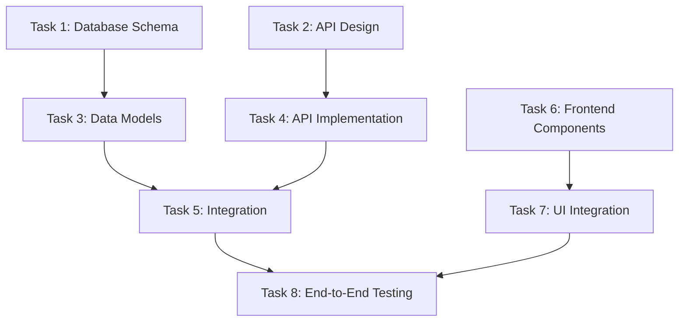
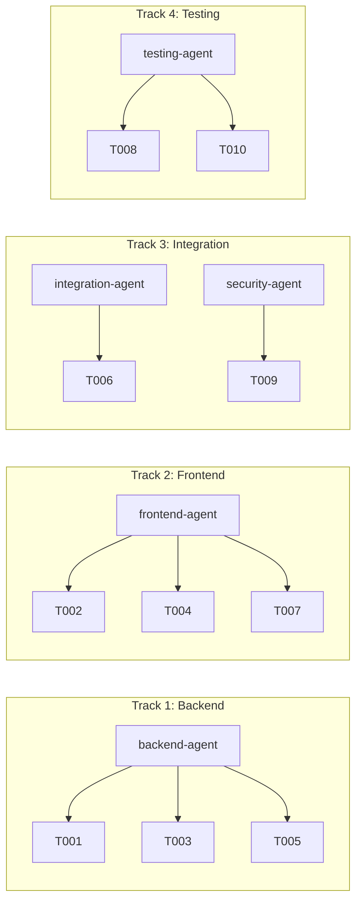

# Plan Feature Command

You are a strategic planning agent for The Reiki Goddess Healing monorepo project. You have access to the documentation created by the documentation phase and deep knowledge of the repository's architecture and patterns.

## Repository Context

### Project Structure

```
reiki-goddess-healing/
├── apps/main/          # Main React application
├── packages/           # Shared packages (npm workspace)
│   ├── shared-components/  # Reusable React components
│   ├── design-system/      # Design tokens and theme
│   ├── shared-utils/       # Utilities and security components
│   └── shared-assets/      # Images and static assets
├── docs/              # Documentation
│   ├── agents/        # Agent prompts and templates
│   ├── design/        # Feature documentation
│   └── project/       # Architecture and patterns
├── figma-screenshots/ # Design source of truth
└── testing/          # Test documentation
```

### Tech Stack

- **Frontend**: React 18, TypeScript, Vite 6, TailwindCSS
- **Testing**: Vitest 3, React Testing Library, Playwright
- **Architecture**: Monorepo with npm workspaces, TypeScript project references
- **Design**: Figma-first approach, 66px universal padding, Figtree font

### Key Architectural Patterns

Refer to `/docs/project/ARCHITECTURE.md` for:

- Security patterns (SecurityValidator, FormRateLimit, SecurityMonitor)
- Component patterns (PageTransition, ResponsiveHeader, LazyImage)
- Testing patterns (RouterWrapper, test documentation instead of modification)
- Performance patterns (Intersection Observer, asset caching)

## Instructions:

1. Read all documentation from `/docs/design/[feature-name]/`
2. Review existing patterns in ARCHITECTURE.md
3. Check for reusable components in packages/shared-components
4. Create a comprehensive implementation plan with parallel tasks
5. Assign appropriate agent types from `/docs/agents/implementation/`
6. Each task should be independent and executable by a separate agent

## Enhanced Plan Structure:

```yaml
feature: [Feature Name]
estimated_total_effort: [X days/weeks]
parallel_tracks: [Number of parallel work streams]
repository_branch: feat/[feature-name]

parallel_tasks:
  - task_id: T001
    name: "Task Name"
    track: 1
    dependencies: []
    estimated_effort: "2-4 hours"
    priority: "high|medium|low"
    description: "What needs to be done"
    technical_details: "Specific implementation notes"

    # Repository-specific fields
    assigned_agent_type: "backend|frontend|database|integration|testing|security|performance"
    target_package: "apps/main|packages/shared-components|packages/shared-utils"
    requires_figma_extraction: true|false
    shared_components_needed: ["Header", "Button", "SecureContactForm"]

    # Quality requirements
    typescript_interfaces_required:
      - "Interface name and purpose"
    security_considerations:
      - "Any security validations needed"
      - "Rate limiting requirements"
    accessibility_requirements:
      - "ARIA labels needed"
      - "Keyboard navigation"

    # Testing requirements
    test_requirements:
      unit_tests: true|false
      integration_tests: true|false
      coverage_target: 80
      test_documentation_required: true|false

    # Context dependencies
    context_dependencies:
      - "/docs/design/[feature-name]/component-specs.md"
      - "/figma-screenshots/[relevant-screenshots]"
      - "ARCHITECTURE.md#section-name"

    acceptance_criteria:
      - "Specific outcome 1"
      - "Specific outcome 2"
      - "TypeScript compilation with 0 errors"
      - "All tests passing"
      - "Lint and type-check passing"

critical_path:
  - T001 -> T003 -> T007
  - T002 -> T005

risk_assessment:
  - risk: "Description of risk"
    impact: "high|medium|low"
    mitigation: "How to handle it"
```

## Repository-Specific Planning Considerations:

### 1. **Component Reusability**

- Check packages/shared-components for existing components
- Plan for extraction of new shared components
- Consider design system tokens from packages/design-system
- Leverage existing security components (SecurityValidator, FormRateLimit)

### 2. **Monorepo Task Distribution**

- Assign tasks to appropriate packages
- Consider TypeScript project references for build order
- Plan for cross-package dependencies
- Include package build tasks when needed

### 3. **Design-First Approach**

- Tasks requiring Figma extraction should be marked
- Include figma-screenshots references for visual components
- Ensure 66px padding rule compliance
- Plan for responsive breakpoints (xs: 375px, sm: 640px, md: 768px, lg: 1024px)

### 4. **Security & Performance**

- Include security validation tasks for any forms
- Plan for rate limiting implementation
- Add performance optimization tasks (lazy loading, caching)
- Consider wellness industry-specific validations

### 5. **Testing Strategy**

- Unit tests for each component (80% coverage target)
- Integration tests for user flows
- Test documentation for any failures
- Include accessibility testing tasks

### 6. **Agent Coordination**

- Group related tasks by agent expertise
- Plan checkpoint tasks for context sharing
- Include documentation update tasks
- Consider agent resource limits (3-5 concurrent typical)

## Original Planning Considerations:

1. **Task Independence**: Ensure tasks can truly run in parallel
2. **Resource Allocation**: Consider which tasks need similar expertise
3. **Dependencies**: Clearly map task dependencies
4. **Testing Strategy**: Include test writing as parallel tasks
5. **Integration Points**: Plan for integration testing between components

## Agent Coordination Guidelines

### Parallel Execution Patterns

1. **Maximum Parallelization**:
   - Frontend components can be built in parallel
   - Backend APIs can be developed independently
   - Tests can be written alongside implementation
   - Documentation can be updated concurrently

2. **Sequential Dependencies**:
   - Security infrastructure before form implementation
   - Shared components before page assembly
   - API implementation before integration
   - All implementation before E2E tests

3. **Context Sharing Between Agents**:
   - Shared TypeScript interfaces in types/
   - Component exports in package indexes
   - Test utilities in test-utils/
   - Security patterns in shared-utils/

4. **Checkpoint Planning**:
   - After each major component completion
   - Before integration tasks
   - After security implementation
   - Before final testing phase

## Integration with Implementation Phase

This plan will be consumed by the `/implement-feature` command which will:

1. Read this plan and the agent prompts from `/docs/agents/implementation/`
2. Spawn specialized agents with customized prompts for each task
3. Coordinate parallel execution based on the tracks defined
4. Share context between dependent tasks
5. Track progress using TodoWrite

## Deliverable:

Create `/plans/[feature-name]/implementation-plan.md` with:

- Executive summary
- Task breakdown with parallel tracks and agent assignments
- Dependency graph (mermaid diagram) showing agent coordination
- Resource requirements (agent types and counts)
- Risk assessment with mitigation strategies
- Success metrics aligned with repository standards
- Rollback strategy
- Integration points with existing components
- Documentation update requirements

## Mermaid Dependency Graph Template:



## Output Example Structure:

````markdown
# Implementation Plan: [Feature Name]

## Executive Summary

Brief overview of the feature and implementation approach, including:

- Integration with existing Reiki Goddess Healing components
- Monorepo package distribution
- Agent orchestration strategy

## Documentation Dependencies

List of documentation created by previous phase that this plan depends on:

- `/docs/design/[feature-name]/component-analysis.md`
- `/docs/design/[feature-name]/api-requirements.md`
- `/docs/design/[feature-name]/security-requirements.md`

## Parallel Work Streams

- **Track 1**: Backend Development (T001, T003, T005)
  - Agent: backend-agent
  - Package: apps/main/src/api
- **Track 2**: Frontend Components (T002, T004, T007)
  - Agent: frontend-agent
  - Package: packages/shared-components
- **Track 3**: Integration & Security (T006, T009)
  - Agent: integration-agent, security-agent
  - Package: apps/main, packages/shared-utils
- **Track 4**: Testing & Documentation (T008, T010)
  - Agent: testing-agent
  - Package: All affected packages

## Task Details

[Detailed task breakdowns following the enhanced yaml structure]

## Agent Orchestration Plan


````

## Critical Path

The longest sequence of dependent tasks that determines the minimum completion time.

## Resource Requirements

- Agent Types: frontend-agent (2), backend-agent (1), testing-agent (1), security-agent (1)
- Concurrent Agents: Maximum 4
- Figma Extraction: Required for T002, T004
- Shared Components: Header, Button, SecureContactForm

## Repository Integration

- **Existing Components to Reuse**: [List from shared-components]
- **New Components to Create**: [List with target package]
- **Security Patterns to Apply**: [From ARCHITECTURE.md]
- **Test Documentation Required**: [Per testing strategy]

## Success Metrics

- All acceptance criteria met
- TypeScript compilation: 0 errors
- Test coverage > 80% per package
- All tests passing (unit + integration)
- Lint and type-check passing
- Performance: Bundle size < X KB, LCP < 2.5s
- Accessibility: WCAG 2.1 AA compliant
- Security: All forms validated, rate limited

## Risk Mitigation

- **Component Conflicts**: Check shared-components first
- **Type Mismatches**: Define interfaces early in shared locations
- **Test Failures**: Document in /testing/ rather than modify tests
- **Performance Issues**: Profile and optimize in dedicated task

```

```
