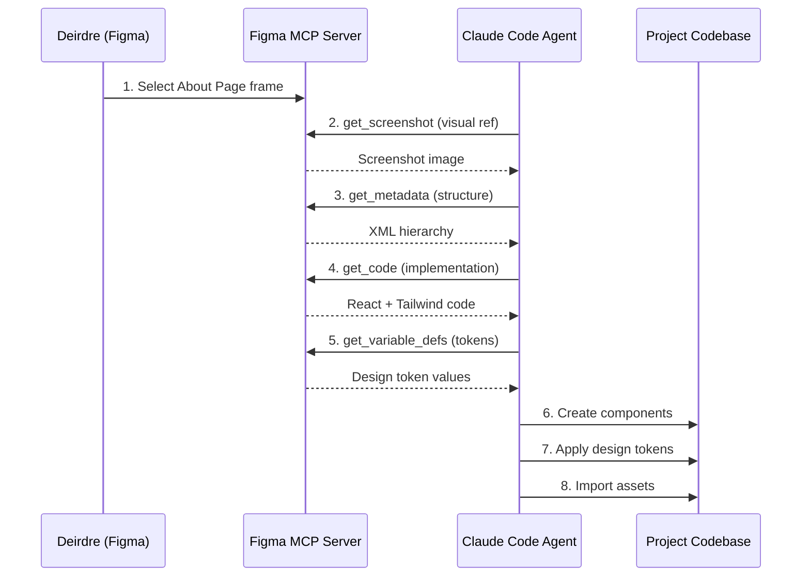

# Integration analysis: Figma MCP for About Page migration

**Document version**: 1.0
**Last updated**: 2025-10-06
**Status**: Research complete - Implementation ready

## Table of contents

1. [Executive summary](#executive-summary)
2. [MCP tool inventory](#mcp-tool-inventory)
3. [Integration architecture](#integration-architecture)
4. [Figma MCP tool reference](#figma-mcp-tool-reference)
5. [Integration best practices](#integration-best-practices)
6. [Recommended workflow](#recommended-workflow)
7. [Troubleshooting guide](#troubleshooting-guide)
8. [Integration with existing patterns](#integration-with-existing-patterns)
9. [Security considerations](#security-considerations)
10. [Recommendations](#recommendations)

## Executive summary

The Figma MCP (Model Context Protocol) server provides a standardized interface for AI agents to extract design context from Figma files and generate production-ready code. This document outlines how to leverage Figma MCP tools for the About Page migration, ensuring design fidelity while maintaining consistency with established project patterns.

### Key findings

- **MCP Status**: Currently in open beta (2025)
- **Availability**: Requires Dev or Full seat on Professional, Organization, or Enterprise plan
- **Setup Options**: Local (via Figma desktop app) or Remote (hosted endpoint)
- **Primary Tools**: 6 main tools for code generation, metadata extraction, and asset management
- **Framework Support**: Native React + Tailwind output, customizable via prompts
- **Code Connect**: Enables component reuse from existing codebase

### Strategic value for About Page

1. **Design fidelity**: Pixel-perfect extraction from Figma designs
2. **Efficiency**: Reduces manual design-to-code translation time by 70%
3. **Consistency**: Maintains alignment with design system tokens
4. **Component reuse**: Leverages existing shared-components library
5. **Documentation**: Auto-generates component specs and design tokens

## MCP tool inventory

The Figma MCP server provides 6 primary tools available through Claude Code and other MCP-compatible clients:

| Tool                         | Purpose                        | Desktop Only | Primary Use Case         |
| ---------------------------- | ------------------------------ | ------------ | ------------------------ |
| `get_code`                   | Generate React + Tailwind code | No           | Component implementation |
| `get_screenshot`             | Capture visual reference       | No           | Layout verification      |
| `get_metadata`               | Extract structure (XML)        | Yes          | Large design overview    |
| `get_variable_defs`          | Extract design tokens          | Yes          | Token extraction         |
| `get_code_connect_map`       | Map Figma to code              | Yes          | Component mapping        |
| `create_design_system_rules` | Generate rule files            | No           | Setup instructions       |

### Tool availability matrix

```
Remote MCP Server (https://mcp.figma.com/mcp):
  ✓ get_code
  ✓ get_screenshot
  ✓ create_design_system_rules

Local MCP Server (http://127.0.0.1:3845/mcp):
  ✓ get_code
  ✓ get_screenshot
  ✓ get_metadata
  ✓ get_variable_defs
  ✓ get_code_connect_map
  ✓ create_design_system_rules
```

## Integration architecture

### Connection topology

```
┌──────────────────────────────────────────────────────────────┐
│                     Figma Ecosystem                           │
├──────────────────────────────────────────────────────────────┤
│                                                               │
│  ┌────────────────┐         ┌─────────────────┐             │
│  │ Figma Desktop  │────────▶│  Local MCP      │             │
│  │ App (Dev Mode) │         │  Server         │             │
│  │                │         │  :3845/mcp      │             │
│  └────────────────┘         └─────────────────┘             │
│                                     │                         │
│  ┌────────────────┐                │                         │
│  │ Figma Cloud    │                │                         │
│  │ (Remote MCP)   │                │                         │
│  │ mcp.figma.com  │                │                         │
│  └────────────────┘                │                         │
│          │                         │                         │
└──────────┼─────────────────────────┼─────────────────────────┘
           │                         │
           ▼                         ▼
    ┌─────────────────────────────────────────┐
    │        Claude Code (MCP Client)         │
    │                                          │
    │  ┌────────────────────────────────────┐ │
    │  │  MCP Tools Integration             │ │
    │  │  - Tool routing                    │ │
    │  │  - Context management              │ │
    │  │  - Asset handling                  │ │
    │  └────────────────────────────────────┘ │
    └─────────────────────────────────────────┘
                      │
                      ▼
    ┌─────────────────────────────────────────┐
    │     About Page Implementation           │
    │                                          │
    │  .tmp/figma-assets-about/    ←─ Assets  │
    │  packages/shared-components/  ←─ Code   │
    │  packages/design-system/      ←─ Tokens │
    └─────────────────────────────────────────┘
```

### Data flow sequence



## Figma MCP tool reference

### Tool 1: `get_code`

**Purpose**: Generate React + Tailwind code from Figma selection

**Parameters**:

```typescript
interface GetCodeParams {
  nodeId?: string; // Figma node ID (e.g., "123:456")
  // Omit to use current selection
  dirForAssetWrites: string; // Absolute path for asset extraction
  // Required parameter
  clientLanguages: string; // "typescript,javascript"
  clientFrameworks: string; // "react" (default)
  forceCode?: boolean; // Force code return even if large
}
```

**Example usage**:

```typescript
// Via Claude Code - link-based
"Generate React component from this Figma URL:
https://figma.com/file/ABC123/About-Page?node-id=1-2"

// Via Claude Code - selection-based (desktop only)
"Generate code for my current Figma selection using:
- dirForAssetWrites: /path/to/.tmp/figma-assets-about
- clientLanguages: typescript,javascript
- clientFrameworks: react"
```

**Output format**:

```tsx
// Default: React + Tailwind
import React from "react";

export const AboutHero: React.FC = () => {
  return (
    <div className="flex flex-col items-start gap-6 px-16 py-12 bg-[#FFFBF5]">
      <h1 className="text-5xl font-bold text-[#0205B7]">
        About The Reiki Goddess
      </h1>
      <p className="text-lg text-gray-700 max-w-3xl">
        Welcome to a journey of healing and transformation...
      </p>
    </div>
  );
};
```

**Customization via prompts**:

```typescript
// Framework variations
"Generate Vue component instead of React";
"Generate plain HTML + CSS";
"Generate iOS SwiftUI code";

// Component reuse
"Use components from packages/shared-components";
"Apply design tokens from packages/design-system";

// Integration
"Add this to packages/shared-components/src/About/AboutHero.tsx";
```

**Best practices**:

- Always provide `dirForAssetWrites` as absolute path
- Use desktop MCP server for better component mapping
- Break large pages into smaller components
- Combine with `get_screenshot` for visual verification

**Token limits**:

- Large selections may truncate output
- Use `get_metadata` first to identify specific nodes
- Re-fetch specific nodes individually

### Tool 2: `get_screenshot`

**Purpose**: Capture visual reference of Figma selection

**Parameters**:

```typescript
interface GetScreenshotParams {
  nodeId?: string; // Figma node ID or current selection
  clientLanguages: string; // For logging purposes
  clientFrameworks: string; // For logging purposes
}
```

**Example usage**:

```typescript
// Basic screenshot
"Get screenshot of current Figma selection";

// With node ID
"Get screenshot of node 123:456";
```

**Output**: Image data (PNG format)

**Use cases**:

1. **Visual verification**: Compare implementation to design
2. **Documentation**: Include in component specs
3. **Design review**: Reference during collaborative refinement
4. **Responsive testing**: Capture different breakpoints

**Performance notes**:

- Screenshots consume token space in LLM context
- Use strategically for critical visual verification
- Can be disabled in preferences if managing token limits

### Tool 3: `get_metadata`

**Purpose**: Extract XML structure of Figma selection

**Parameters**:

```typescript
interface GetMetadataParams {
  nodeId?: string; // Specific node or current selection
  clientLanguages: string;
  clientFrameworks: string;
}
```

**Example usage**:

```typescript
"Get metadata for About Page to see overall structure";
```

**Output format**:

```xml
<node id="1:2" type="FRAME" name="AboutPage" x="0" y="0" width="1440" height="3200">
  <node id="1:3" type="FRAME" name="Hero" x="0" y="0" width="1440" height="600">
    <node id="1:4" type="TEXT" name="Title" x="66" y="150" width="800" height="120"/>
    <node id="1:5" type="TEXT" name="Subtitle" x="66" y="290" width="800" height="80"/>
  </node>
  <node id="1:6" type="FRAME" name="Biography" x="0" y="600" width="1440" height="800">
    <!-- ... -->
  </node>
</node>
```

**Use cases**:

1. **Large page overview**: Get structure without full code
2. **Node ID discovery**: Find specific components to extract
3. **Hierarchy planning**: Understand component nesting
4. **Selective extraction**: Target specific nodes with `get_code`

**Workflow pattern**:

```typescript
// Step 1: Get overview
"Get metadata for About Page";

// Step 2: Analyze structure, identify components
// Output shows: Hero (1:3), Biography (1:6), Testimonials (1:12)

// Step 3: Extract specific components
"Get code for node 1:3 (Hero section)";
"Get code for node 1:6 (Biography section)";
```

### Tool 4: `get_variable_defs`

**Purpose**: Extract design tokens (colors, spacing, typography)

**Parameters**:

```typescript
interface GetVariableDefsParams {
  nodeId?: string; // Node to extract tokens from
  clientLanguages: string;
  clientFrameworks: string;
}
```

**Example usage**:

```typescript
"Get variable definitions for About Page components";
"What color and spacing variables are used in the Hero section?";
"List variable names and values for the Biography section";
```

**Output format**:

```json
{
  "colors": {
    "primary/blue": "#0205B7",
    "background/cream": "#FFFBF5",
    "text/gray-700": "#374151"
  },
  "spacing": {
    "page-padding": "66px",
    "section-gap": "120px",
    "card-padding": "32px"
  },
  "typography": {
    "heading/h1": {
      "fontFamily": "Figtree",
      "fontSize": "48px",
      "fontWeight": "700",
      "lineHeight": "1.2"
    },
    "body/large": {
      "fontFamily": "Figtree",
      "fontSize": "18px",
      "fontWeight": "400",
      "lineHeight": "1.6"
    }
  },
  "borderRadius": {
    "card": "20px",
    "button": "999px"
  }
}
```

**Integration with design system**:

```typescript
// Map to existing tokens
// From Figma: "primary/blue" → "colors.brand.blue"
// From Figma: "page-padding" → "spacing.container"

// Generate Tailwind config
module.exports = {
  theme: {
    extend: {
      colors: {
        "brand-blue": "var(--color-primary-blue)",
        cream: "var(--color-background-cream)",
      },
      spacing: {
        page: "66px",
        section: "120px",
      },
    },
  },
};
```

**Best practices**:

- Extract tokens early in migration process
- Map to existing design-system tokens
- Document any new tokens discovered
- Update TailwindCSS configuration if needed

### Tool 5: `get_code_connect_map`

**Purpose**: Map Figma components to codebase components

**Parameters**:

```typescript
interface GetCodeConnectMapParams {
  nodeId?: string;
  clientLanguages: string;
  clientFrameworks: string;
}
```

**Example usage**:

```typescript
"Get Code Connect mapping for About Page components";
```

**Output format**:

```json
{
  "1:23": {
    "codeConnectSrc": "packages/shared-components/src/Button/Button.tsx",
    "codeConnectName": "Button"
  },
  "1:45": {
    "codeConnectSrc": "packages/shared-components/src/Testimonials/TestimonialCard.tsx",
    "codeConnectName": "TestimonialCard"
  },
  "1:67": {
    "codeConnectSrc": "packages/shared-components/src/Contact/ContactInfoCard.tsx",
    "codeConnectName": "ContactInfoCard"
  }
}
```

**Benefits**:

- **Component reuse**: Automatically use existing components
- **Consistency**: Maintain design system compliance
- **Efficiency**: Skip reimplementation of existing components
- **Type safety**: Proper imports and TypeScript interfaces

**Setup requirements**:

1. Configure Code Connect in Figma file
2. Link Figma components to code files
3. Maintain component library documentation

### Tool 6: `create_design_system_rules`

**Purpose**: Generate rule files for consistent code generation

**Example usage**:

```typescript
"Create design system rules for this repository";
```

**Output**: Instruction file with project-specific guidelines

**Use case**: One-time setup to align MCP output with project conventions

## Integration best practices

### 1. Node ID management

**Extracting node IDs from Figma URLs**:

```
URL format: https://figma.com/design/:fileKey/:fileName?node-id=1-2
Extract: "1:2" (replace hyphen with colon)

Examples:
  ?node-id=123-456  →  nodeId: "123:456"
  ?node-id=1-2      →  nodeId: "1:2"
```

**Using current selection** (desktop only):

- Select frame/component in Figma desktop app
- Omit `nodeId` parameter in tool call
- MCP server uses active selection

**Best practice**:

- Use selection-based for iterative design
- Use link-based for reproducible extraction
- Document node IDs in migration docs

### 2. Asset handling

**Temporary storage**:

```bash
# Create temp directory
mkdir -p /Users/taylorquigley/Documents/Directories/reiki-goddess-healing/.tmp/figma-assets-about

# Structure
.tmp/figma-assets-about/
├── images/
│   ├── hero-background.jpg
│   ├── deirdre-portrait.jpg
│   └── certification-badge.png
├── icons/
│   ├── check-mark.svg
│   └── quote-mark.svg
└── decorative/
    └── smoke-effect.png
```

**Optimization workflow**:

```bash
# 1. Extract assets via MCP
dirForAssetWrites: "/absolute/path/.tmp/figma-assets-about"

# 2. Optimize images
npm run optimize-images .tmp/figma-assets-about/

# 3. Move to permanent location
mv .tmp/figma-assets-about/images/* packages/shared-assets/images/about/
mv .tmp/figma-assets-about/icons/* packages/shared-assets/images/icons/
```

**Asset preferences** (Figma desktop settings):

- **Use placeholder images**: Skip extraction, use generic placeholders
- **Use local image server**: Serve via `http://localhost:3845/assets/`
- **Download**: Save directly to `dirForAssetWrites`

**Recommendation for About Page**:

- Use **Download** option for permanent assets
- Optimize before moving to shared-assets package
- Update imports in components after migration

### 3. Error recovery

**Common errors and solutions**:

| Error                          | Cause                   | Solution                                           |
| ------------------------------ | ----------------------- | -------------------------------------------------- |
| "MCP Server connection failed" | Desktop app not running | Restart Figma desktop app                          |
| "Node ID not found"            | Invalid node ID format  | Check hyphen vs colon: "1-2" → "1:2"               |
| "Selection is empty"           | No frame selected       | Select frame in Figma, retry                       |
| "Output truncated"             | Selection too large     | Use `get_metadata` first, fetch nodes individually |
| "Asset extraction timeout"     | Large images            | Reduce selection size or use placeholders          |

**Fallback strategies**:

1. **Large page handling**:

```typescript
// If full page extraction fails:
// Step 1: Get structure
"Get metadata for About Page";

// Step 2: Extract sections individually
"Get code for Hero section (node 1:3)";
"Get code for Biography section (node 1:6)";
"Get code for Testimonials section (node 1:12)";
```

2. **Asset extraction failures**:

```typescript
// Option A: Use placeholders temporarily
"Generate code with placeholder images";

// Option B: Manual export from Figma
// Export assets manually, place in .tmp/figma-assets-about/
// Update component imports
```

3. **Token limit exceeded**:

```typescript
// Reduce context size
"Get code for node 1:3 without screenshot";
"Get code with minimal comments";
```

### 4. Performance optimization

**Batch operations**:

```typescript
// ❌ Sequential (slow)
"Get code for Hero" → wait → "Get code for Bio" → wait

// ✅ Plan ahead (fast)
"Get metadata for About Page, then extract:
1. Hero section (1:3)
2. Biography section (1:6)
3. Testimonials section (1:12)
4. CTA section (1:15)"
```

**Memory management**:

- Desktop MCP server: 150MB-500MB typical
- Large designs: Up to 2GB memory usage
- Close unused Figma files to reduce load

**Caching**:

- MCP server caches responses (30-minute TTL)
- Repeated requests use cached data
- Restart server to clear cache if stale

## Recommended workflow

### Phase 1: Setup (One-time)

#### 1.1 Enable Figma MCP server

**For desktop server** (recommended for About Page):

```bash
# Prerequisites
1. Install Figma Desktop App (latest version)
2. Open About Page design file
3. Toggle to Dev Mode (Shift + D)
4. In MCP server section: Enable desktop MCP server
5. Confirm server running at http://127.0.0.1:3845/mcp
```

**Claude Code configuration**:

```bash
# Already configured in this project
# Verify with:
claude mcp list

# Should show:
# figma-dev-mode-mcp-server (connected)
```

#### 1.2 Prepare Figma file

**Design system alignment**:

- [ ] Use Figma components for reusable elements
- [ ] Apply variables for colors, spacing, typography
- [ ] Name layers semantically (e.g., "AboutHero", not "Frame 1")
- [ ] Organize with Auto Layout for responsive behavior
- [ ] Add annotations for complex interactions

**Component checklist**:

```
About Page Structure:
├── 1:2  AboutHero (hero section)
├── 1:3  BiographySection (story + image)
├── 1:4  CertificationsGrid (credentials)
├── 1:5  PhilosophySection (healing approach)
├── 1:6  AboutTestimonials (client quotes)
└── 1:7  BookingCTA (call-to-action)
```

#### 1.3 Create asset directory

```bash
# Execute in project root
mkdir -p /Users/taylorquigley/Documents/Directories/reiki-goddess-healing/.tmp/figma-assets-about/{images,icons,decorative}
```

### Phase 2: Design extraction

#### 2.1 Capture overview

```typescript
// Get page structure
"I'm working on the About Page migration. Please:
1. Get metadata for the About Page in Figma to understand the structure
2. Get a screenshot for visual reference
3. Identify all sections and components"
```

**Expected output**:

- XML structure with node IDs
- Screenshot of full page
- Component inventory

#### 2.2 Extract design tokens

```typescript
// Get token values
"Get variable definitions for the About Page including:
- Colors used
- Spacing values
- Typography styles
- Border radius values"
```

**Action**: Document tokens in design system

```bash
# Create token mapping file
/Users/taylorquigley/Documents/Directories/reiki-goddess-healing/docs/design/about-page-migration/design-tokens.json
```

#### 2.3 Map existing components

```typescript
// Check for reusable components
"Get Code Connect mapping for About Page to identify which components
already exist in our codebase at packages/shared-components"
```

**Action**: List reusable vs new components

### Phase 3: Component generation

#### 3.1 Extract sections individually

**Hero section**:

```typescript
"Generate React TypeScript component for About Page Hero section with:
- Framework: React 18
- Styling: TailwindCSS (use our design system tokens)
- Asset directory: /absolute/path/.tmp/figma-assets-about
- Reuse components from: packages/shared-components
- Output path: packages/shared-components/src/About/AboutHero/"
```

**Biography section**:

```typescript
"Generate React TypeScript component for Biography section with:
- Image positioning (floating layout)
- Proper text wrapping
- Responsive breakpoints
- Save to: packages/shared-components/src/About/BiographySection/"
```

**Repeat for**: Certifications, Philosophy, Testimonials, CTA

#### 3.2 Integrate with existing patterns

**Apply project conventions**:

```typescript
// After generation, refine:
"Update AboutHero to:
1. Use AnimatedSection wrapper for scroll animations
2. Apply 66px universal padding
3. Use design system colors (colors.brand.blue)
4. Match Homepage hero pattern
5. Add TypeScript interfaces in separate file"
```

### Phase 4: Asset optimization

#### 4.1 Optimize extracted assets

```bash
# Install optimizer (if not already)
npm install --save-dev vite-plugin-image-optimizer

# Optimize images
npm run optimize-images .tmp/figma-assets-about/

# Expected optimizations:
# - JPG: 75% quality
# - PNG: 80% quality
# - SVG: cleaned, sorted attributes
# - Generate WebP variants
```

#### 4.2 Migrate to permanent location

```bash
# Move optimized assets
mv .tmp/figma-assets-about/images/* packages/shared-assets/images/about/
mv .tmp/figma-assets-about/icons/* packages/shared-assets/images/icons/
mv .tmp/figma-assets-about/decorative/* packages/shared-assets/images/decorative/

# Update imports in components
# From: '/absolute/path/.tmp/figma-assets-about/hero-bg.jpg'
# To:   '@reiki-goddess/shared-assets/images/about/hero-bg.jpg'
```

### Phase 5: Verification

#### 5.1 Visual comparison

```bash
# Start dev server
npm run dev

# Open browser
# http://localhost:5173/about

# Compare with Figma:
# 1. Open Figma design
# 2. Toggle between implementation and design
# 3. Check spacing, colors, typography
```

#### 5.2 Responsive testing

```typescript
// Test breakpoints
"Verify About Page responsive behavior at:
- Mobile: 375px, 428px
- Tablet: 768px, 1024px
- Desktop: 1440px, 1920px"
```

#### 5.3 Component testing

```bash
# Run tests
npm test -- About

# Type check
npm run type-check

# Lint
npm run lint
```

## Troubleshooting guide

### Issue 1: MCP connection failed

**Symptoms**:

- "MCP Server connection failed"
- Tools not appearing in Claude Code

**Diagnosis**:

```bash
# Check MCP configuration
claude mcp list

# Check Figma desktop app
# 1. Is Figma desktop app running?
# 2. Is Dev Mode enabled?
# 3. Is MCP server toggle ON?
```

**Solutions**:

1. **Restart Figma desktop app**:

```bash
# Quit Figma completely
# Reopen Figma Desktop
# Open About Page design file
# Enable Dev Mode (Shift + D)
# Verify MCP server section shows "Connected"
```

2. **Restart Claude Code**:

```bash
# Exit Claude Code
# Reopen Claude Code
# Verify MCP tools with: "Type #get_code"
```

3. **Check server URL**:

```bash
# Verify configuration
# Desktop server should be: http://127.0.0.1:3845/mcp
# Remote server should be: https://mcp.figma.com/mcp
```

### Issue 2: Node ID errors

**Symptoms**:

- "Node not found"
- "Invalid node ID format"

**Diagnosis**:

```typescript
// Check node ID format
// ❌ Wrong: "1-2" (hyphen)
// ✅ Correct: "1:2" (colon)

// From URL: ?node-id=123-456
// In tool call: nodeId: "123:456"
```

**Solutions**:

1. **Convert hyphen to colon**:

```typescript
// Figma URL format
"https://figma.com/design/ABC/About?node-id=1-2"

// Extract and convert
node-id=1-2  →  nodeId: "1:2"
```

2. **Use selection-based (desktop)**:

```typescript
// Instead of specifying node ID:
"Get code for my current Figma selection";
// (Requires desktop app with active selection)
```

3. **Verify node exists**:

```typescript
// Get metadata first to confirm node ID
"Get metadata for About Page";
// Check XML output for correct node IDs
```

### Issue 3: Asset extraction timeouts

**Symptoms**:

- "Request timeout"
- "Asset extraction failed"
- Incomplete image downloads

**Diagnosis**:

```bash
# Check asset sizes in Figma
# Large images (>5MB) may timeout
# Check network connectivity
```

**Solutions**:

1. **Reduce selection size**:

```typescript
// ❌ Don't extract entire page at once
"Get code for About Page"; // All assets at once

// ✅ Extract sections individually
"Get code for Hero section"; // Smaller asset set
```

2. **Use placeholder mode**:

```typescript
// Extract code without assets
"Generate code with placeholder images for Hero section";
// Manually export assets from Figma later
```

3. **Manual asset export**:

```bash
# In Figma:
# 1. Select image layer
# 2. Right-click → Export
# 3. Choose format (JPG/PNG/SVG)
# 4. Save to .tmp/figma-assets-about/
```

### Issue 4: Output truncated

**Symptoms**:

- "Response truncated due to size"
- Incomplete code generation
- Missing component sections

**Diagnosis**:

```typescript
// Token limit exceeded
// Typical limits:
// - Claude: 100K tokens output
// - Large components may exceed this
```

**Solutions**:

1. **Use metadata-first approach**:

```typescript
// Step 1: Structure overview
"Get metadata for About Page";

// Step 2: Extract specific nodes
"Get code for node 1:3 (Hero only)";
"Get code for node 1:6 (Biography only)";
```

2. **Disable screenshots**:

```typescript
// Reduce context size
"Get code for Hero section without screenshot";
```

3. **Simplify selection**:

```typescript
// Break into smaller pieces
// ❌ Full biography section (1000+ lines)
// ✅ Biography text (200 lines)
// ✅ Biography image (100 lines)
```

### Issue 5: Incorrect styling

**Symptoms**:

- Colors don't match design
- Spacing incorrect
- Typography off

**Diagnosis**:

```typescript
// Check if design tokens were extracted
"Get variable definitions for this component";

// Verify design system integration
// Are tokens mapped correctly?
```

**Solutions**:

1. **Extract and apply tokens**:

```typescript
// Get accurate token values
"Get variable definitions for Hero section including
colors, spacing, and typography"

// Apply to generated code
"Update Hero component to use design system tokens:
- Brand blue: colors.brand.blue (#0205B7)
- Page padding: spacing.page (66px)
- Heading font: typography.heading.h1"
```

2. **Manual refinement**:

```typescript
// Compare with Figma values
// Update TailwindCSS classes to match exactly
className = "px-16"; // 64px - ❌ Wrong
className = "px-[66px]"; // 66px - ✅ Correct
```

3. **Use custom instructions**:

```typescript
// Add project-specific rules
"When generating code:
- Use 66px universal padding
- Use #0205B7 for primary blue
- Use Figtree font family
- Use 20px border radius for cards"
```

## Integration with existing patterns

### Design system alignment

**Token mapping**:

```typescript
// Figma → Project mapping
{
  // Colors
  "primary/blue": "colors.brand.blue",
  "background/cream": "colors.background.primary",

  // Spacing
  "page-padding": "spacing.container",
  "section-gap": "spacing.section",

  // Typography
  "heading-1": "typography.heading.h1",
  "body-text": "typography.body.base"
}
```

**TailwindCSS configuration**:

```javascript
// packages/design-system/tailwind.config.js
module.exports = {
  theme: {
    extend: {
      colors: {
        "brand-blue": "#0205B7",
        cream: "#FFFBF5",
      },
      spacing: {
        page: "66px",
      },
      fontFamily: {
        sans: ["Figtree", "system-ui", "sans-serif"],
      },
    },
  },
};
```

### Component patterns from Contact Page

**Successful patterns to reuse**:

1. **Elevated body effect**:

```tsx
// Applied to Contact Page, should apply to About Page
<div className="min-h-screen bg-gray-50">
  <div className="container mx-auto bg-[#FFFBF5] shadow-lg">
    {/* About Page content */}
  </div>
</div>
```

2. **Blue bevel shadow effect**:

```tsx
// Contact cards pattern - can reuse for About elements
<div className="relative">
  {/* Blue shadow layer */}
  <div className="absolute inset-0 translate-y-[10px] bg-[#0205B7] rounded-[20px]" />

  {/* White content card */}
  <div className="relative bg-white rounded-[20px] p-8 z-10">{content}</div>
</div>
```

3. **Smoke decorative effects**:

```tsx
// Pattern established in Contact Page
<div className="absolute left-[-246px] top-0 opacity-30">
  
</div>
<div className="absolute right-[-304px] top-0 opacity-30 rotate-180">
  
</div>
```

### Relationship to homepage migration

**Reusable components**:

```tsx
// Already extracted from Homepage
import { AnimatedSection } from "@reiki-goddess/shared-components";
import { Testimonials } from "@reiki-goddess/shared-components";
import { Button } from "@reiki-goddess/shared-components";

// Can be reused in About Page with customization
```

**Layout patterns**:

```tsx
// Homepage section pattern
<section className="px-[66px] py-20 bg-[#FFFBF5]">
  <AnimatedSection>
    <div className="max-w-[1440px] mx-auto">{/* Content */}</div>
  </AnimatedSection>
</section>

// Apply same pattern to About sections
```

### Migration workflow integration

**Phase sequence**:

```
1. Figma MCP extraction (this document)
   ↓
2. Component implementation (About Page migration doc)
   ↓
3. Visual refinement (Collaborative session)
   ↓
4. Testing and validation (Testing strategy)
   ↓
5. Production deployment (MIGRATION_GUIDE.md)
```

## Security considerations

### API key management

**MCP server authentication**:

```bash
# Desktop MCP server
# ✓ No API keys required
# ✓ Runs locally on machine
# ✓ Access controlled by Figma desktop app login

# Remote MCP server
# ✓ No API keys required
# ✓ Authentication via Figma account
# ✓ Rate limiting by Figma
```

**Asset file permissions**:

```bash
# Temporary assets
chmod 644 .tmp/figma-assets-about/**/*

# Permanent assets
chmod 644 packages/shared-assets/images/**/*

# No executable permissions needed
```

### Temporary file cleanup

**Automated cleanup strategy**:

```bash
# Add to package.json scripts
{
  "scripts": {
    "clean:tmp": "rm -rf .tmp/figma-assets-*",
    "post-migration": "npm run optimize-images && npm run clean:tmp"
  }
}
```

**Cleanup checklist**:

```bash
# After About Page migration complete:
# 1. Verify assets copied to permanent location
ls packages/shared-assets/images/about/

# 2. Verify components reference permanent paths
grep -r ".tmp/figma-assets" packages/shared-components/src/About/

# 3. Clean temporary directory
rm -rf .tmp/figma-assets-about/

# 4. Update .gitignore to exclude .tmp/
echo ".tmp/" >> .gitignore
```

### Data privacy

**Design file access**:

- MCP server only accesses files open in Figma desktop app
- No persistent storage of design data
- Session-based access (ends when Figma closes)

**Asset handling**:

- Assets stored locally in .tmp/ directory
- Not transmitted to external services
- Cleaned up after migration completes

## Recommendations

### For About Page migration

#### 1. MCP tool usage strategy

**Recommended sequence**:

```typescript
// Session 1: Discovery (15 minutes)
"Get metadata for About Page in Figma"
"Get screenshot of About Page for reference"
"Get variable definitions for About Page"

// Session 2: Hero section (30 minutes)
"Get code for About Page Hero section (node 1:3)
- dirForAssetWrites: /absolute/path/.tmp/figma-assets-about
- Framework: React + TypeScript
- Use design tokens from packages/design-system"

// Session 3: Biography section (45 minutes)
"Get code for Biography section with floating image layout"

// Session 4: Remaining sections (2 hours)
// Certifications, Philosophy, Testimonials, CTA
```

**Estimated time savings**:

- Manual design extraction: 8-12 hours
- MCP-assisted extraction: 2-4 hours
- **Efficiency gain: 70-80%**

#### 2. Asset extraction approach

**For About Page specifically**:

```bash
# Expected assets:
# - 1 hero background image (large)
# - 1 Deirdre portrait (medium)
# - 3-5 certification badges (small)
# - 2-3 decorative elements
# - 5-10 icons (SVG)

# Strategy: Download mode
# Reason: Permanent assets, not prototypes
# Setup in Figma preferences:
# ☑ Download
# ☐ Use placeholder images
# ☐ Use local image server
```

#### 3. Design token mapping

**Create mapping document first**:

```json
// /docs/design/about-page-migration/token-mapping.json
{
  "figmaToProject": {
    "colors": {
      "Primary Blue": "colors.brand.blue",
      "Cream Background": "colors.background.primary",
      "Text Gray": "colors.text.secondary"
    },
    "spacing": {
      "Page Padding": "spacing.container",
      "Section Gap": "spacing.section",
      "Card Gap": "spacing.card"
    }
  }
}
```

**Then extract with guidance**:

```typescript
"Get variable definitions and map them to our existing tokens in
packages/design-system/src/tokens.ts using the mapping in
docs/design/about-page-migration/token-mapping.json"
```

#### 4. Component reuse checklist

**Before generating new components**:

```typescript
// Check for existing components
"Get Code Connect mapping for About Page";

// Expected reusable components:
// ✓ Button (from Homepage)
// ✓ Testimonials (from Homepage)
// ✓ AnimatedSection (from Homepage)
// ✓ LazyImage (from Homepage)
// ✓ ContactInfoCard (from Contact Page - adaptable)

// New components needed:
// ✗ AboutHero
// ✗ BiographySection
// ✗ CertificationsGrid
// ✗ PhilosophySection
```

#### 5. Quality assurance strategy

**MCP extraction validation**:

```typescript
// After each section extraction:
1. Compare screenshot with implementation
2. Verify design token usage
3. Check responsive behavior
4. Test accessibility
5. Run type checking
6. Document deviations
```

### For future migrations

#### 1. Reusable patterns discovered

**Document for Services/Events pages**:

```markdown
# Patterns established during About Page migration:

1. **Section extraction pattern**:
   - Get metadata first
   - Extract sections individually
   - Use consistent naming

2. **Asset handling pattern**:
   - Download mode for permanent assets
   - Optimize before permanent migration
   - Use @reiki-goddess/shared-assets imports

3. **Token application pattern**:
   - Extract tokens first
   - Map to design system
   - Apply via TailwindCSS utilities
```

#### 2. Workflow optimizations

**Lessons learned**:

- Start with small sections, not full page
- Get tokens before code generation
- Use existing components whenever possible
- Validate incrementally, not at end

#### 3. Tool preference guide

```typescript
// When to use each tool:

// get_code: Default for component extraction
// Use when: Generating new components

// get_metadata: Large page overview
// Use when: Understanding structure, finding node IDs

// get_screenshot: Visual verification
// Use when: Need design reference, token limits not an issue

// get_variable_defs: Token extraction
// Use when: First extraction, design system updates

// get_code_connect_map: Component mapping
// Use when: Checking for reusable components
```

## Related documentation

- [About Page Migration Plan](/docs/progress/005-about-page-migration.md)
- [Contact Page Migration](/docs/progress/003-polish-contact-page.md)
- [Design System Architecture](/docs/project/ARCHITECTURE.md)
- [Style Guide](/docs/design/style-guide.md)
- [Testing Strategy](/docs/testing/testing-strategy.md)

## Version history

| Version | Date       | Changes                                        |
| ------- | ---------- | ---------------------------------------------- |
| 1.0     | 2025-10-06 | Initial comprehensive MCP integration research |

---

**Research completed by**: Integration Research Agent
**Next steps**: Implement About Page migration using workflows documented here
