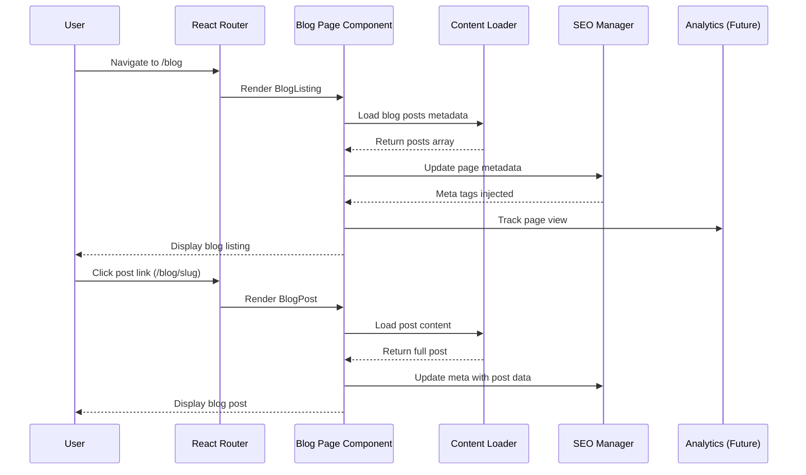

# Integration points: Blog Page Migration

**Document version**: 1.0
**Last updated**: 2025-10-06
**Status**: Research complete - Implementation ready

## Table of contents

1. [Executive summary](#executive-summary)
2. [Integration architecture overview](#integration-architecture-overview)
3. [Routing integration](#routing-integration)
4. [Content management integration](#content-management-integration)
5. [Internal component integrations](#internal-component-integrations)
6. [External service integrations](#external-service-integrations)
7. [SEO integration](#seo-integration)
8. [Performance optimizations](#performance-optimizations)
9. [Security considerations](#security-considerations)
10. [Monitoring and analytics](#monitoring-and-analytics)
11. [Data synchronization patterns](#data-synchronization-patterns)
12. [Error handling strategies](#error-handling-strategies)
13. [Recommendations](#recommendations)

## Executive summary

The Blog Page Migration requires integration across multiple layers of the application stack. This document maps all integration points, dependencies, and recommended patterns for implementing a modern, performant blog system within The Reiki Goddess Healing monorepo.

### Key integration categories

| Category        | Complexity | Dependencies                      | Priority |
| --------------- | ---------- | --------------------------------- | -------- |
| **Routing**     | Medium     | React Router v6                   | High     |
| **Content**     | Low-Medium | Static files or future CMS        | High     |
| **SEO**         | Medium     | HTML meta tags, structured data   | High     |
| **Navigation**  | Low        | Existing Header component         | High     |
| **Social**      | Low        | Footer social links               | Medium   |
| **Analytics**   | Low        | Future Google Analytics           | Low      |
| **Performance** | Medium     | Vite build, lazy loading          | High     |
| **Security**    | Low        | CSP headers, content sanitization | Medium   |

### Strategic recommendations

1. **Content Source**: Start with **static Markdown/JSON** files, design for future CMS migration
2. **Routing**: Implement **nested routes** with React Router for blog listing, categories, and individual posts
3. **SEO**: Use **react-helmet-async** for dynamic meta tags and structured data
4. **Performance**: Leverage **build-time rendering** where possible, lazy load images and components
5. **Security**: Sanitize user-generated content (comments in future), enforce CSP headers

## Integration architecture overview

### System context diagram

```
┌─────────────────────────────────────────────────────────────────┐
│                    Blog Page Ecosystem                           │
├─────────────────────────────────────────────────────────────────┤
│                                                                   │
│  ┌──────────────────┐         ┌──────────────────┐             │
│  │   Content Source │         │   React Router   │             │
│  │   (Markdown/JSON)│────────▶│   Integration    │             │
│  │   Static Files   │         │   /blog/*        │             │
│  └──────────────────┘         └──────────────────┘             │
│           │                              │                       │
│           │                              │                       │
│           ▼                              ▼                       │
│  ┌─────────────────────────────────────────────────────────┐   │
│  │           Blog Page Components                          │   │
│  │  ┌──────────┐ ┌──────────┐ ┌──────────┐ ┌──────────┐  │   │
│  │  │BlogListing││ BlogPost │ │BlogFilters││RelatedPosts│ │   │
│  │  └──────────┘ └──────────┘ └──────────┘ └──────────┘  │   │
│  └─────────────────────────────────────────────────────────┘   │
│           │                              │                       │
│           ▼                              ▼                       │
│  ┌──────────────────┐         ┌──────────────────┐             │
│  │ Shared Components│         │   SEO Layer      │             │
│  │ Header, Footer   │         │   Meta Tags      │             │
│  │ AnimatedSection  │         │   Structured Data│             │
│  └──────────────────┘         └──────────────────┘             │
│                                                                   │
└─────────────────────────────────────────────────────────────────┘
                              │
                              ▼
                    ┌──────────────────┐
                    │  Build Process   │
                    │  (Vite)          │
                    │  - Bundle Split  │
                    │  - Image Opt     │
                    │  - Route Pre-gen │
                    └──────────────────┘
```

### Data flow sequence



## Routing integration

### Current routing architecture

The application uses **React Router v6** with a centralized route configuration in `/apps/main/src/App.tsx`:

```tsx
// Current structure
<BrowserRouter>
  <Routes>
    <Route path="/" element={<AppLayout />}>
      <Route index element={<Home />} />
      <Route path="about" element={<About />} />
      <Route path="services" element={<Services />} />
      <Route path="events" element={<Events />} />
      <Route path="contact" element={<Contact />} />
      <Route path="blog" element={<Blog />} /> // ← Currently placeholder
      <Route path="*" element={<NotFound />} />
    </Route>
  </Routes>
</BrowserRouter>
```

### Recommended blog routing structure

**Nested routes pattern** for blog functionality:

```tsx
// apps/main/src/App.tsx
import { lazy } from "react";

const BlogListing = lazy(() => import("./pages/Blog/BlogListing"));
const BlogPost = lazy(() => import("./pages/Blog/BlogPost"));
const BlogCategory = lazy(() => import("./pages/Blog/BlogCategory"));

<Route path="blog" element={<BlogOutlet />}>
  <Route index element={<BlogListing />} />
  <Route path="category/:categorySlug" element={<BlogCategory />} />
  <Route path=":postSlug" element={<BlogPost />} />
</Route>;
```

**URL structure**:

```
/blog                           # Blog listing (all posts)
/blog/category/healing          # Category filter
/blog/category/wellness         # Category filter
/blog/reiki-energy-healing-101  # Individual post
```

### Route parameters

```typescript
// Type definitions for route params
interface BlogPostParams {
  postSlug: string;
}

interface BlogCategoryParams {
  categorySlug: "healing" | "wellness" | "events" | "stories";
}

// Usage in component
import { useParams } from "react-router-dom";

const BlogPost = () => {
  const { postSlug } = useParams<BlogPostParams>();
  // Load post by slug
};
```

### Navigation active states

**Integration with existing Header component** (`/packages/shared-components/src/Header/Header.tsx`):

```tsx
// Current navigation items
const navigationItems = [
  { label: "Home", href: "/", isActive: (pathname) => pathname === "/" },
  { label: "Blog", href: "/blog", isActive: (pathname) => pathname.startsWith("/blog") },
  // ... other items
];

// Active state styling
style={{
  textDecoration: item.isActive(location.pathname) ? "underline" : "none",
}}
```

**Note**: The `isActive` pattern already supports sub-routes via `pathname.startsWith()`, so blog post pages will correctly show "Blog" as active.

### PageTransition integration

**Existing pattern** (`/apps/main/src/components/PageTransition.tsx`):

```tsx
// Applied to all page-level components
function BlogListing() {
  return <PageTransition>{/* Blog listing content */}</PageTransition>;
}

// Animation settings (already configured)
const pageVariants = {
  initial: { opacity: 0, y: 20 },
  animate: { opacity: 1, y: 0, transition: { duration: 0.6 } },
  exit: { opacity: 0, y: -20, transition: { duration: 0.4 } },
};
```

**Recommendation**: Apply PageTransition to all blog page variants (listing, category, post) for consistent UX.

### Breadcrumb navigation

**New pattern for blog posts**:

```tsx
// packages/shared-components/src/Breadcrumbs/Breadcrumbs.tsx
interface BreadcrumbItem {
  label: string;
  href?: string;
}

export const Breadcrumbs: React.FC<{ items: BreadcrumbItem[] }> = ({
  items,
}) => {
  return (
    <nav aria-label="Breadcrumb">
      <ol className="flex gap-2 text-sm text-gray-600">
        {items.map((item, index) => (
          <li key={index}>
            {item.href ? (
              <Link to={item.href}>{item.label}</Link>
            ) : (
              <span>{item.label}</span>
            )}
            {index < items.length - 1 && <span> / </span>}
          </li>
        ))}
      </ol>
    </nav>
  );
};

// Usage in BlogPost
<Breadcrumbs
  items={[
    { label: "Home", href: "/" },
    { label: "Blog", href: "/blog" },
    { label: post.title },
  ]}
/>;
```

## Content management integration

### Content source analysis

**Current state**: No existing CMS integration

**Recommended approach**: **Static content** with future CMS migration path

### Static content strategy

**Directory structure**:

```
apps/main/src/content/
├── blog/
│   ├── posts/
│   │   ├── reiki-energy-healing-101.md
│   │   ├── sound-therapy-benefits.md
│   │   └── upcoming-events-march.md
│   ├── categories.json
│   └── authors.json
└── utils/
    └── contentLoader.ts
```

**Post metadata format** (frontmatter):

```yaml
---
title: "Reiki Energy Healing 101: A Beginner's Guide"
slug: "reiki-energy-healing-101"
excerpt: "Discover the ancient practice of Reiki and how it can transform your healing journey."
category: "healing"
author: "Deirdre - The Reiki Goddess"
publishDate: "2025-10-01"
readTime: "5 min read"
featuredImage: "/img/blog/reiki-healing-101.jpg"
tags: ["reiki", "energy-healing", "beginners"]
seo:
  metaDescription: "Learn about Reiki energy healing from an experienced master practitioner in Roy, WA"
  keywords: ["reiki", "energy healing", "holistic wellness", "Roy WA"]
---
# Post content in Markdown...
```

**Content loader implementation**:

```typescript
// apps/main/src/content/utils/contentLoader.ts
import { lazy } from "react";

interface BlogPost {
  slug: string;
  title: string;
  excerpt: string;
  category: "healing" | "wellness" | "events" | "stories";
  author: string;
  publishDate: string;
  readTime: string;
  featuredImage: string;
  tags: string[];
  seo: {
    metaDescription: string;
    keywords: string[];
  };
}

// Build-time content loading (Vite plugin)
export async function getAllPosts(): Promise<BlogPost[]> {
  const modules = import.meta.glob("/src/content/blog/posts/*.md", {
    eager: true,
  });

  return Object.entries(modules)
    .map(([path, module]) => {
      const { frontmatter, default: Component } = module as any;
      return {
        ...frontmatter,
        component: Component,
      };
    })
    .sort(
      (a, b) =>
        new Date(b.publishDate).getTime() - new Date(a.publishDate).getTime()
    );
}

export async function getPostBySlug(slug: string): Promise<BlogPost | null> {
  const posts = await getAllPosts();
  return posts.find((post) => post.slug === slug) || null;
}

export async function getPostsByCategory(
  category: string
): Promise<BlogPost[]> {
  const posts = await getAllPosts();
  return posts.filter((post) => post.category === category);
}
```

**Vite plugin for Markdown processing**:

```typescript
// vite.config.ts
import { defineConfig } from "vite";
import react from "@vitejs/plugin-react";
import markdown from "vite-plugin-markdown";

export default defineConfig({
  plugins: [
    react(),
    markdown({
      mode: ["react"],
      markdownIt: {
        html: true,
        linkify: true,
        typographer: true,
      },
    }),
  ],
});
```

**Required dependencies**:

```json
{
  "dependencies": {
    "gray-matter": "^4.0.3", // Frontmatter parsing
    "marked": "^9.1.6" // Markdown to HTML
  },
  "devDependencies": {
    "vite-plugin-markdown": "^2.2.0"
  }
}
```

### Future CMS integration path

**Design for abstraction**:

```typescript
// apps/main/src/services/contentService.ts
interface ContentService {
  getAllPosts(): Promise<BlogPost[]>;
  getPostBySlug(slug: string): Promise<BlogPost | null>;
  getPostsByCategory(category: string): Promise<BlogPost[]>;
}

// Static implementation
class StaticContentService implements ContentService {
  async getAllPosts() {
    /* ... */
  }
}

// Future CMS implementation
class CMSContentService implements ContentService {
  constructor(
    private apiUrl: string,
    private apiKey: string
  ) {}
  async getAllPosts() {
    const response = await fetch(`${this.apiUrl}/posts`, {
      headers: { Authorization: `Bearer ${this.apiKey}` },
    });
    return response.json();
  }
}

// Factory pattern
export function getContentService(): ContentService {
  const useCMS = import.meta.env.VITE_USE_CMS === "true";
  return useCMS
    ? new CMSContentService(
        import.meta.env.VITE_CMS_URL,
        import.meta.env.VITE_CMS_KEY
      )
    : new StaticContentService();
}
```

**CMS candidates for future**:

- **Contentful**: Headless CMS with great DX
- **Sanity**: Real-time collaborative editing
- **Strapi**: Open-source, self-hosted
- **Ghost**: Purpose-built for blogging

### Content update workflow

**Static content workflow**:

1. Create/edit Markdown file in `/src/content/blog/posts/`
2. Add frontmatter metadata
3. Commit to Git
4. Deploy via Vercel (auto-rebuild on push)

**Future CMS workflow**:

1. Log into CMS dashboard
2. Create/edit post via rich editor
3. Publish
4. Webhook triggers rebuild OR fetch at runtime

## Internal component integrations

### Header navigation integration

**Current implementation**: `/packages/shared-components/src/Header/Header.tsx`

**Blog link already exists**:

```tsx
navigationItems = [
  { label: "Blog", href: "/blog" },
  // ... other items
];
```

**Active state behavior**:

- Blog listing page (`/blog`): "Blog" underlined
- Blog post page (`/blog/some-post`): "Blog" underlined (via `startsWith()`)
- Blog category page (`/blog/category/healing`): "Blog" underlined

**No changes required** - existing implementation supports blog sub-routes.

### Footer social integration

**Current implementation**: `/packages/shared-components/src/Footer/Footer.tsx`

```tsx
socialLinks = {
  facebook: "https://facebook.com",
  instagram: "https://instagram.com",
  twitter: "https://twitter.com",
  linkedin: "https://linkedin.com",
};
```

**Blog-specific integration**:

```tsx
// Add social sharing buttons to blog posts
// packages/shared-components/src/SocialShare/SocialShare.tsx
export const SocialShare: React.FC<{ url: string; title: string }> = ({
  url,
  title,
}) => {
  return (
    <div className="flex gap-4">
      <a
        href={`https://facebook.com/sharer/sharer.php?u=${url}`}
        target="_blank"
      >
        <FacebookIcon />
      </a>
      <a
        href={`https://twitter.com/intent/tweet?url=${url}&text=${title}`}
        target="_blank"
      >
        <TwitterIcon />
      </a>
      <a
        href={`https://linkedin.com/sharing/share-offsite/?url=${url}`}
        target="_blank"
      >
        <LinkedInIcon />
      </a>
    </div>
  );
};

// Usage in BlogPost component
<SocialShare
  url={`https://reikigoddesshealingllc.com/blog/${post.slug}`}
  title={post.title}
/>;
```

### Reusable component integration

**Components to reuse from existing pages**:

| Component           | Source    | Blog Usage                               |
| ------------------- | --------- | ---------------------------------------- |
| **AnimatedSection** | Homepage  | Wrap blog sections for scroll animations |
| **Testimonials**    | Homepage  | "What readers say" section               |
| **Button**          | Homepage  | CTA buttons ("Read More", "Contact Us")  |
| **LazyImage**       | Shared    | Featured images, inline images           |
| **PageTransition**  | App-level | Page enter/exit animations               |

**Example integration**:

```tsx
// packages/shared-components/src/Blog/BlogListing.tsx
import { AnimatedSection } from "../AnimatedSection";
import { Button } from "../Button";
import { LazyImage } from "../LazyImage";

export const BlogListing = () => {
  return (
    <AnimatedSection>
      <div className="grid grid-cols-3 gap-8">
        {posts.map((post) => (
          <article key={post.slug}>
            <LazyImage src={post.featuredImage} alt={post.title} />
            <h2>{post.title}</h2>
            <p>{post.excerpt}</p>
            <Button href={`/blog/${post.slug}`}>Read More</Button>
          </article>
        ))}
      </div>
    </AnimatedSection>
  );
};
```

### Newsletter signup integration

**Future Resend integration** (pattern already established):

Existing contact form uses Resend for email delivery (`/docs/design/contact-resend-integration/`). Same pattern applies for newsletter:

```tsx
// packages/shared-components/src/NewsletterSignup/NewsletterSignup.tsx
export const NewsletterSignup = () => {
  const [email, setEmail] = useState("");
  const [status, setStatus] = useState<
    "idle" | "loading" | "success" | "error"
  >("idle");

  const handleSubmit = async (e: React.FormEvent) => {
    e.preventDefault();
    setStatus("loading");

    try {
      const response = await fetch("/api/newsletter/subscribe", {
        method: "POST",
        headers: { "Content-Type": "application/json" },
        body: JSON.stringify({ email }),
      });

      if (response.ok) {
        setStatus("success");
        // Add to Resend audience for blog updates
      } else {
        setStatus("error");
      }
    } catch (error) {
      setStatus("error");
    }
  };

  return (
    <form onSubmit={handleSubmit}>
      <input
        type="email"
        value={email}
        onChange={(e) => setEmail(e.target.value)}
        placeholder="your@email.com"
        required
      />
      <button type="submit">Subscribe to Blog Updates</button>
    </form>
  );
};
```

**API endpoint** (Vercel serverless function):

```typescript
// apps/main/api/newsletter/subscribe.ts
import { Resend } from "resend";

const resend = new Resend(process.env.RESEND_API_KEY);

export default async function handler(req, res) {
  if (req.method !== "POST") {
    return res.status(405).json({ error: "Method not allowed" });
  }

  const { email } = req.body;

  // Add to Resend audience
  await resend.contacts.create({
    email,
    audienceId: process.env.RESEND_BLOG_AUDIENCE_ID,
  });

  return res.status(200).json({ success: true });
}
```

### Related posts integration

**Algorithm**: Similar category + recent posts

```tsx
// packages/shared-components/src/Blog/RelatedPosts.tsx
export const RelatedPosts: React.FC<{ currentPost: BlogPost }> = ({
  currentPost,
}) => {
  const relatedPosts = useMemo(() => {
    const allPosts = getAllPosts();

    // Filter by same category, exclude current
    const sameCategoryPosts = allPosts.filter(
      (post) =>
        post.category === currentPost.category && post.slug !== currentPost.slug
    );

    // Return 3 most recent
    return sameCategoryPosts.slice(0, 3);
  }, [currentPost]);

  return (
    <section className="mt-16">
      <h3>Related Articles</h3>
      <div className="grid grid-cols-3 gap-6">
        {relatedPosts.map((post) => (
          <BlogCard key={post.slug} post={post} />
        ))}
      </div>
    </section>
  );
};
```

## External service integrations

### SEO meta tags integration

**Requirement**: Dynamic meta tags for each blog post

**Solution**: **react-helmet-async**

**Installation**:

```bash
npm install react-helmet-async
```

**Setup** (`apps/main/src/main.tsx`):

```tsx
import { HelmetProvider } from "react-helmet-async";

root.render(
  <HelmetProvider>
    <BrowserRouter>
      <App />
    </BrowserRouter>
  </HelmetProvider>
);
```

**Usage in BlogPost**:

```tsx
import { Helmet } from "react-helmet-async";

export const BlogPost = () => {
  const { postSlug } = useParams();
  const post = getPostBySlug(postSlug);

  return (
    <>
      <Helmet>
        <title>{post.title} | The Reiki Goddess Healing</title>
        <meta name="description" content={post.seo.metaDescription} />
        <meta name="keywords" content={post.seo.keywords.join(", ")} />

        {/* Open Graph */}
        <meta property="og:type" content="article" />
        <meta property="og:title" content={post.title} />
        <meta property="og:description" content={post.excerpt} />
        <meta property="og:image" content={post.featuredImage} />
        <meta
          property="og:url"
          content={`https://reikigoddesshealingllc.com/blog/${post.slug}`}
        />

        {/* Twitter Card */}
        <meta name="twitter:card" content="summary_large_image" />
        <meta name="twitter:title" content={post.title} />
        <meta name="twitter:description" content={post.excerpt} />
        <meta name="twitter:image" content={post.featuredImage} />

        {/* Canonical URL */}
        <link
          rel="canonical"
          href={`https://reikigoddesshealingllc.com/blog/${post.slug}`}
        />
      </Helmet>

      {/* Post content */}
    </>
  );
};
```

### Structured data (Schema.org)

**For blog listing**:

```tsx
<Helmet>
  <script type="application/ld+json">
    {JSON.stringify({
      "@context": "https://schema.org",
      "@type": "Blog",
      name: "The Reiki Goddess Healing Blog",
      description: "Insights on Reiki, energy healing, and holistic wellness",
      url: "https://reikigoddesshealingllc.com/blog",
      author: {
        "@type": "Person",
        name: "Deirdre - The Reiki Goddess",
      },
    })}
  </script>
</Helmet>
```

**For individual posts**:

```tsx
<script type="application/ld+json">
  {JSON.stringify({
    "@context": "https://schema.org",
    "@type": "BlogPosting",
    headline: post.title,
    description: post.excerpt,
    image: post.featuredImage,
    datePublished: post.publishDate,
    author: {
      "@type": "Person",
      name: post.author,
    },
    publisher: {
      "@type": "Organization",
      name: "The Reiki Goddess Healing",
      logo: {
        "@type": "ImageObject",
        url: "https://reikigoddesshealingllc.com/img/logo.png",
      },
    },
  })}
</script>
```

### Sitemap generation

**Vite plugin for sitemap**:

```bash
npm install vite-plugin-sitemap
```

```typescript
// vite.config.ts
import sitemap from "vite-plugin-sitemap";
import { getAllPosts } from "./src/content/utils/contentLoader";

export default defineConfig({
  plugins: [
    react(),
    sitemap({
      hostname: "https://reikigoddesshealingllc.com",
      dynamicRoutes: async () => {
        const posts = await getAllPosts();
        return posts.map((post) => `/blog/${post.slug}`);
      },
      exclude: ["/404", "/admin"],
      changefreq: "weekly",
      priority: 0.8,
    }),
  ],
});
```

**Generated sitemap.xml**:

```xml
<?xml version="1.0" encoding="UTF-8"?>
<urlset xmlns="http://www.sitemaps.org/schemas/sitemap/0.9">
  <url>
    <loc>https://reikigoddesshealingllc.com/blog</loc>
    <changefreq>weekly</changefreq>
    <priority>0.8</priority>
  </url>
  <url>
    <loc>https://reikigoddesshealingllc.com/blog/reiki-energy-healing-101</loc>
    <lastmod>2025-10-01</lastmod>
    <changefreq>monthly</changefreq>
    <priority>0.7</priority>
  </url>
  <!-- More posts... -->
</urlset>
```

### RSS feed generation

**Manual implementation** (build-time):

```typescript
// scripts/generate-rss.ts
import { Feed } from "feed";
import { getAllPosts } from "../src/content/utils/contentLoader";
import fs from "fs";

async function generateRSS() {
  const feed = new Feed({
    title: "The Reiki Goddess Healing Blog",
    description: "Insights on Reiki, energy healing, and holistic wellness",
    id: "https://reikigoddesshealingllc.com/blog",
    link: "https://reikigoddesshealingllc.com/blog",
    language: "en",
    image: "https://reikigoddesshealingllc.com/img/logo.png",
    favicon: "https://reikigoddesshealingllc.com/favicon.ico",
    copyright: "All rights reserved 2025, The Reiki Goddess Healing",
    author: {
      name: "Deirdre - The Reiki Goddess",
      email: "thereikigoddesshealing@gmail.com",
    },
  });

  const posts = await getAllPosts();

  posts.forEach((post) => {
    feed.addItem({
      title: post.title,
      id: `https://reikigoddesshealingllc.com/blog/${post.slug}`,
      link: `https://reikigoddesshealingllc.com/blog/${post.slug}`,
      description: post.excerpt,
      date: new Date(post.publishDate),
      image: post.featuredImage,
    });
  });

  fs.writeFileSync("./public/rss.xml", feed.rss2());
}

generateRSS();
```

**Add to package.json**:

```json
{
  "scripts": {
    "build": "npm run generate-rss && tsc && vite build",
    "generate-rss": "tsx scripts/generate-rss.ts"
  },
  "dependencies": {
    "feed": "^4.2.2"
  }
}
```

### Social media embeds

**Twitter/X embed**:

```tsx
// Use react-twitter-embed
import { TwitterTweetEmbed } from "react-twitter-embed";

<TwitterTweetEmbed tweetId="1234567890" />;
```

**Instagram embed**:

```tsx
// Use react-instagram-embed
import InstagramEmbed from "react-instagram-embed";

<InstagramEmbed
  url="https://www.instagram.com/p/ABC123/"
  clientAccessToken="your_token"
  maxWidth={320}
/>;
```

**Recommendation**: Lazy load social embeds to avoid performance impact.

### Analytics integration (future)

**Google Analytics 4** (when implemented):

```tsx
// apps/main/src/utils/analytics.ts
export const trackPageView = (path: string) => {
  if (typeof window !== "undefined" && window.gtag) {
    window.gtag("config", "G-XXXXXXXXXX", {
      page_path: path,
    });
  }
};

export const trackBlogPostView = (postSlug: string, postTitle: string) => {
  if (typeof window !== "undefined" && window.gtag) {
    window.gtag("event", "blog_post_view", {
      post_slug: postSlug,
      post_title: postTitle,
    });
  }
};

// Usage in BlogPost component
useEffect(() => {
  trackBlogPostView(post.slug, post.title);
}, [post]);
```

**Events to track**:

- Page views (listing, category, post)
- Post reads (scroll depth)
- Newsletter signups
- Social shares
- Category filter usage
- Related post clicks

## Performance optimizations

### Code splitting strategy

**Route-based splitting** (already configured):

```tsx
// apps/main/src/App.tsx
import { lazy, Suspense } from "react";

const BlogListing = lazy(() => import("./pages/Blog/BlogListing"));
const BlogPost = lazy(() => import("./pages/Blog/BlogPost"));

<Suspense fallback={<LoadingSpinner />}>
  <Route path="blog" element={<BlogOutlet />}>
    <Route index element={<BlogListing />} />
    <Route path=":postSlug" element={<BlogPost />} />
  </Route>
</Suspense>;
```

**Component-level splitting**:

```tsx
// Lazy load heavy components
const NewsletterSignup = lazy(() => import("./NewsletterSignup"));
const SocialShare = lazy(() => import("./SocialShare"));
const CommentSection = lazy(() => import("./CommentSection")); // Future

// Render with Suspense
<Suspense fallback={<div>Loading...</div>}>
  <NewsletterSignup />
</Suspense>;
```

### Image optimization

**LazyImage pattern** (already implemented):

```tsx
// packages/shared-components/src/LazyImage/LazyImage.tsx
export const LazyImage: React.FC<{ src: string; alt: string }> = ({
  src,
  alt,
}) => {
  return (
    
  );
};
```

**WebP conversion** (Vite plugin):

```typescript
// vite.config.ts
import imagemin from "vite-plugin-imagemin";

export default defineConfig({
  plugins: [
    imagemin({
      gifsicle: { optimizationLevel: 3 },
      mozjpeg: { quality: 75 },
      pngquant: { quality: [0.7, 0.8] },
      webp: { quality: 75 },
    }),
  ],
});
```

### Build-time optimizations

**Pre-render blog listing** (static generation):

```typescript
// vite.config.ts
import { ViteSSG } from "vite-ssg";

export default defineConfig({
  plugins: [
    ViteSSG({
      includedRoutes: async () => {
        const posts = await getAllPosts();
        return [
          "/blog",
          ...posts.map((post) => `/blog/${post.slug}`),
          ...["healing", "wellness", "events", "stories"].map(
            (cat) => `/blog/category/${cat}`
          ),
        ];
      },
    }),
  ],
});
```

### Caching strategy

**Browser caching** (Vercel headers):

```json
// vercel.json
{
  "headers": [
    {
      "source": "/blog/:slug*",
      "headers": [
        {
          "key": "Cache-Control",
          "value": "public, max-age=3600, s-maxage=86400, stale-while-revalidate"
        }
      ]
    },
    {
      "source": "/img/blog/:image*",
      "headers": [
        {
          "key": "Cache-Control",
          "value": "public, max-age=31536000, immutable"
        }
      ]
    }
  ]
}
```

**Strategy**:

- **Blog posts**: 1 hour browser cache, 24 hour CDN cache
- **Images**: 1 year cache (versioned filenames)
- **Listing page**: 10 minutes cache (updated frequently)

### Bundle size optimization

**Dependencies analysis**:

```bash
npm run build -- --analyze
```

**Potential savings**:

- Markdown parser: ~50KB (necessary)
- Syntax highlighting (if needed): ~100KB (lazy load)
- Social embeds: ~150KB (lazy load per platform)

**Target bundle size**:

- Main bundle: <200KB
- Blog route chunk: <100KB
- Individual post: <50KB

## Security considerations

### Content Security Policy

**CSP headers for blog** (Vercel):

```json
{
  "headers": [
    {
      "source": "/blog/:path*",
      "headers": [
        {
          "key": "Content-Security-Policy",
          "value": "default-src 'self'; script-src 'self' 'unsafe-inline' https://www.google-analytics.com https://platform.twitter.com; style-src 'self' 'unsafe-inline' https://fonts.googleapis.com; img-src 'self' data: https: blob:; font-src 'self' https://fonts.gstatic.com; connect-src 'self' https://www.google-analytics.com; frame-src https://www.youtube.com https://platform.twitter.com"
        }
      ]
    }
  ]
}
```

**Allow lists**:

- Twitter embeds: `platform.twitter.com`
- YouTube embeds: `www.youtube.com`
- Instagram embeds: `www.instagram.com`
- Google Fonts: `fonts.googleapis.com`, `fonts.gstatic.com`
- Analytics: `www.google-analytics.com`

### Content sanitization

**For future user-generated content** (comments):

```typescript
import DOMPurify from 'dompurify';

// Sanitize HTML content
const sanitizeHTML = (html: string): string => {
  return DOMPurify.sanitize(html, {
    ALLOWED_TAGS: ['p', 'br', 'strong', 'em', 'a', 'ul', 'ol', 'li'],
    ALLOWED_ATTR: ['href', 'title'],
  });
};

// Usage
<div dangerouslySetInnerHTML={{ __html: sanitizeHTML(comment.content) }} />
```

**Note**: Not needed for static Markdown content (trusted source).

### XSS prevention

**Markdown rendering**:

```typescript
import { marked } from "marked";
import DOMPurify from "dompurify";

// Configure marked for security
marked.setOptions({
  sanitize: false, // We'll use DOMPurify instead
  breaks: true,
  gfm: true,
});

// Render and sanitize
const renderMarkdown = (markdown: string): string => {
  const html = marked(markdown);
  return DOMPurify.sanitize(html);
};
```

### API security (newsletter)

**Rate limiting** (existing pattern from contact form):

```typescript
// apps/main/api/newsletter/subscribe.ts
import { FormRateLimit } from "@reiki-goddess/shared-utils";

export default async function handler(req, res) {
  const { allowed, timeUntilReset } = FormRateLimit.canSubmit();

  if (!allowed) {
    return res.status(429).json({
      error: `Too many requests. Try again in ${timeUntilReset} minutes.`,
    });
  }

  // Process subscription
  FormRateLimit.recordSubmission();
}
```

**Email validation** (existing pattern):

```typescript
import { SecurityValidator } from "@reiki-goddess/shared-utils";

const validationResult = SecurityValidator.validateContactFormField(
  "email",
  email
);

if (!validationResult.isValid) {
  return res.status(400).json({ error: "Invalid email address" });
}
```

## Monitoring and analytics

### Performance monitoring

**Core Web Vitals tracking**:

```typescript
// apps/main/src/utils/vitals.ts
export function reportWebVitals(metric: any) {
  if (window.gtag) {
    window.gtag("event", metric.name, {
      value: Math.round(metric.value),
      metric_id: metric.id,
      metric_delta: metric.delta,
    });
  }
}

// Usage in main.tsx
import { reportWebVitals } from "./utils/vitals";
reportWebVitals(console.log); // or send to analytics
```

**Metrics to track**:

- **LCP** (Largest Contentful Paint): Target <2.5s
- **FID** (First Input Delay): Target <100ms
- **CLS** (Cumulative Layout Shift): Target <0.1
- **TTFB** (Time to First Byte): Target <600ms

### Error monitoring

**Future integration** (Sentry):

```typescript
import * as Sentry from '@sentry/react';

Sentry.init({
  dsn: process.env.VITE_SENTRY_DSN,
  integrations: [new BrowserTracing()],
  tracesSampleRate: 1.0,
});

// Wrap blog routes
<Sentry.ErrorBoundary fallback={<ErrorFallback />}>
  <BlogPost />
</Sentry.ErrorBoundary>
```

### Content engagement metrics

**Custom events**:

```typescript
// Track reading progress
const trackReadingProgress = (percentage: number) => {
  window.gtag?.("event", "blog_reading_progress", {
    post_slug: postSlug,
    percentage: Math.round(percentage),
  });
};

// Track on scroll
useEffect(() => {
  const handleScroll = () => {
    const scrollPercentage =
      (window.scrollY / document.body.scrollHeight) * 100;

    if (scrollPercentage > 25 && !milestones.has(25)) {
      trackReadingProgress(25);
      milestones.add(25);
    }
    // Repeat for 50%, 75%, 100%
  };

  window.addEventListener("scroll", handleScroll);
  return () => window.removeEventListener("scroll", handleScroll);
}, []);
```

## Data synchronization patterns

### Static content sync

**Build-time synchronization**:

```
1. Git commit → Push to GitHub
2. Vercel webhook triggered
3. Build process runs:
   - Load all Markdown files
   - Parse frontmatter
   - Generate static pages
   - Build sitemap
   - Generate RSS feed
4. Deploy to CDN
```

**Update frequency**: On-demand (manual deploys)

### Future CMS sync patterns

**Webhook-triggered rebuild**:

```typescript
// apps/main/api/webhooks/cms-update.ts
export default async function handler(req, res) {
  // Verify webhook signature
  const signature = req.headers["x-webhook-signature"];
  if (!verifySignature(signature, req.body)) {
    return res.status(401).json({ error: "Invalid signature" });
  }

  // Trigger Vercel rebuild
  await fetch(
    `https://api.vercel.com/v1/integrations/deploy/${process.env.VERCEL_DEPLOY_HOOK}`,
    {
      method: "POST",
    }
  );

  return res.status(200).json({ success: true });
}
```

**Runtime data fetching** (alternative):

```typescript
// apps/main/src/hooks/useBlogPosts.ts
export function useBlogPosts() {
  const [posts, setPosts] = useState<BlogPost[]>([]);
  const [loading, setLoading] = useState(true);

  useEffect(() => {
    async function fetchPosts() {
      const response = await fetch("https://cms.example.com/api/posts");
      const data = await response.json();
      setPosts(data);
      setLoading(false);
    }

    fetchPosts();
  }, []);

  return { posts, loading };
}
```

**Cache invalidation strategy**:

- **Stale-while-revalidate**: Serve cached, fetch in background
- **Cache TTL**: 5 minutes for listing, 1 hour for individual posts
- **Manual invalidation**: Purge cache on publish/update

## Error handling strategies

### Content loading errors

**Graceful degradation**:

```tsx
export const BlogPost = () => {
  const { postSlug } = useParams();
  const [post, setPost] = useState<BlogPost | null>(null);
  const [error, setError] = useState<Error | null>(null);

  useEffect(() => {
    async function loadPost() {
      try {
        const loadedPost = await getPostBySlug(postSlug);
        if (!loadedPost) {
          throw new Error("Post not found");
        }
        setPost(loadedPost);
      } catch (err) {
        setError(err as Error);
      }
    }

    loadPost();
  }, [postSlug]);

  if (error) {
    return <NotFound message="Blog post not found" />;
  }

  if (!post) {
    return <LoadingSpinner />;
  }

  return <PostContent post={post} />;
};
```

### Image loading errors

**Fallback images**:

```tsx
<LazyImage
  src={post.featuredImage}
  alt={post.title}
  onError={(e) => {
    e.currentTarget.src = "/img/blog/default-featured.jpg";
  }}
/>
```

### API errors (newsletter, comments)

**User-friendly messages**:

```tsx
const [submitStatus, setSubmitStatus] = useState<{
  type: "idle" | "success" | "error";
  message?: string;
}>({ type: "idle" });

const handleSubscribe = async () => {
  try {
    await fetch("/api/newsletter/subscribe", {
      /* ... */
    });
    setSubmitStatus({
      type: "success",
      message: "Successfully subscribed! Check your email.",
    });
  } catch (error) {
    setSubmitStatus({
      type: "error",
      message: "Subscription failed. Please try again later.",
    });
  }
};

// Display feedback
{
  submitStatus.type === "error" && (
    <div className="text-red-600">{submitStatus.message}</div>
  );
}
```

### 404 handling

**Redirect to blog listing**:

```tsx
// apps/main/src/pages/Blog/BlogPost.tsx
const navigate = useNavigate();

useEffect(() => {
  if (error?.message === "Post not found") {
    setTimeout(() => {
      navigate("/blog", {
        state: { message: "Post not found. Browse our latest articles." },
      });
    }, 3000);
  }
}, [error]);
```

## Recommendations

### Phase 1: MVP (Weeks 1-2)

**Essential integrations**:

1. ✅ **Routing**: Nested routes for listing, category, post
2. ✅ **Content**: Static Markdown files with frontmatter
3. ✅ **Components**: BlogListing, BlogCard, BlogPost components
4. ✅ **SEO**: Basic meta tags with react-helmet-async
5. ✅ **Performance**: Lazy loading, code splitting

**Defer to later**:

- RSS feed generation
- Newsletter signup
- Social media embeds
- Analytics integration
- Comments system

### Phase 2: Enhancement (Weeks 3-4)

**Add-ons**:

1. ✅ **Social sharing**: Share buttons on posts
2. ✅ **Related posts**: Algorithm-based recommendations
3. ✅ **Breadcrumbs**: Navigation for blog posts
4. ✅ **SEO**: Structured data (Schema.org)
5. ✅ **Sitemap**: Auto-generated with Vite plugin

### Phase 3: Advanced (Month 2+)

**Future features**:

1. ⏳ **Newsletter**: Resend integration for blog updates
2. ⏳ **Analytics**: Google Analytics 4 integration
3. ⏳ **RSS feed**: Auto-generated on build
4. ⏳ **Comments**: Third-party service (Disqus, utterances)
5. ⏳ **CMS migration**: Headless CMS for content management

### Technical priorities

| Priority | Integration             | Reason             |
| -------- | ----------------------- | ------------------ |
| **P0**   | Routing, Content, SEO   | Core functionality |
| **P1**   | Performance, Components | User experience    |
| **P2**   | Social sharing, Sitemap | Discoverability    |
| **P3**   | Newsletter, Analytics   | Engagement metrics |
| **P4**   | Comments, CMS           | Advanced features  |

### Architecture principles

1. **Start simple**: Static Markdown → CMS later
2. **Design for scale**: Abstract content service layer
3. **Performance first**: Code split, lazy load, cache aggressively
4. **SEO-conscious**: Meta tags, structured data, sitemap
5. **Security-minded**: Sanitize content, enforce CSP, rate limit APIs
6. **Monitor everything**: Track vitals, errors, engagement

## Related documentation

- [Blog Page Migration Plan](/Users/taylorquigley/Documents/Directories/reiki-goddess-healing/docs/progress/006-blog-page-migration.md)
- [About Page Integration](/Users/taylorquigley/Documents/Directories/reiki-goddess-healing/docs/design/about-page-migration/integration-points.md)
- [Contact Resend Integration](/Users/taylorquigley/Documents/Directories/reiki-goddess-healing/docs/design/contact-resend-integration/api-architecture.md)
- [Project Architecture](/Users/taylorquigley/Documents/Directories/reiki-goddess-healing/docs/project/ARCHITECTURE.md)
- [Security Configuration](/Users/taylorquigley/Documents/Directories/reiki-goddess-healing/docs/design/contact-google-maps-location/security-configuration.md)

## Version history

| Version | Date       | Changes                                    |
| ------- | ---------- | ------------------------------------------ |
| 1.0     | 2025-10-06 | Initial comprehensive integration research |

---

**Research completed by**: Integration Research Agent
**Next steps**: Proceed with blog page implementation using documented integration patterns
