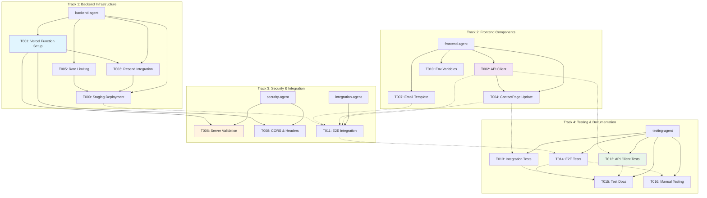

# Implementation Plan: Contact Form Resend Integration

## Executive summary

This plan details the implementation of Resend email integration for The Reiki Goddess Healing contact form. The integration leverages the existing enterprise-grade client-side security (SecurityValidator, FormRateLimit, SecurityMonitor) while adding Vercel Serverless Functions for secure, server-side email delivery.

**Key strategy**: Parallel implementation across 4 work streams using specialized agents to maximize velocity while maintaining quality.

### Integration points

- **Existing Security**: Already implemented and tested (95%+ coverage)
- **Frontend API Client**: New utility in packages/shared-utils
- **Vercel API Endpoint**: New serverless function in apps/main/api
- **React Email Templates**: New template system for branded emails
- **ContactPage Integration**: Update onSubmit handler to call real API

### Repository context

- **Monorepo**: npm workspaces with TypeScript project references
- **Existing Components**: FigmaContactForm (95% tested), SecurityValidator (98% tested)
- **Security Features**: Client-side validation, rate limiting (3/hour), sanitization
- **Testing**: Vitest + React Testing Library + Playwright (90%+ coverage)
- **Design**: Figma-first, 66px padding, Figtree font, #0205B7 brand blue

## Documentation dependencies

This implementation plan depends on documentation created in the documentation phase:

- `/docs/design/contact-resend-integration/api-architecture.md` - Resend API specs, endpoint design
- `/docs/design/contact-resend-integration/security-requirements.md` - Security patterns, validation
- `/docs/design/contact-resend-integration/workflow-integration.md` - Current implementation analysis
- `/docs/design/contact-resend-integration/testing-strategy.md` - Test requirements, mock patterns
- `/docs/project/ARCHITECTURE.md` - Repository patterns, security architecture

## Parallel work streams

### Track 1: Backend Infrastructure (backend-agent)

**Duration**: 6-8 hours
**Package**: apps/main/api
**Dependencies**: None (can start immediately)

Tasks:

- T001: Set up Vercel serverless function structure
- T003: Implement Resend API integration
- T005: Add server-side rate limiting
- T009: Deploy and test in Vercel staging

### Track 2: Frontend Components (frontend-agent)

**Duration**: 4-6 hours
**Package**: packages/shared-utils, packages/shared-components
**Dependencies**: None (can start immediately)

Tasks:

- T002: Create API client utility (submitContactForm)
- T004: Update ContactPage onSubmit handler
- T007: Build React Email template
- T010: Add environment variable configuration

### Track 3: Security & Integration (security-agent, integration-agent)

**Duration**: 4-5 hours
**Package**: apps/main, packages/shared-utils
**Dependencies**: T001, T002 (requires basic infrastructure)

Tasks:

- T006: Implement server-side validation (defense in depth)
- T008: Configure CORS and security headers
- T011: End-to-end integration testing

### Track 4: Testing & Documentation (testing-agent)

**Duration**: 6-8 hours
**Package**: All affected packages
**Dependencies**: T002, T003, T007 (requires implementations)

Tasks:

- T012: Write unit tests for API client
- T013: Write integration tests for email flow
- T014: Write E2E tests for complete submission
- T015: Update test documentation
- T016: Manual testing checklist execution

## Task details

### T001: Set up Vercel serverless function structure

**Track**: 1 (Backend)
**Priority**: High
**Estimated Effort**: 1-2 hours
**Assigned Agent**: backend-agent
**Target Package**: apps/main

**Description**: Create the foundational API endpoint structure for contact form submissions using Vercel's serverless function pattern.

**Technical Details**:

- Create `apps/main/api/contact.ts` with VercelRequest/VercelResponse types
- Set up CORS configuration for production and development origins
- Implement request method validation (POST only, handle OPTIONS for preflight)
- Add basic request body parsing and structure validation
- Set up environment variable access for RESEND_API_KEY
- Configure error response structure

**TypeScript Interfaces Required**:

```typescript
interface ContactRequest {
  firstName: string;
  lastName: string;
  email: string;
  phone: string;
  message: string;
  agreeToTerms: boolean;
}

interface ContactResponse {
  success: boolean;
  emailId?: string;
  error?: string;
}
```

**Security Considerations**:

- CORS restricted to production domain and localhost:5173
- API key stored in environment variables only
- No API key logging or exposure in errors

**Accessibility Requirements**: N/A (backend)

**Test Requirements**:

- Unit tests: Request validation, CORS headers, method filtering
- Coverage target: 90%

**Context Dependencies**:

- `/docs/design/contact-resend-integration/api-architecture.md` (lines 181-364)
- `ARCHITECTURE.md#security-architecture`

**Acceptance Criteria**:

- [ ] API endpoint responds to POST /api/contact
- [ ] CORS headers correctly set for allowed origins
- [ ] OPTIONS requests handled for preflight
- [ ] Invalid methods return 405
- [ ] Request body validated for structure
- [ ] TypeScript compilation with 0 errors
- [ ] Environment variables accessible

---

### T002: Create API client utility (submitContactForm)

**Track**: 2 (Frontend)
**Priority**: High
**Estimated Effort**: 2-3 hours
**Assigned Agent**: frontend-agent
**Target Package**: packages/shared-utils

**Description**: Build the frontend API client that communicates with the Vercel serverless function, with timeout handling and error classification.

**Technical Details**:

- Create `/packages/shared-utils/src/api/contact.ts`
- Implement `submitContactForm(data: FigmaContactFormData)` function
- Add 30-second timeout using AbortController
- Implement error classification (network, timeout, API errors)
- Map HTTP status codes to user-friendly messages
- Add request/response logging for debugging
- Export from packages/shared-utils index

**TypeScript Interfaces Required**:

```typescript
interface ContactFormResponse {
  success: boolean;
  messageId?: string;
  error?: string;
}

interface ContactFormError extends Error {
  status?: number;
  code?: string;
}
```

**Security Considerations**:

- Never expose API keys (backend only)
- Sanitized data already received from FigmaContactForm
- No sensitive data in error messages

**Accessibility Requirements**: N/A (utility function)

**Test Requirements**:

- Unit tests: true
- Coverage target: 95%
- Test scenarios:
  - Successful submission
  - Network timeout
  - Network offline
  - 400, 429, 500 responses
  - Malformed JSON

**Context Dependencies**:

- `/docs/design/contact-resend-integration/workflow-integration.md` (lines 416-527)
- `/docs/design/contact-resend-integration/api-architecture.md` (lines 422-463)

**Acceptance Criteria**:

- [ ] Function accepts FigmaContactFormData
- [ ] Returns ContactFormResponse on success
- [ ] Throws ContactFormError on failure
- [ ] 30-second timeout enforced
- [ ] User-friendly error messages for all status codes
- [ ] TypeScript compilation with 0 errors
- [ ] All tests passing
- [ ] 95%+ test coverage

---

### T003: Implement Resend API integration

**Track**: 1 (Backend)
**Priority**: High
**Estimated Effort**: 3-4 hours
**Assigned Agent**: backend-agent
**Target Package**: apps/main/api
**Requires Figma Extraction**: false

**Description**: Integrate Resend email SDK into the serverless function to send emails when contact form is submitted.

**Technical Details**:

- Install Resend SDK: `npm install resend`
- Initialize Resend client with API key from environment
- Implement email sending logic in contact.ts endpoint
- Add payload transformation (form data → Resend email structure)
- Implement error handling for Resend API errors
- Add email ID tracking in response
- Configure tags for email filtering (source: contact-form, environment: production)

**TypeScript Interfaces Required**:

```typescript
interface ResendPayload {
  from: string;
  to: string[];
  replyTo: string;
  subject: string;
  react: React.ReactNode;
  tags: { name: string; value: string }[];
}
```

**Security Considerations**:

- API key never exposed to client
- Rate limiting via Resend (2 req/sec, 100/day free tier)
- Error messages don't expose API details
- Validate email deliverability

**Accessibility Requirements**: N/A (backend)

**Test Requirements**:

- Unit tests: true
- Integration tests: true
- Coverage target: 90%
- Mock Resend SDK for testing

**Context Dependencies**:

- `/docs/design/contact-resend-integration/api-architecture.md` (lines 37-178)
- `/docs/design/contact-resend-integration/security-requirements.md` (lines 148-201)

**Acceptance Criteria**:

- [ ] Resend SDK installed and configured
- [ ] Email sending function implemented
- [ ] Form data correctly transformed to email payload
- [ ] Resend API errors handled gracefully
- [ ] Email ID returned on success
- [ ] Tags configured for filtering
- [ ] TypeScript compilation with 0 errors
- [ ] All tests passing
- [ ] Lint and type-check passing

---

### T004: Update ContactPage onSubmit handler

**Track**: 2 (Frontend)
**Priority**: High
**Estimated Effort**: 1 hour
**Assigned Agent**: frontend-agent
**Target Package**: packages/shared-components
**Requires Figma Extraction**: false

**Description**: Replace the console.log placeholder in ContactPage.tsx with the actual API client call.

**Technical Details**:

- Import submitContactForm from @reiki-goddess/shared-utils
- Update onSubmit handler in ContactPage.tsx (lines 76-80)
- Implement try/catch for error propagation
- Let FigmaContactForm handle success/error states
- Keep handler thin (no additional logic)

**TypeScript Interfaces Required**: None (using existing types)

**Security Considerations**: Data already sanitized by FigmaContactForm

**Accessibility Requirements**: N/A (no UI changes)

**Test Requirements**:

- Unit tests: true
- Integration tests: true
- Coverage target: 90%

**Context Dependencies**:

- `/docs/design/contact-resend-integration/workflow-integration.md` (lines 185-223)
- `packages/shared-components/src/pages/ContactPage.tsx:76-80`

**Acceptance Criteria**:

- [ ] submitContactForm imported and called
- [ ] Errors propagate to FigmaContactForm
- [ ] Success handled by FigmaContactForm
- [ ] No console.log statements remain
- [ ] TypeScript compilation with 0 errors
- [ ] All tests passing

---

### T005: Add server-side rate limiting

**Track**: 1 (Backend)
**Priority**: Medium
**Estimated Effort**: 2 hours
**Assigned Agent**: backend-agent
**Target Package**: apps/main/api

**Description**: Implement IP-based rate limiting on the server to complement client-side rate limiting.

**Technical Details**:

- Install rate limiting library (e.g., express-rate-limit or custom implementation)
- Configure: 3 requests per hour per IP address
- Handle X-Forwarded-For header for proxy environments
- Return HTTP 429 with retry-after header
- Log rate limit violations for monitoring

**TypeScript Interfaces Required**:

```typescript
interface RateLimitConfig {
  windowMs: number;
  max: number;
  message: string;
  standardHeaders: boolean;
}
```

**Security Considerations**:

- IP extraction from X-Forwarded-For (Vercel provides this)
- Prevent rate limit bypass via IP spoofing
- Log violations for security monitoring

**Accessibility Requirements**: N/A (backend)

**Test Requirements**:

- Unit tests: true
- Coverage target: 85%

**Context Dependencies**:

- `/docs/design/contact-resend-integration/security-requirements.md` (lines 242-281)
- `ARCHITECTURE.md#form-rate-limit`

**Acceptance Criteria**:

- [ ] Rate limiting enforced (3/hour/IP)
- [ ] HTTP 429 returned when exceeded
- [ ] Retry-after header included
- [ ] X-Forwarded-For handled correctly
- [ ] Rate limit violations logged
- [ ] TypeScript compilation with 0 errors
- [ ] All tests passing

---

### T006: Implement server-side validation (defense in depth)

**Track**: 3 (Security)
**Priority**: High
**Estimated Effort**: 2-3 hours
**Assigned Agent**: security-agent
**Target Package**: apps/main/api
**Dependencies**: T001

**Description**: Re-validate all inputs server-side using SecurityValidator to ensure defense in depth (never trust client).

**Technical Details**:

- Import SecurityValidator from @reiki-goddess/shared-utils
- Re-run all client-side validations on server
- Validate: required fields, email format, phone format, message length
- Check for high-risk content (SQL injection, XSS, email injection)
- Sanitize inputs even though client already did
- Return HTTP 400 with field-specific errors

**TypeScript Interfaces Required**: Using existing SecurityValidator types

**Security Considerations**:

- Never trust client validation
- Assume client can be bypassed
- Log security incidents server-side
- Block high-risk submissions

**Accessibility Requirements**: N/A (backend)

**Test Requirements**:

- Unit tests: true
- Coverage target: 95%
- Test all validation patterns

**Context Dependencies**:

- `/docs/design/contact-resend-integration/security-requirements.md` (lines 202-241)
- `packages/shared-utils/src/security/SecurityValidator.ts`

**Acceptance Criteria**:

- [ ] All client validations re-run on server
- [ ] Required field validation implemented
- [ ] Email and phone format validation
- [ ] High-risk content detection active
- [ ] SQL injection patterns blocked
- [ ] XSS patterns blocked
- [ ] HTTP 400 returned with field errors
- [ ] TypeScript compilation with 0 errors
- [ ] All tests passing

---

### T007: Build React Email template

**Track**: 2 (Frontend)
**Priority**: Medium
**Estimated Effort**: 2-3 hours
**Assigned Agent**: frontend-agent
**Target Package**: apps/main
**Requires Figma Extraction**: false

**Description**: Create a professional, brand-consistent email template using React Email for contact form submissions.

**Technical Details**:

- Install: `npm install react-email @react-email/components`
- Create `apps/main/emails/ContactEmailTemplate.tsx`
- Use React Email components (Html, Head, Body, Container, Section, Text, Hr, Heading)
- Apply brand styling: Figtree font, #0205B7 primary blue, #FFFBF5 cream background
- Include all form data: name, email, phone, message, timestamp
- Use inline styles for email client compatibility
- Format timestamp as human-readable date/time
- Add email footer with website link

**Shared Components Needed**: None (React Email components)

**Security Considerations**:

- Use sanitized data from form
- No JavaScript in email
- Safe HTML only

**Accessibility Requirements**:

- Semantic HTML structure
- Sufficient color contrast
- Clear hierarchy

**Test Requirements**:

- Unit tests: true
- Coverage target: 80%
- Test template rendering with sample data

**Context Dependencies**:

- `/docs/design/contact-resend-integration/api-architecture.md` (lines 644-845)
- `/docs/project/style-guide.md` (brand colors, typography)

**Acceptance Criteria**:

- [ ] Template created with React Email
- [ ] Brand colors applied (#0205B7, #FFFBF5)
- [ ] Figtree font used for headings
- [ ] All form fields displayed
- [ ] Timestamp formatted correctly
- [ ] Email footer included
- [ ] Template renders correctly in preview
- [ ] TypeScript compilation with 0 errors
- [ ] All tests passing

---

### T008: Configure CORS and security headers

**Track**: 3 (Security)
**Priority**: High
**Estimated Effort**: 1-2 hours
**Assigned Agent**: security-agent
**Target Package**: apps/main/api
**Dependencies**: T001

**Description**: Configure production-ready CORS policy and security headers for the API endpoint.

**Technical Details**:

- CORS: Allow only production domain and localhost:5173
- Headers: Content-Security-Policy, X-Content-Type-Options, X-Frame-Options
- Validate Origin header
- Handle preflight OPTIONS requests
- Add security headers to all responses
- Configure HTTPS redirect (production only)

**TypeScript Interfaces Required**:

```typescript
interface CORSConfig {
  allowedOrigins: string[];
  allowedMethods: string[];
  allowedHeaders: string[];
}
```

**Security Considerations**:

- Strict origin validation
- No wildcard CORS
- HTTPS enforced in production
- Security headers prevent common attacks

**Accessibility Requirements**: N/A (backend)

**Test Requirements**:

- Unit tests: true
- Coverage target: 90%

**Context Dependencies**:

- `/docs/design/contact-resend-integration/security-requirements.md` (lines 282-322)
- `ARCHITECTURE.md#security-headers-configuration`

**Acceptance Criteria**:

- [ ] CORS configured for production domain
- [ ] localhost:5173 allowed in development
- [ ] OPTIONS preflight handled
- [ ] Security headers added
- [ ] Origin header validated
- [ ] Unauthorized origins blocked
- [ ] TypeScript compilation with 0 errors
- [ ] All tests passing

---

### T009: Deploy and test in Vercel staging

**Track**: 1 (Backend)
**Priority**: Medium
**Estimated Effort**: 2 hours
**Assigned Agent**: backend-agent
**Target Package**: apps/main
**Dependencies**: T001, T003, T005, T006

**Description**: Deploy the serverless function to Vercel staging environment and validate functionality.

**Technical Details**:

- Configure Vercel project settings
- Add environment variables in Vercel dashboard (RESEND_API_KEY, CONTACT_EMAIL)
- Deploy to staging environment
- Test API endpoint with Postman/curl
- Verify email delivery
- Check Resend dashboard for email logs
- Monitor for errors
- Performance testing (response time)

**TypeScript Interfaces Required**: None

**Security Considerations**:

- Use staging-specific API key
- Don't send emails to production recipient
- Test rate limiting

**Accessibility Requirements**: N/A (backend)

**Test Requirements**:

- Integration tests: true
- Smoke tests after deployment

**Context Dependencies**:

- `/docs/design/contact-resend-integration/api-architecture.md` (lines 876-965)

**Acceptance Criteria**:

- [ ] Deployed to Vercel staging
- [ ] Environment variables configured
- [ ] API endpoint accessible
- [ ] Test email sent and received
- [ ] Resend dashboard shows delivery
- [ ] Response time < 3 seconds
- [ ] Rate limiting works
- [ ] No errors in Vercel logs

---

### T010: Add environment variable configuration

**Track**: 2 (Frontend)
**Priority**: Low
**Estimated Effort**: 30 minutes
**Assigned Agent**: frontend-agent
**Target Package**: apps/main

**Description**: Set up environment variable configuration for API endpoint URL across development and production.

**Technical Details**:

- Create `.env.example` with VITE_CONTACT_API_ENDPOINT
- Add `.env.local` to `.gitignore`
- Document environment variables in README
- Configure for development (localhost) and production (Vercel)
- Use import.meta.env for Vite access

**TypeScript Interfaces Required**: None

**Security Considerations**:

- Never commit `.env.local`
- No API keys in frontend env vars
- Document rotation process

**Accessibility Requirements**: N/A

**Test Requirements**:

- Test documentation: true

**Context Dependencies**:

- `/docs/design/contact-resend-integration/workflow-integration.md` (lines 548-565)

**Acceptance Criteria**:

- [ ] .env.example created
- [ ] .env.local in .gitignore
- [ ] Environment variable documented
- [ ] Works in development
- [ ] Works in production
- [ ] README updated

---

### T011: End-to-end integration testing

**Track**: 3 (Integration)
**Priority**: High
**Estimated Effort**: 2 hours
**Assigned Agent**: integration-agent
**Target Package**: All
**Dependencies**: T002, T004, T007, T009

**Description**: Validate the complete integration flow from form submission to email delivery.

**Technical Details**:

- Set up integration test environment
- Mock Resend API for testing
- Test complete flow: form fill → submit → API call → email
- Verify error handling for all failure modes
- Test rate limiting (client + server)
- Validate data transformation at each step
- Check email template rendering

**TypeScript Interfaces Required**: None

**Security Considerations**:

- Test security validations
- Verify sanitization at each layer
- Validate rate limiting

**Accessibility Requirements**: N/A

**Test Requirements**:

- Integration tests: true
- E2E tests: true
- Coverage target: Full workflow coverage

**Context Dependencies**:

- `/docs/design/contact-resend-integration/testing-strategy.md` (lines 361-503)
- `/docs/design/contact-resend-integration/workflow-integration.md` (lines 237-321)

**Acceptance Criteria**:

- [ ] Complete workflow tested
- [ ] All error paths validated
- [ ] Rate limiting verified
- [ ] Email delivery confirmed
- [ ] Data transformation validated
- [ ] All tests passing
- [ ] Integration test documentation updated

---

### T012: Write unit tests for API client

**Track**: 4 (Testing)
**Priority**: High
**Estimated Effort**: 3 hours
**Assigned Agent**: testing-agent
**Target Package**: packages/shared-utils
**Dependencies**: T002

**Description**: Comprehensive unit testing for the submitContactForm API client function.

**Technical Details**:

- Create `/packages/shared-utils/src/api/contact.test.ts`
- Test scenarios:
  - Successful submission
  - Network timeout (30s)
  - Network offline
  - HTTP 400, 429, 500 responses
  - Malformed JSON response
  - AbortController functionality
  - Error message mapping
- Mock fetch API
- Use vi.fn() for mocks

**TypeScript Interfaces Required**: None (testing)

**Security Considerations**: N/A

**Accessibility Requirements**: N/A

**Test Requirements**:

- Unit tests: true
- Coverage target: 95%

**Context Dependencies**:

- `/docs/design/contact-resend-integration/testing-strategy.md` (lines 99-220)

**Acceptance Criteria**:

- [ ] Test file created
- [ ] All scenarios tested
- [ ] Fetch API mocked correctly
- [ ] Error handling validated
- [ ] Timeout behavior verified
- [ ] 95%+ test coverage
- [ ] All tests passing
- [ ] Test documentation updated

---

### T013: Write integration tests for email flow

**Track**: 4 (Testing)
**Priority**: High
**Estimated Effort**: 3 hours
**Assigned Agent**: testing-agent
**Target Package**: packages/shared-components
**Dependencies**: T004

**Description**: Integration tests for ContactPage with email submission workflow.

**Technical Details**:

- Update `/packages/shared-components/src/pages/ContactPage.test.tsx`
- Test scenarios:
  - Form submission calls submitContactForm
  - Success shows success message
  - Success clears form
  - Error shows error message
  - Error preserves form data
  - Loading state during submission
  - Rate limit error handling
- Mock submitContactForm utility
- Use React Testing Library

**TypeScript Interfaces Required**: None (testing)

**Security Considerations**: N/A

**Accessibility Requirements**: Verify accessible error messages

**Test Requirements**:

- Integration tests: true
- Coverage target: 90%

**Context Dependencies**:

- `/docs/design/contact-resend-integration/testing-strategy.md` (lines 222-359)

**Acceptance Criteria**:

- [ ] All workflow scenarios tested
- [ ] Success/error paths validated
- [ ] Loading states verified
- [ ] Form data retention checked
- [ ] 90%+ test coverage
- [ ] All tests passing
- [ ] Test documentation updated

---

### T014: Write E2E tests for complete submission

**Track**: 4 (Testing)
**Priority**: Medium
**Estimated Effort**: 2-3 hours
**Assigned Agent**: testing-agent
**Target Package**: e2e
**Dependencies**: T011

**Description**: Playwright E2E tests for the complete user journey from form fill to confirmation.

**Technical Details**:

- Create `/e2e/email-submission.spec.ts`
- Test scenarios:
  - Happy path: fill form → submit → confirmation
  - Network error handling
  - Server error handling
  - Rate limit enforcement
  - Form validation
- Mock API responses using Playwright routes
- Verify DOM state at each step

**TypeScript Interfaces Required**: None (testing)

**Security Considerations**: Test XSS prevention, SQL injection blocks

**Accessibility Requirements**: Test keyboard navigation, screen reader labels

**Test Requirements**:

- E2E tests: true
- Coverage target: Complete user journeys

**Context Dependencies**:

- `/docs/design/contact-resend-integration/testing-strategy.md` (lines 505-603)

**Acceptance Criteria**:

- [ ] E2E test file created
- [ ] All user journeys tested
- [ ] API mocking implemented
- [ ] Success and error flows validated
- [ ] Accessibility tested
- [ ] All tests passing
- [ ] E2E documentation updated

---

### T015: Update test documentation

**Track**: 4 (Testing)
**Priority**: Low
**Estimated Effort**: 1 hour
**Assigned Agent**: testing-agent
**Target Package**: docs
**Dependencies**: T012, T013, T014

**Description**: Document all new tests, coverage metrics, and testing patterns for the integration.

**Technical Details**:

- Update `/docs/testing/TESTING_SUMMARY.md`
- Document new test files
- Add coverage metrics
- Explain mock strategies
- Document test execution commands
- Add troubleshooting guide

**TypeScript Interfaces Required**: None

**Security Considerations**: N/A

**Accessibility Requirements**: N/A

**Test Requirements**: Test documentation required: true

**Context Dependencies**:

- `/docs/design/contact-resend-integration/testing-strategy.md` (all)

**Acceptance Criteria**:

- [ ] TESTING_SUMMARY.md updated
- [ ] New tests documented
- [ ] Coverage metrics added
- [ ] Mock strategies explained
- [ ] Execution commands documented
- [ ] Troubleshooting guide added

---

### T016: Manual testing checklist execution

**Track**: 4 (Testing)
**Priority**: High
**Estimated Effort**: 2 hours
**Assigned Agent**: testing-agent (manual execution)
**Target Package**: All
**Dependencies**: T011, T014

**Description**: Execute comprehensive manual testing checklist to validate integration before production.

**Technical Details**:

- Execute all scenarios from testing-strategy.md manual testing section
- Test on Chrome, Firefox, Safari
- Test on mobile devices (iOS/Android)
- Test with slow network (throttling)
- Verify email delivery in real inbox
- Check email formatting across clients
- Validate error messages
- Test rate limiting
- Verify security features

**TypeScript Interfaces Required**: None

**Security Considerations**:

- Validate API key not exposed
- Test XSS prevention
- Test SQL injection blocks
- Verify rate limiting

**Accessibility Requirements**:

- Test keyboard navigation
- Test screen reader
- Verify WCAG 2.1 AA compliance

**Test Requirements**: Test documentation required: true

**Context Dependencies**:

- `/docs/design/contact-resend-integration/testing-strategy.md` (lines 973-1015)

**Acceptance Criteria**:

- [ ] All checklist items executed
- [ ] Cross-browser testing complete
- [ ] Mobile testing complete
- [ ] Email delivery verified
- [ ] Security validated
- [ ] Accessibility confirmed
- [ ] Results documented

---

## Agent orchestration plan



## Critical path

The longest sequence determining minimum completion time:

```
T001 (Vercel Setup, 2h)
  → T003 (Resend Integration, 4h)
    → T009 (Staging Deploy, 2h)
      → T011 (Integration Test, 2h)
        → T014 (E2E Tests, 3h)
          → T016 (Manual Testing, 2h)

Total Critical Path: ~15 hours
```

**Parallelization benefit**: With 4 agents working concurrently, estimated wall-clock time is 8-10 hours vs. 28-34 hours sequential.

## Resource requirements

### Agent types and counts

- **backend-agent**: 1 instance (Track 1)
- **frontend-agent**: 1 instance (Track 2)
- **security-agent**: 1 instance (Track 3, partial)
- **integration-agent**: 1 instance (Track 3, partial)
- **testing-agent**: 1 instance (Track 4)

**Maximum concurrent agents**: 4

### Figma extraction

Not required for this feature (no new UI components, only email template styling)

### Shared components

**Existing components to reuse**:

- FigmaContactForm (already built, 95% tested)
- SecurityValidator (already built, 98% tested)
- FormRateLimit (already built, 95% tested)
- SecurityMonitor (already built, 90% tested)
- ContactPage (exists, needs onSubmit update)

**New components to create**:

- ContactEmailTemplate (React Email component)
- submitContactForm (API client utility)
- /api/contact (Vercel serverless function)

## Repository integration

### Existing components to reuse

- **FigmaContactForm**: Already handles validation, sanitization, rate limiting, success/error states
- **SecurityValidator**: Multi-layer validation (SQL injection, XSS, email injection, medical terms)
- **FormRateLimit**: Client-side rate limiting (3/hour)
- **SecurityMonitor**: Security incident logging
- **ContactPage**: Main page composition (update onSubmit only)

### New components to create

1. **API Client** (`packages/shared-utils/src/api/contact.ts`)
   - Package: shared-utils
   - Purpose: Frontend API communication
   - Exports: submitContactForm, ContactFormResponse, ContactFormError

2. **Email Template** (`apps/main/emails/ContactEmailTemplate.tsx`)
   - Package: main app
   - Purpose: Branded email rendering
   - Uses: React Email components

3. **API Endpoint** (`apps/main/api/contact.ts`)
   - Package: main app
   - Purpose: Serverless function for email sending
   - Uses: Resend SDK

### Security patterns to apply

From ARCHITECTURE.md:

- **SecurityValidator**: Already implemented, re-use on server
- **FormRateLimit**: Client-side (exists), add server-side IP-based
- **SecurityMonitor**: Client-side (exists), add server-side logging
- **CORS Configuration**: Apply from security headers pattern
- **API Key Management**: Environment variables only

### Test documentation required

Per testing strategy, if tests fail:

- Document in `/testing/api/contact.md`
- Document in `/testing/components/ContactPage.md`
- Never modify tests to match broken behavior
- Tests represent requirements

## Success metrics

### Functional requirements

- ✅ Form submission sends email via Resend
- ✅ User receives success confirmation
- ✅ Business owner receives email in inbox
- ✅ Email includes all form data
- ✅ Reply-to address is user's email
- ✅ Email template matches brand design

### Technical requirements

- ✅ TypeScript compilation: 0 errors
- ✅ Test coverage > 90% per package
- ✅ All tests passing (unit + integration + E2E)
- ✅ Lint and type-check passing
- ✅ Build succeeds across all packages

### Performance requirements

- ✅ API response time < 3 seconds (p95)
- ✅ Email delivery < 10 seconds
- ✅ Bundle size increase < 5KB
- ✅ No performance regression in form

### Security requirements

- ✅ API key never exposed to client
- ✅ All forms validated server-side
- ✅ Rate limiting enforced (client + server)
- ✅ CORS properly configured
- ✅ Security headers applied
- ✅ No PII in logs

### Accessibility requirements

- ✅ WCAG 2.1 AA compliant error messages
- ✅ Screen reader accessible
- ✅ Keyboard navigation maintained
- ✅ Clear error feedback

### User experience requirements

- ✅ Loading state visible during submission
- ✅ Success message clear and reassuring
- ✅ Error messages helpful and actionable
- ✅ Form data preserved on error
- ✅ Form resets on success

## Risk assessment

### Risk 1: Resend API rate limits exceeded

**Impact**: High
**Probability**: Low
**Mitigation**:

- Free tier: 3,000 emails/month, 100/day
- Expected volume: 300-600/month
- Monitor usage in Resend dashboard
- Set up alerts at 80% quota
- Upgrade plan ($20/month) if approaching limits
- Client-side rate limiting prevents abuse

### Risk 2: Email deliverability issues

**Impact**: High
**Probability**: Medium
**Mitigation**:

- Verify domain in Resend dashboard
- Configure SPF, DKIM, DMARC records
- Test with multiple email providers
- Monitor bounce rates
- Provide alternative contact methods (phone, email link)
- Log email IDs for support tracking

### Risk 3: API endpoint timeouts

**Impact**: Medium
**Probability**: Low
**Mitigation**:

- 30-second client timeout
- Optimize email template rendering
- Use async email sending
- Monitor response times
- Add retry logic with exponential backoff
- Graceful degradation message

### Risk 4: Security vulnerabilities

**Impact**: Critical
**Probability**: Low
**Mitigation**:

- Defense in depth: client + server validation
- SecurityValidator blocks common attacks
- Server-side rate limiting
- CORS restricts origins
- API key in environment only
- Regular security audits
- Comprehensive testing

### Risk 5: Test failures blocking deployment

**Impact**: Medium
**Probability**: Medium
**Mitigation**:

- Write tests alongside implementation
- Maintain 90%+ coverage requirement
- Document test failures (don't modify tests)
- Fix code to match test requirements
- Run full test suite before PRs
- E2E tests in staging before production

### Risk 6: Monorepo build conflicts

**Impact**: Medium
**Probability**: Low
**Mitigation**:

- TypeScript project references configured
- Independent package builds
- Clear dependency graph
- Test packages in isolation
- Incremental builds
- CI/CD validates all packages

## Rollback strategy

### Level 1: Immediate revert (< 5 minutes)

**Trigger**: Critical production issue, emails not sending

**Action**:

1. Revert ContactPage.tsx onSubmit to console.log
2. Deploy rollback to production
3. Add banner: "Contact form temporarily unavailable"
4. Direct users to email link and phone

**Implementation**:

```typescript
// apps/main/src/pages/ContactPage.tsx
onSubmit={async (data) => {
  console.log("Contact form submitted:", data);
  await new Promise((resolve) => setTimeout(resolve, 2000));
}}
```

### Level 2: Partial rollback (< 30 minutes)

**Trigger**: Non-critical issues, degraded performance

**Action**:

1. Disable Resend integration, keep form validation
2. Log submissions to console for manual follow-up
3. Investigate and fix issue
4. Re-deploy with fix

### Level 3: Feature flag disable (< 1 minute)

**Trigger**: Suspected security issue, high error rate

**Action**:

1. Add feature flag for email integration
2. Disable via environment variable
3. Form still works but logs instead of emails
4. Investigate thoroughly before re-enabling

### Alternative contact methods

Always available as fallback:

- **Email link**: `mailto:thereikigoddesshealing@gmail.com`
- **Phone**: Display prominently
- **Contact info cards**: Already on page
- **Social media**: Instagram, Facebook links

### Recovery testing

Before re-deploying after rollback:

1. Run full test suite
2. Deploy to staging
3. Manual testing checklist
4. Monitor for 24 hours
5. Gradual rollout (if possible)

## Integration points with existing components

### FigmaContactForm component

**Location**: `/packages/shared-components/src/FigmaContactForm/FigmaContactForm.tsx`

**Current state**:

- 95% test coverage
- Complete client-side validation
- Rate limiting (3/hour)
- Security monitoring
- Success/error state handling

**Integration changes**:

- **No changes to component itself**
- Component already accepts `onSubmit: (data: FigmaContactFormData) => Promise<void>`
- All validation, sanitization, rate limiting stays in component
- Success and error handling already implemented

**Why minimal changes**: Form is production-ready, just needs real API call instead of console.log

### ContactPage component

**Location**: `/packages/shared-components/src/pages/ContactPage.tsx`

**Current state**:

- Lines 76-80: Placeholder onSubmit with console.log
- 85% test coverage
- Complete page layout

**Integration changes**:

```typescript
// Before
onSubmit={async (data) => {
  console.log("Contact form submitted:", data);
  await new Promise((resolve) => setTimeout(resolve, 2000));
}}

// After
onSubmit={async (data) => {
  await submitContactForm(data);
}}
```

**Why minimal changes**: FigmaContactForm handles all UI feedback, ContactPage just needs to call API

### SecurityValidator utility

**Location**: `/packages/shared-utils/src/security/SecurityValidator.ts`

**Current state**:

- 98% test coverage
- Multi-layer validation
- SQL injection, XSS, email injection prevention
- Medical term blocking
- Input sanitization

**Integration changes**:

- **Import on server**: Use same validator in API endpoint
- **No code changes**: Re-use existing validation logic
- **Defense in depth**: Client validation + server validation

**Why reuse**: Already tested, proven patterns, consistent validation

## Documentation update requirements

### Phase 1: Implementation documentation

- [ ] Update `/docs/project/ARCHITECTURE.md` with Resend pattern
- [ ] Document API endpoint in `/docs/api/contact.md`
- [ ] Add email template documentation
- [ ] Update package READMEs

### Phase 2: Testing documentation

- [ ] Update `/docs/testing/TESTING_SUMMARY.md`
- [ ] Document new test files and coverage
- [ ] Add mock strategies to testing guide
- [ ] Update E2E test documentation

### Phase 3: Operational documentation

- [ ] Create runbook for common issues
- [ ] Document monitoring and alerting
- [ ] Add troubleshooting guide
- [ ] Document environment variables
- [ ] Add deployment procedures

### Phase 4: User-facing documentation

- [ ] Update privacy policy (data handling)
- [ ] Document contact form behavior
- [ ] Add FAQ if needed
- [ ] Update support documentation

## Estimated timeline

### Parallel execution (4 agents)

- **Day 1** (8 hours):
  - Track 1: T001, T003, T005 (backend setup + Resend)
  - Track 2: T002, T004, T007 (frontend + template)
  - Track 3: T006, T008 (security)
  - Track 4: T012, T013 (tests)

- **Day 2** (8 hours):
  - Track 1: T009 (deployment)
  - Track 2: T010 (env vars)
  - Track 3: T011 (integration)
  - Track 4: T014, T015, T016 (E2E, docs, manual testing)

**Total: 2 days (16 hours wall-clock time)**

### Sequential execution (1 developer)

- Backend: 10 hours
- Frontend: 6 hours
- Security: 6 hours
- Testing: 10 hours

**Total: 4 days (32 hours)**

**Time savings with parallel approach: 50%**

## Next steps

### Immediate actions (before starting implementation)

1. **Review this plan** with development team
2. **Create Resend account** and verify domain
3. **Set up Vercel project** for serverless functions
4. **Generate API keys** (dev and production)
5. **Create feature branch**: `feat/contact-resend-integration`

### Agent deployment order

1. **Start immediately** (parallel):
   - backend-agent: T001
   - frontend-agent: T002

2. **After 2-3 hours** (dependent):
   - security-agent: T006, T008
   - Continue frontend-agent: T004, T007
   - Continue backend-agent: T003, T005

3. **After 6-8 hours** (integration):
   - integration-agent: T011
   - backend-agent: T009
   - testing-agent: T012, T013

4. **Final phase** (validation):
   - testing-agent: T014, T015, T016

### Prerequisites

- [ ] Resend account created
- [ ] Domain verified in Resend
- [ ] API keys generated
- [ ] Vercel project configured
- [ ] Environment variables documented
- [ ] Feature branch created
- [ ] Team review complete

### Success criteria for go-live

- [ ] All acceptance criteria met
- [ ] Test coverage > 90%
- [ ] All tests passing
- [ ] Security audit complete
- [ ] Staging deployment successful
- [ ] Manual testing complete
- [ ] Documentation updated
- [ ] Rollback plan tested
- [ ] Team approval

---

**Document Version**: 1.0
**Created**: 2025-10-02
**Status**: Ready for Review
**Estimated Effort**: 28-34 hours (sequential) / 14-18 hours (parallel)
**Risk Level**: Low (well-isolated, comprehensive rollback plan)
**Business Value**: High (enables core contact functionality)
