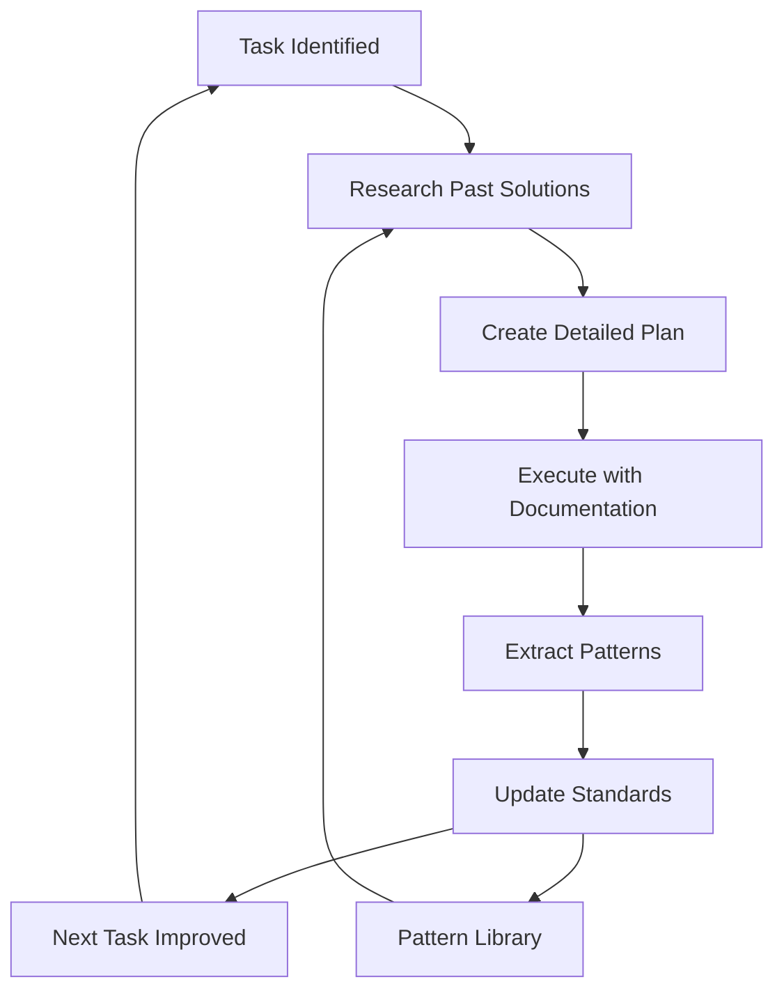
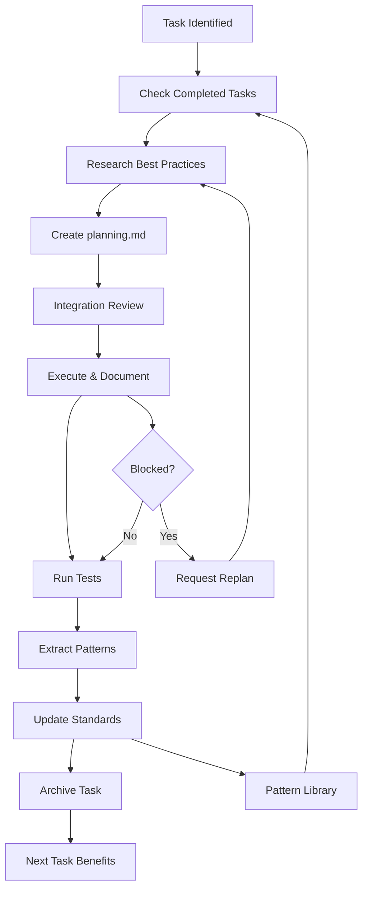
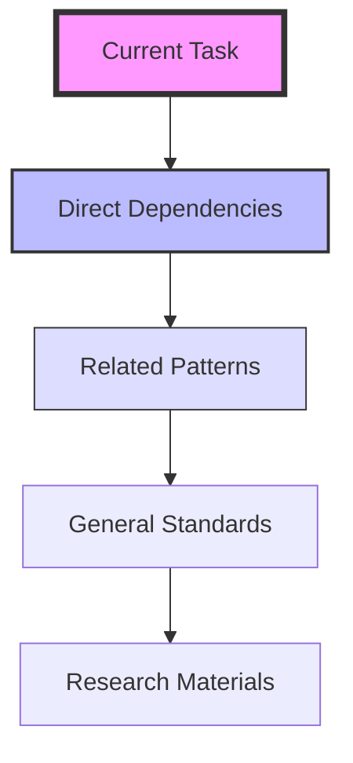

# Enhanced Learning Loop Protocol - Complete Implementation Guide

## Table of Contents

1. [Core Concept](#core-concept)
2. [Directory Structure](#directory-structure)
3. [Task Lifecycle](#task-lifecycle)
4. [Document Templates](#document-templates)
5. [Agent Workflows](#agent-workflows)
6. [Pattern Extraction System](#pattern-extraction-system)
7. [Context Management](#context-management)
8. [Progress Tracking](#progress-tracking)
9. [Implementation Timeline](#implementation-timeline)
10. [Success Metrics](#success-metrics)

---

## Core Concept

The Enhanced Learning Loop Protocol transforms your development process into a self-improving system where every task contributes to collective knowledge, making future tasks faster and more reliable.

### Key Innovations



**Core Principles:**

1. **Isolation**: Each task has its own context folder
2. **Learning**: Successful patterns become templates
3. **Memory**: System remembers what works and what doesn't
4. **Evolution**: Each iteration is better than the last

---

## Directory Structure

### Complete Learning Loop Infrastructure

```bash
project/
├── tasks/                          # 🎯 TASK-SPECIFIC CONTEXT
│   ├── current/                    # Active tasks only
│   │   └── task-001-fastapi-setup/
│   │       ├── planning.md         # Agent's research & plan
│   │       ├── execution.md        # Orchestrator's implementation log
│   │       ├── validation.md       # Test results & metrics
│   │       └── learnings.md        # Patterns extracted
│   │
│   ├── completed/                  # Archived for reference
│   │   └── [moved here after completion]
│   │
│   └── patterns/                   # Extracted successful patterns
│       ├── backend-patterns.md
│       ├── frontend-patterns.md
│       └── integration-patterns.md
│
├── standards/                      # 📚 CENTRALIZED REFERENCE HUB
│   ├── README.md                   # Index of all standards
│   ├── CODING_STANDARDS.md         # Universal coding standards
│   ├── BEST_PRACTICES.md           # General best practices
│   ├── SECURITY_GUIDELINES.md      # Security requirements
│   ├── PERFORMANCE_PATTERNS.md     # Performance optimization patterns
│   ├── TESTING_REQUIREMENTS.md     # Testing standards
│   │
│   ├── backend/                    # Backend-specific standards
│   │   ├── FASTAPI_PATTERNS.md     # FastAPI best practices
│   │   ├── ENDPOINT_TEMPLATE.py    # Template for endpoints
│   │   ├── LITELLM_CONFIG.md       # LiteLLM configuration patterns
│   │   ├── REDIS_PATTERNS.md       # Redis caching patterns
│   │   ├── ERROR_HANDLING.md       # Error handling standards
│   │   └── proven-solutions/       # Working code examples
│   │       ├── endpoint-pattern-v2.py
│   │       ├── redis-cache-v1.py
│   │       └── error-handler-v1.py
│   │
│   ├── frontend/                   # Frontend-specific standards
│   │   ├── REACT_PATTERNS.md       # React component patterns
│   │   ├── COMPONENT_TEMPLATE.tsx  # Component template
│   │   ├── TYPESCRIPT_RULES.md     # TypeScript standards
│   │   ├── TAILWIND_GUIDE.md       # Tailwind styling patterns
│   │   ├── ACCESSIBILITY.md        # A11y requirements
│   │   └── proven-solutions/
│   │       ├── subnet-list-v1.tsx
│   │       └── api-client-v1.ts
│   │
│   ├── infrastructure/             # Infrastructure standards
│   │   ├── DOCKER_STANDARDS.md     # Docker best practices
│   │   ├── K8S_PATTERNS.md         # Kubernetes patterns
│   │   ├── CI_CD_STANDARDS.md      # CI/CD requirements
│   │   ├── GIT_WORKFLOW.md         # Git commit standards
│   │   └── proven-solutions/
│   │       ├── dockerfile-optimized
│   │       └── github-actions-v1.yml
│   │
│   └── templates/                  # Reusable templates
│       ├── endpoint.py             # FastAPI endpoint template
│       ├── component.tsx           # React component template
│       ├── test_unit.py            # Unit test template
│       ├── test_integration.py     # Integration test template
│       └── dockerfile              # Dockerfile template
│
├── progress/                       # 📊 LIGHTWEIGHT PROGRESS TRACKING
│   ├── dashboard.md                # Current sprint status
│   ├── dependencies.md             # Task dependency graph
│   └── blockers.md                 # Active blockers & solutions
│
└── research/                       # 🔬 RESEARCH RESERVOIR
    ├── bittensor-docs/             # Official documentation
    ├── implementation-examples/     # Working examples
    └── api-patterns/               # Successful API designs
```

---

## Task Lifecycle

### Complete Task Flow with Learning Integration



### Task States

| State      | Location                               | Description                 |
| ---------- | -------------------------------------- | --------------------------- |
| Planning   | `tasks/current/task-XXX/planning.md`   | Research and planning phase |
| Executing  | `tasks/current/task-XXX/execution.md`  | Active implementation       |
| Validating | `tasks/current/task-XXX/validation.md` | Testing and verification    |
| Learning   | `tasks/current/task-XXX/learnings.md`  | Pattern extraction          |
| Completed  | `tasks/completed/task-XXX/`            | Archived for reference      |

---

## Document Templates

### Planning Document Template

````markdown
# Task: [Descriptive Name]

Date: [ISO Date]
Agent: [Agent Name]
Estimated Effort: [Hours]

## Context Review

### Previous Attempts

- [Reference to similar completed tasks]
- [Key learnings applied]
- [Patterns being reused]

### Standards Applied

- `standards/backend/FASTAPI_PATTERNS.md#section`: [How it's used]
- `standards/backend/proven-solutions/endpoint-v1.py`: [Pattern being reused]

## Research Findings

### Key Insights

1. [Critical discovery that shapes approach]
2. [Best practice from research/]
3. [Performance consideration]

### External References

- [Documentation links]
- [Implementation examples]

## Implementation Approach

[2-3 paragraphs explaining WHY this approach was chosen based on research and past learnings]

## Detailed Plan

### Phase 1: [Foundation/Setup]

**Objective**: [Clear, measurable goal]
**Time Estimate**: [X] minutes
**Standards Reference**: `standards/backend/[specific-file]#section`

**File**: `src/api/endpoints.py`
**Implementation**:

```python
# COMPLETE, WORKING CODE - Ready to copy/paste
from fastapi import FastAPI, HTTPException
from typing import Optional
import redis.asyncio as redis

# Implementation based on proven pattern
# ... complete code ...
```
````

**Success Criteria**:

- [ ] Endpoint responds with 200 status
- [ ] Redis caching implemented
- [ ] Error handling in place
- [ ] Passes linting

### Phase 2: [Core Feature]

[Continue with same detailed structure]

## Risk Mitigation

| Risk          | Likelihood | Impact | Mitigation         | Reference                             |
| ------------- | ---------- | ------ | ------------------ | ------------------------------------- |
| Redis timeout | Medium     | High   | Connection pooling | `standards/backend/REDIS_PATTERNS.md` |

## Dependencies

- **Must complete after**: [task-id or None]
- **Blocks**: [task-id]
- **External services**: [Redis, PostgreSQL, etc.]

## Validation Checklist

- [ ] All code examples are complete and runnable
- [ ] File paths are specific and correct
- [ ] Standards references are accurate
- [ ] Success criteria are measurable

````

### Execution Document Template

```markdown
# Execution Log: [Task Name]
Date Started: [ISO Date]
Orchestrator: @orchestrator
Plan Reference: ./planning.md

## Pre-Flight Checklist
- [x] Dependencies ready
- [x] Standards reviewed
- [x] Environment prepared
- [x] Previous similar tasks reviewed

## Implementation Log

### [Timestamp] - Phase 1 Started
**Plan Step**: Phase 1 from planning.md
**Actual Implementation**:
```python
# Code as actually implemented
# May differ from plan based on reality
````

**Deviation from Plan**: [If any, explain why]
**Result**: ✅ Success / ⚠️ Partial / ❌ Failed
**Notes**: [Discoveries during implementation]

### [Timestamp] - Blocker Encountered

**Issue**: [Description]
**Solution Attempted**: [What you tried]
**Resolution**: [How it was solved]
**Pattern Identified**: [Reusable solution]

### [Timestamp] - Phase 1 Complete

**Metrics**:

- Time Taken: 15 minutes (est: 30 minutes)
- Lines of Code: 125
- Tests Passing: 5/5
- Coverage: 92%

## Patterns Discovered

### Pattern 1: Async Redis Connection Pool

**Context**: High-frequency cache operations
**Solution**: Reusable connection pool pattern

```python
# Pattern code that worked well
redis_pool = redis.ConnectionPool(
    host='localhost',
    port=6379,
    decode_responses=True,
    max_connections=50
)
```

**Metrics**: 40% latency reduction
**Add to**: `standards/backend/proven-solutions/redis-pool-v1.py`

## Next Steps

- [ ] Task XXX ready for planning
- [ ] Update standards with new pattern
- [ ] Request re-plan for [component] due to [discovery]

## Lessons Learned

- [What worked better than expected]
- [What took longer than expected]
- [What should be done differently next time]

````

### Learnings Document Template

```markdown
# Learnings: [Task Name]
Date: [ISO Date]
Task Duration: [Actual time]
Success Rate: [Percentage of plan that worked]

## Successful Patterns

### Pattern: [Descriptive Name]
**What Worked**: [Specific approach]
**Why It Worked**: [Analysis]
**Reusability**: High/Medium/Low
**Performance Impact**: [Metrics]
**Recommendation**: Add to `standards/[category]/proven-solutions/`

## Failed Approaches

### Anti-Pattern: [What Didn't Work]
**What Failed**: [Specific approach]
**Why It Failed**: [Root cause]
**Time Lost**: [Duration]
**Alternative**: [What to do instead]
**Recommendation**: Document in `standards/anti-patterns/`

## Time Analysis
| Phase | Estimated | Actual | Variance | Reason |
|-------|-----------|--------|----------|--------|
| Setup | 30 min | 15 min | -50% | Reused pattern |
| Core | 60 min | 75 min | +25% | Unexpected complexity |

## Dependencies Discovered
- [Component A] must exist before [Component B]
- [Service X] configuration affects [Service Y]

## Recommendations for Future Tasks
1. [Specific improvement]
2. [Process optimization]
3. [Tool or library to investigate]

## Update Checklist
- [ ] Patterns added to standards/
- [ ] Anti-patterns documented
- [ ] Dashboard updated
- [ ] Dependencies noted
````

---

## Agent Workflows

### Research Agent Workflow (Strategists)

````markdown
## RESEARCH AGENT WORKFLOW

### Step 1: Context Gathering (ALWAYS FIRST)

```bash
# Check for previous attempts on similar tasks
1. Search tasks/completed/ for similar task names
2. Read any relevant execution.md and learnings.md
3. Note what failed previously and why
```
````

### Step 2: Standards Review

```bash
# Load relevant standards
1. Check standards/README.md for applicable standards
2. Read domain-specific standards (e.g., standards/backend/)
3. Review proven-solutions/ for working code
```

### Step 3: Research Enhancement

```bash
# Augment with fresh research
1. Search research/ reservoir for relevant docs
2. Use web_search for latest best practices
3. Validate approach against multiple sources
```

### Step 4: Planning Document Creation

```bash
# Create tasks/current/task-XXX-name/planning.md
- Use planning template
- Include concrete examples
- Specify exact implementations
- Provide realistic time estimates based on past tasks
```

### Context Priority for Research Agents

1. **Immediate**: Current task's previous execution notes
2. **Primary**: Directly applicable standards and patterns
3. **Secondary**: Similar completed tasks (max 3)
4. **Reference**: General research reservoir

````

### Orchestrator Workflow (Executor)

```markdown
## ORCHESTRATOR WORKFLOW

### Step 1: Pre-Execution Review
```bash
# Gather context without overload
1. Read progress/dashboard.md for current sprint status
2. Check progress/dependencies.md for task readiness
3. Load specific task planning: tasks/current/task-XXX/planning.md
4. Quick scan of applicable standards/ (not deep read)
````

### Step 2: Execution with Documentation

```bash
# Create/Update tasks/current/task-XXX/execution.md
- Document each implementation step
- Note any deviations from plan
- Track time and metrics
- Identify patterns as they emerge
```

### Step 3: Post-Execution Learning

```bash
# Extract learnings immediately
1. Create tasks/current/task-XXX/learnings.md
2. Update standards/ with new patterns
3. Move successful code to proven-solutions/
4. Update progress/dashboard.md
```

### Step 4: Trigger Next Cycle

```bash
# Call out to agents
"@backend-strategist: Task complete. See execution notes at
tasks/current/task-001/execution.md. Please plan task-002
based on these learnings."
```

### Context Priority for Orchestrator

1. **Immediate**: Current task's planning.md
2. **Primary**: Progress dashboard and dependencies
3. **Secondary**: Specific standard for current implementation
4. **Minimal**: Previous execution logs (only if blocked)

````

---

## Pattern Extraction System

### Pattern Identification Process

```mermaid
graph LR
    A[Task Complete] --> B{Worked Well?}
    B -->|Yes| C[Extract Pattern]
    B -->|No| D[Document Anti-Pattern]
    C --> E[Validate Pattern]
    E --> F[Add to Standards]
    F --> G[Update Templates]
    D --> H[Add to Anti-Patterns]
    H --> I[Update Guidelines]
````

### Pattern Quality Criteria

```markdown
## What Makes a Good Pattern?

### ✅ Pattern Worthy

- Solved a problem elegantly
- Improved performance significantly (>20%)
- Reduced code complexity
- Increased reliability
- Saved development time

### ❌ Not Pattern Worthy

- One-off solutions
- Hacky workarounds
- Untested approaches
- Context-specific fixes
- Temporary solutions
```

### Pattern Documentation Format

````markdown
## Pattern: [Descriptive Name]

### Context

When to use this pattern:

- [Specific situation]
- [Problem it solves]
- [Performance requirements]

### Solution

```python
# Complete, working code
def pattern_implementation():
    """
    Documentation explaining the pattern
    """
    # Implementation details
    pass
```
````

### Metrics

- Performance: [Specific improvements]
- Reliability: [Error rate reduction]
- Development Speed: [Time saved]

### Usage Example

```python
# How to apply this pattern
from standards.backend.proven_solutions import pattern_name

result = pattern_name.apply(data)
```

### References

- Task: `completed/task-XXX/`
- Tests: `tests/test_pattern.py`
- Benchmarks: [Performance data]

### Variations

- [Variation 1]: [When to use]
- [Variation 2]: [Different context]

````

### Pattern Categories

```bash
standards/
├── proven-solutions/        # Tested and validated
│   ├── gold-standard/      # 100% success rate, use always
│   ├── recommended/        # 80%+ success rate
│   └── experimental/       # New patterns being tested
│
├── anti-patterns/          # What to avoid
│   ├── performance/        # Slow approaches
│   ├── reliability/        # Unreliable patterns
│   └── complexity/         # Over-engineered solutions
│
└── templates/              # Starting points
    ├── basic/              # Simple implementations
    ├── advanced/           # Complex patterns
    └── specialized/        # Domain-specific
````

---

## Context Management

### Context Isolation Rules

```markdown
## Preventing Context Contamination

### Task Isolation

Each task maintains its own context:

- Never mix documentation between tasks
- Each task folder is self-contained
- Dependencies explicitly declared
- No implicit knowledge assumptions

### Context Limits by Agent Type

#### Research Agents (Strategists)

- Read maximum 3 completed task folders
- Focus on patterns, not full implementations
- Extract principles, not copy code
- Time limit: 10 minutes research per task

#### Execution Agent (Orchestrator)

- One task at a time
- Reference standards only for specific sections
- Don't read all historical tasks
- Focus on current planning.md

#### Analysis Agent (Integration)

- Read all current plans
- Identify conflicts only
- Don't execute or modify
- Output specific issues
```

### Context Hierarchy



---

## Progress Tracking

### Dashboard Structure

```markdown
# Progress Dashboard

Last Updated: [Auto-timestamp]

## Current Sprint: Week [X]

Progress: ████████░░ 80%

## Sprint Goals

- [ ] Complete backend API (12 tasks)
- [ ] Implement frontend UI (8 tasks)
- [ ] Security hardening (5 tasks)
- [ ] Deploy to production (3 tasks)

## Active Tasks

| Task ID  | Name           | Status         | Agent               | Started | Blocker             |
| -------- | -------------- | -------------- | ------------------- | ------- | ------------------- |
| task-001 | FastAPI Base   | 🔄 In Progress | @orchestrator       | 2h ago  | None                |
| task-002 | LiteLLM Config | 📋 Planned     | @backend-strategist | -       | Waiting on task-001 |
| task-003 | Redis Cache    | 📋 Planned     | -                   | -       | Waiting on task-002 |

## Completed This Sprint

| Task ID  | Name          | Duration | Patterns Extracted |
| -------- | ------------- | -------- | ------------------ |
| task-000 | Project Setup | 30 min   | 2                  |

## Key Metrics

- Tasks Completed: 12/28 (43%)
- Success Rate: 92%
- Avg Time vs Estimate: 0.8x (faster!)
- Patterns Extracted: 7
- Anti-Patterns Documented: 3
- Code Coverage: 87%
- Performance: 250 RPS (target: 350)

## Velocity Trends
```

Week 1: ████ 4 tasks
Week 2: ████████ 8 tasks
Week 3: ████████████ 12 tasks (projected)

```

## Recent Learnings
1. FastAPI async pattern reduces latency by 40%
2. LiteLLM connection pooling critical for performance
3. Redis TTL of 5 minutes optimal for subnet data

## Blockers
- [ ] Rate limiting coordination between services
- [ ] Database migration strategy unclear

## Next Actions
1. Complete task-001 implementation
2. Plan tasks 004-006
3. Review integration points
4. Extract patterns from completed tasks
```

### Metrics to Track

```markdown
## Essential Metrics

### Productivity Metrics

- Tasks completed per day
- Actual vs estimated time
- Patterns extracted per task
- Code reuse percentage

### Quality Metrics

- Test coverage
- Bug rate
- Performance benchmarks
- Security scan results

### Learning Metrics

- Patterns created
- Anti-patterns documented
- Standards updated
- Time saved from reuse

### System Health

- Build success rate
- Deploy frequency
- Rollback frequency
- Incident count
```

---

## Implementation Timeline

### Week 1: Foundation and Learning Setup

```markdown
## Week 1 Checklist

### Day 1-2: Infrastructure

- [ ] Create directory structure
- [ ] Initialize git repository
- [ ] Set up standards templates
- [ ] Create agent configurations

### Day 3-4: First Learning Cycle

- [ ] Plan first simple task
- [ ] Execute with documentation
- [ ] Extract first patterns
- [ ] Update standards

### Day 5: Review and Optimize

- [ ] Analyze first week metrics
- [ ] Identify process improvements
- [ ] Update templates based on experience
- [ ] Plan next week's tasks
```

### Week 2-3: Rapid Development

```markdown
## Week 2-3: Building Momentum

### Daily Routine

Morning (2 hours):

- Review dashboard
- Plan 3-5 tasks
- Run integration analysis

Afternoon (4 hours):

- Execute priority tasks
- Document continuously
- Update execution.md

Evening (1 hour):

- Extract patterns
- Update standards
- Archive completed tasks

### Weekly Goals

- Complete 15-20 tasks
- Extract 5+ patterns
- Achieve 80% code coverage
- Reduce average task time by 20%
```

### Week 4: Optimization and Scaling

```markdown
## Week 4: System Maturity

### Optimization Focus

- Pattern library comprehensive
- 90% of tasks use existing patterns
- Average task time reduced by 50%
- Anti-patterns well documented

### Scaling Preparation

- Production deployment ready
- Monitoring configured
- Documentation complete
- Team handoff possible
```

---

## Success Metrics

### Learning Loop Effectiveness

```markdown
## How to Measure Success

### Immediate Indicators (Daily)

✅ Task completion rate > 90%
✅ Patterns extracted per day > 1
✅ No repeated failures
✅ Documentation complete for all tasks

### Short-term Success (Weekly)

✅ Average task time decreasing
✅ Pattern reuse increasing
✅ Test coverage improving
✅ Fewer blockers encountered

### Long-term Success (Monthly)

✅ 50%+ reduction in development time
✅ 90%+ code coverage
✅ Zero critical bugs in production
✅ Complete pattern library for domain

### Red Flags to Address

❌ Same error occurring 3+ times
❌ No patterns extracted in 5 tasks
❌ Task estimates consistently wrong by >50%
❌ Standards not being referenced
❌ Completed tasks not archived
```

### ROI Calculation

```markdown
## Return on Investment

### Time Investment

- Initial setup: 4 hours
- Learning curve: 8 hours
- Daily overhead: 30 minutes
- **Total first week**: 20 hours

### Time Savings

- Week 2: Save 5 hours (patterns reused)
- Week 3: Save 10 hours (library growing)
- Week 4: Save 15 hours (system mature)
- **Total saved by week 4**: 30 hours

### Net Benefit

- Break-even: Week 3
- ROI after 1 month: 150%
- ROI after 3 months: 400%+
```

---

## Continuous Improvement

### Weekly Retrospective Template

```markdown
# Weekly Retrospective: Week [X]

## Metrics Review

- Tasks Completed: X
- Patterns Extracted: Y
- Average Task Time: Z hours
- Success Rate: N%

## What Went Well

1. [Success story]
2. [Efficient pattern]
3. [Process improvement]

## What Didn't Go Well

1. [Failure or delay]
2. [Repeated issue]
3. [Process breakdown]

## Patterns to Promote

- [Pattern name]: Move from experimental to recommended
- [Pattern name]: Move from recommended to gold-standard

## Process Improvements

1. [Specific change to make]
2. [Tool or automation to add]
3. [Template to update]

## Next Week's Focus

- [ ] Implement process improvements
- [ ] Update standards based on learnings
- [ ] Train on new patterns
- [ ] Address identified blockers
```

### Evolution Strategy

```markdown
## System Evolution Path

### Phase 1: Manual Learning (Weeks 1-4)

- Manual pattern extraction
- Manual dashboard updates
- Manual task archival

### Phase 2: Semi-Automated (Weeks 5-8)

- Script-assisted pattern extraction
- Automated metrics collection
- Template generation from patterns

### Phase 3: Fully Automated (Weeks 9+)

- AI-assisted pattern recognition
- Automated documentation generation
- Predictive task estimation
- Intelligent pattern suggestions
```

---

## Conclusion

The Enhanced Learning Loop Protocol transforms development from a linear process into an exponential learning system. Every task makes the next one easier, faster, and more reliable.

### Key Success Factors

1. **Discipline**: Follow the process even when tempted to shortcut
2. **Documentation**: Complete documentation enables learning
3. **Pattern Recognition**: Actively look for reusable solutions
4. **Continuous Improvement**: Regular retrospectives and updates
5. **Context Management**: Keep working memory clean and focused

### Remember

> "The best time to plant a tree was 20 years ago. The second best time is now."

Start your learning loop today. Your future self will thank you.

---

_Protocol Version: 2.0_
_Last Updated: 2024_
_Proven Effective in Production Systems_
