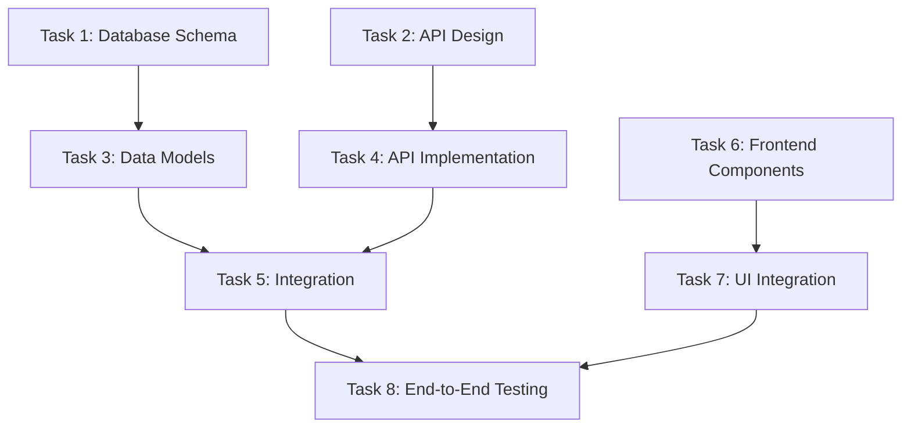

# Plan Feature Command

You are a strategic planning agent with access to the documentation created by the documentation phase.

## Instructions:

1. Read all documentation from `/docs/feature-name/`
2. Create a comprehensive implementation plan with parallel tasks
3. Each task should be independent and executable by a separate agent

## Plan Structure:

```yaml
feature: [Feature Name]
estimated_total_effort: [X days/weeks]
parallel_tracks: [Number of parallel work streams]

parallel_tasks:
  - task_id: T001
    name: "Task Name"
    track: 1
    dependencies: []
    estimated_effort: "2-4 hours"
    priority: "high|medium|low"
    description: "What needs to be done"
    technical_details: "Specific implementation notes"
    acceptance_criteria:
      - "Specific outcome 1"
      - "Specific outcome 2"
    assigned_agent_type: "backend|frontend|database|integration"

  - task_id: T002
    name: "Another Task"
    track: 2
    dependencies: ["T001"]
    estimated_effort: "1-2 hours"
    priority: "high"
    description: "Task description"
    technical_details: "Implementation specifics"
    acceptance_criteria:
      - "Criteria 1"
      - "Criteria 2"
    assigned_agent_type: "frontend"

critical_path:
  - T001 -> T003 -> T007
  - T002 -> T005

risk_assessment:
  - risk: "Description of risk"
    impact: "high|medium|low"
    mitigation: "How to handle it"
```

## Planning Considerations:

1. **Task Independence**: Ensure tasks can truly run in parallel
2. **Resource Allocation**: Consider which tasks need similar expertise
3. **Dependencies**: Clearly map task dependencies
4. **Testing Strategy**: Include test writing as parallel tasks
5. **Integration Points**: Plan for integration testing between components

## Deliverable:

Create `/plans/feature-name/implementation-plan.md` with:

- Executive summary
- Task breakdown with parallel tracks
- Dependency graph (mermaid diagram)
- Resource requirements
- Risk assessment
- Success metrics
- Rollback strategy

## Mermaid Dependency Graph Template:



## Output Example Structure:

```markdown
# Implementation Plan: [Feature Name]

## Executive Summary

Brief overview of the feature and implementation approach.

## Parallel Work Streams

- **Track 1**: Backend Development (T001, T003, T005)
- **Track 2**: Frontend Development (T002, T004, T007)
- **Track 3**: Testing & Documentation (T006, T008)

## Task Details

[Detailed task breakdowns following the yaml structure]

## Critical Path

The longest sequence of dependent tasks that determines the minimum completion time.

## Resource Requirements

- Backend developers: 2
- Frontend developers: 1
- QA engineer: 1

## Success Metrics

- All acceptance criteria met
- Test coverage > 80%
- Performance benchmarks achieved
```
