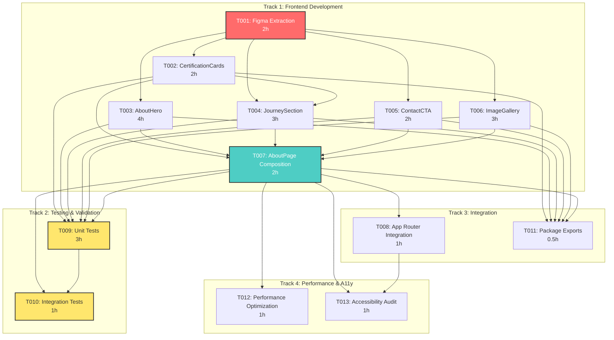

# Implementation Plan: About Page Migration

## Executive Summary

The About Page migration transforms a 499-line Figma export into a modern, component-based React implementation following established patterns from the homepage and contact page migrations. This plan coordinates parallel development across 4 specialized agents, with an estimated total effort of **18.5-19.5 hours** completing in 2-3 days with optimal resource allocation.

### Integration with Existing Components

**Repository**: The Reiki Goddess Healing monorepo
**Branch**: `feat/about-page-implementation`
**Target Package**: `packages/shared-components/src/pages/AboutPage.tsx`
**Reusable Components**: 8 existing components (MeetTheGoddess, Testimonials, AppLayout, PageTransition, AnimatedSection, **FeaturesBar**, **LetsConnect**, **ServicesSection** [optional])
**New Components**: 5 custom components (~13 hours development)
**Agent Orchestration**: 4 concurrent agents (frontend, testing, integration, performance)
**Time Savings**: 1.5 hours by reusing LetsConnect instead of building custom ContactCTA

### Key Success Metrics

- **Design Fidelity**: Pixel-perfect match to Figma designs
- **TypeScript**: 0 compilation errors
- **Test Coverage**: >80% per package, 25-35+ total tests (5 new components + integrations)
- **Performance**: LCP < 2.5s, bundle size < 200KB
- **Accessibility**: WCAG 2.1 AA compliant
- **Build**: All packages compile successfully

---

## Documentation Dependencies

This plan builds upon research documentation created in the `/document-feature` phase:

### Primary References

- `/docs/design/about-page-migration/README.md` - Migration overview and component analysis
- `/docs/design/about-page-migration/technical-considerations.md` - Pattern analysis from Contact Page
- `/docs/design/about-page-migration/design-implementation.md` - Design system specifications
- `/docs/design/about-page-migration/integration-points.md` - Figma MCP integration guide
- `/docs/design/about-page-migration/current-state-analysis.md` - Comprehensive component analysis
- `/docs/project/ARCHITECTURE.md` - Repository architectural patterns

### Design References

- Figma Screenshots: `/figma-screenshots/about/` (to be populated with user-provided screenshots)
- Legacy Implementation: `/legacy/About/src/screens/About/About.tsx` (499 lines, reference only)
- Design System: `/packages/design-system/src/` (colors, typography, layout tokens)

---

## Parallel Work Streams

### Track 1: Frontend Component Development

**Agent**: frontend-agent
**Package**: `packages/shared-components`
**Tasks**: T001, T002, T003, T004, T005, T006, T007
**Estimated Effort**: 13.5-14.5 hours
**Priority**: HIGH

### Track 2: Testing & Validation

**Agent**: testing-agent
**Package**: All affected packages
**Tasks**: T007, T008, T009
**Estimated Effort**: 4 hours
**Priority**: HIGH

### Track 3: Integration & Composition

**Agent**: integration-agent
**Package**: `apps/main`, `packages/shared-components`
**Tasks**: T010, T011
**Estimated Effort**: 3 hours
**Priority**: MEDIUM

### Track 4: Performance Optimization

**Agent**: performance-agent
**Package**: All affected packages
**Tasks**: T012, T013
**Estimated Effort**: 2 hours
**Priority**: MEDIUM

---

## Interactive UI Patterns

The About Page leverages several interactive UI patterns already established in the codebase. These patterns create visual interest and improve user engagement through hover effects, animations, and layered design elements.

### Pattern 1: Blue Bevel Effect with Hover Lift

**Used in**: ServicesSection, ContactInfoCard

This pattern creates a 3D depth effect using a blue background rectangle offset behind a white card, with a lift animation on hover.

```typescript
// Pattern: Card with blue shadow + lift on hover
<div className="group relative transition-all duration-300 transform hover:-translate-y-2">
  {/* Blue background rectangle - shifted down 5px for 3D depth */}
  <div className="absolute inset-0"
       style={{
         backgroundColor: "#0205B7",
         borderRadius: "20px",
         transform: "translateY(5px)",
         zIndex: 0
       }}
  />

  {/* White card on top */}
  <div className="relative"
       style={{
         backgroundColor: "#FFFFFF",
         borderRadius: "20px",
         boxShadow: "0px 42px 32.5px -13px rgba(2, 5, 183, 0.25)",
         zIndex: 1
       }}
  >
    {/* Content */}
  </div>
</div>
```

**Key Features**:

- **Bevel**: Blue background (#0205B7) translated down 5px creates shadow effect
- **Hover**: Card lifts up 8px (`-translate-y-2`) for interactive feedback
- **Shadow**: Box shadow increases intensity on hover (0.25 → 0.35 opacity)
- **Transition**: Smooth 300ms animation
- **Z-index**: Background at z-0, card at z-1 for proper layering

**Used in About Page**: CertificationCards component (T002)

---

### Pattern 2: Gradient Overlay on Hover

**Used in**: ServicesSection

This pattern reveals a blue-to-cyan gradient overlay on hover while inverting text and icon colors for maximum contrast.

```typescript
<div className="group">
  {/* Gradient appears on hover - opacity 0 to 100 */}
  <div className="absolute inset-0 opacity-0 group-hover:opacity-100
                  transition-opacity duration-300"
       style={{
         background: "linear-gradient(135deg, #0205B7 0%, rgba(99, 213, 249, 1) 100%)",
         borderRadius: "20px"
       }}
  />

  {/* Text color inverts on hover */}
  <h3 className="transition-colors duration-300 group-hover:text-white"
      style={{ color: "rgba(51, 51, 51, 1)" }}>
    {title}
  </h3>

  {/* Icon inverts on hover */}
  <div className="transition-all duration-300
                  group-hover:brightness-0 group-hover:invert">
    {icon}
  </div>
</div>
```

**Key Features**:

- **Gradient**: Linear gradient from brand blue (#0205B7) to cyan (#63D5F9) at 135° angle
- **Text Transition**: Dark gray (#333333) → White on hover
- **Icon Inversion**: Color icon → White silhouette (brightness-0 + invert filter)
- **Timing**: All transitions synchronized at 300ms
- **Layering**: Gradient overlay positioned absolutely behind content

**Used in About Page**: Optional ServicesSection component if included

---

### Pattern 3: Blue Shadow with Decorative Corners

**Used in**: LetsConnect, BookSessionCTA

This pattern combines a solid blue drop shadow with decorative white dots in the four corners for a distinctive branded look.

```typescript
<section className="shadow-[9px_10px_0px_0px_#0205B7]"
         style={{
           borderRadius: "30px",
           margin: "40px 66px"
         }}>
  {/* Background image + blue overlay */}
  <div className="absolute inset-0">
    
    <div className="absolute inset-0"
         style={{
           backgroundColor: "rgba(2, 5, 183, 0.35)",
           borderRadius: "30px"
         }} />
  </div>

  {/* Decorative white dots in corners */}
  <div className="absolute top-8 left-8 w-3 h-3 bg-white rounded-full" />
  <div className="absolute top-8 right-8 w-3 h-3 bg-white rounded-full" />
  <div className="absolute bottom-8 left-8 w-3 h-3 bg-white rounded-full" />
  <div className="absolute bottom-8 right-8 w-3 h-3 bg-white rounded-full" />

  {/* Content with white text */}
  <div className="relative z-10">
    {/* Heading and contact info */}
  </div>
</section>
```

**Key Features**:

- **Hard Shadow**: Solid blue shadow 9px right, 10px down (no blur)
- **Image Overlay**: Blue tint at 35% opacity over background image for text readability
- **Decorative Dots**: 12px white circles positioned 32px from corners
- **Border Radius**: 30px for smooth, modern appearance
- **Text Color**: All text white for contrast against blue overlay

**Used in About Page**: LetsConnect component replaces custom ContactCTA (saves 2 hours development)

---

### Pattern 4: Icon + Text Badge Grid

**Used in**: FeaturesBar

This pattern displays key business attributes as icon-text pairs in a responsive grid with vertical dividers.

```typescript
<div className="grid grid-cols-2 md:grid-cols-4 gap-4 md:gap-8">
  {features.map((feature, index) => (
    <div key={index} className="flex items-center justify-center gap-3 px-4 py-3 relative">
      {/* Icon in brand blue */}
      <div className="text-[#0205B7] flex-shrink-0">
        {feature.icon}
      </div>

      {/* Vertical divider (except first) */}
      {index > 0 && (
        <div className="hidden md:block absolute left-0 h-12 w-px bg-[#63D5F9] -ml-4" />
      )}

      {/* Text (split into two lines) */}
      <div className="text-left">
        <p className="font-medium text-gray-900 leading-tight"
           style={{ fontFamily: "Figtree, Helvetica, sans-serif", fontSize: "16px" }}>
          {feature.title}
        </p>
        {feature.description && (
          <p className="font-medium text-gray-900 leading-tight"
             style={{ fontFamily: "Figtree, Helvetica, sans-serif", fontSize: "16px" }}>
            {feature.description}
          </p>
        )}
      </div>
    </div>
  ))}
</div>
```

**Key Features**:

- **Responsive Grid**: 2 columns mobile → 4 columns desktop
- **Vertical Dividers**: Cyan (#63D5F9) 1px lines between badges (desktop only)
- **Icons**: Brand blue (#0205B7), 24px size, flex-shrink-0 to prevent squashing
- **Typography**: Figtree 16px medium weight, split into two lines (title + description)
- **Layout**: Horizontal flex with 12px gap between icon and text

**Used in About Page**: FeaturesBar component for credentials display (30min integration)

---

## Task Details

### T001: Extract Figma Design Specifications

**Track**: 1 (Frontend Development)
**Dependencies**: []
**Estimated Effort**: 1-2 hours
**Priority**: CRITICAL
**Agent**: frontend-agent

#### Description

Extract complete design specifications from Figma using MCP tools or manual screenshots. This is the foundation for all subsequent component development.

#### Technical Details

**Approach A: Figma MCP Extraction** (Preferred if user has Figma file open):

1. User opens Figma Desktop App with About Page design
2. User toggles to Dev Mode (Shift + D)
3. For each section frame, user selects and agent extracts:
   - AboutHero
   - Biography/Introduction
   - Certifications
   - Journey/Philosophy
   - Contact CTA
   - Image Gallery (if present)

**Approach B: Screenshot Analysis** (Fallback):

1. User provides screenshots to `/figma-screenshots/about/sections/`
2. Agent analyzes screenshots for:
   - Layout measurements
   - Typography specifications
   - Color values
   - Spacing/padding
   - Image dimensions

**Extraction Tools**:

```typescript
// If Figma MCP available
mcp__figma -
  dev -
  mode -
  mcp -
  server__get_code({
    dirForAssetWrites: "/absolute/path/.tmp/figma-assets-about/",
    clientLanguages: "typescript,javascript",
    clientFrameworks: "react",
  });

// Extract design tokens
mcp__figma - dev - mode - mcp - server__get_variable_defs();

// Get structure overview
mcp__figma - dev - mode - mcp - server__get_metadata();
```

#### Context Dependencies

- `/docs/design/about-page-migration/integration-points.md` - Figma MCP tool reference
- `/docs/design/about-page-migration/design-implementation.md` - Expected design system tokens
- `/figma-screenshots/README.md` - Screenshot directory structure

#### Acceptance Criteria

- [ ] Design specifications documented for all 6 sections
- [ ] Color palette extracted and matched to existing design system
- [ ] Typography specifications (font families, sizes, weights) documented
- [ ] Spacing and layout measurements captured
- [ ] Image asset requirements identified (dimensions, formats)
- [ ] All measurements in px, colors in rgba/hex
- [ ] Responsive breakpoint behaviors documented
- [ ] Design tokens match existing system or deviations noted

#### Deliverables

- Design specification document in `/docs/design/about-page-migration/figma-extraction-results.md`
- Asset exports in `.tmp/figma-assets-about/` (if MCP used)
- Component wireframe sketches or annotated screenshots

---

### T002: Create CertificationCards Component

**Track**: 1 (Frontend Development)
**Dependencies**: [T001]
**Estimated Effort**: 2 hours
**Priority**: HIGH
**Agent**: frontend-agent

#### Description

Develop a reusable certification display card component following the ContactInfoCard bevel pattern. This component showcases Deirdre's credentials with icon, title, issuing body, and optional verification link.

#### Technical Details

**Component Location**: `/packages/shared-components/src/CertificationCards/`

**File Structure**:

```
CertificationCards/
├── CertificationCards.tsx       # Main component
├── CertificationCards.test.tsx  # Unit tests
├── CertificationCards.types.ts  # TypeScript interfaces
└── index.ts                    # Barrel export
```

**TypeScript Interfaces**:

```typescript
export interface Certification {
  id: string;
  title: string;
  issuer: string;
  year?: string;
  icon?: string;
  verificationLink?: string;
}

export interface CertificationCardsProps {
  certifications: Certification[];
  layout?: "grid" | "list";
  className?: string;
}
```

**Pattern to Follow**: Adapt ContactInfoCard bevel effect

- Blue background shifted 10px for depth
- White card with subtle shadow
- Hover animation: `-translate-y-1`
- Icon + title + issuer layout
- Optional CTA link with arrow

**Styling Requirements**:

- Border radius: 17px (match ContactInfoCard)
- Card height: 156px minimum
- Shadow: `0px 42px 32.5px -13px rgba(0, 0, 0, 0.16)`
- Blue background: `#0205B7`
- Font: Figtree family

#### Context Dependencies

- `/packages/shared-components/src/ContactInfoCard/ContactInfoCard.tsx` - Bevel pattern reference
- `/docs/project/ARCHITECTURE.md#component-architecture` - Card component patterns
- ARCHITECTURE.md:397-436 - ContactInfoCard implementation details

#### Shared Components Needed

- None (self-contained component)

#### TypeScript Interfaces Required

- `Certification` - Individual credential data
- `CertificationCardsProps` - Component props
- `CertificationCardProps` - Individual card props (internal)

#### Security Considerations

- Sanitize external verification links
- Use `rel="noopener noreferrer"` for external links
- Validate icon src URLs

#### Accessibility Requirements

- Semantic HTML: `<article>` for each card
- Heading hierarchy: h3 for certification title
- ARIA label for verification links: "Verify [certification name]"
- Alt text for certification icons (descriptive)
- Keyboard accessible links with visible focus states

#### Test Requirements

- Unit tests: TRUE
- Integration tests: FALSE
- Coverage target: 80%
- Test documentation required: TRUE

**Test Cases**:

- Renders certification cards in grid layout
- Renders certification cards in list layout
- Displays all certification data (title, issuer, year, icon)
- Applies bevel effect styling
- Hover animation works correctly
- External links open in new tab with proper security attributes
- Keyboard navigation works
- Screen reader accessible

#### Acceptance Criteria

- [ ] Component renders certification data correctly
- [ ] Bevel effect matches ContactInfoCard pattern
- [ ] Grid and list layouts both functional
- [ ] Hover animations smooth (transition-transform duration-300)
- [ ] External verification links secure (rel="noopener noreferrer")
- [ ] TypeScript compilation: 0 errors
- [ ] All tests passing
- [ ] Lint and type-check passing
- [ ] Test coverage >80%
- [ ] Accessibility: ARIA labels, semantic HTML, keyboard nav
- [ ] Component exported from package index

---

### T003: Create AboutHero Component

**Track**: 1 (Frontend Development)
**Dependencies**: [T001]
**Estimated Effort**: 4 hours
**Priority**: HIGH
**Agent**: frontend-agent

#### Description

Implement a hero section for the About Page following the HeroV2 pattern from homepage, featuring dual-column text layout, background image, and overlay content.

#### Technical Details

**Component Location**: `/packages/shared-components/src/AboutHero/`

**File Structure**:

```
AboutHero/
├── AboutHero.tsx
├── AboutHero.test.tsx
├── AboutHero.types.ts
└── index.ts
```

**TypeScript Interfaces**:

```typescript
export interface AboutHeroProps {
  backgroundImage?: {
    src: string;
    alt: string;
  };
  overlayContent?: {
    heading?: string;
    subheading?: string;
    tagline?: string;
  };
  layout?: "centered" | "split";
  className?: string;
}
```

**Pattern to Follow**: HeroV2 from homepage

- Height: 825px total (93px nav + 732px image)
- Image dimensions: 1308px × 732px (with 66px buffers)
- Border radius: 20px
- Dark overlay: `bg-black/30` for text readability
- Typography: Figtree, 63.55px heading

**Responsive Behavior**:

```typescript
const heroResponsive = {
  mobile: {
    height: "600px",
    imageHeight: "500px",
    paddingX: "24px",
    headingSize: "36px",
    contentWidth: "100%",
  },
  desktop: {
    height: "825px",
    imageHeight: "732px",
    paddingX: "66px",
    headingSize: "63.55px",
    contentWidth: "825px",
  },
};
```

#### Context Dependencies

- `/packages/shared-components/src/Hero/HeroV2.tsx` - Hero pattern reference
- `/docs/design/about-page-migration/design-implementation.md#hero-pattern` - Hero specifications
- ARCHITECTURE.md:163-182 - Responsive Header Overlay Pattern

#### Shared Components Needed

- LazyImage (for background image optimization)

#### TypeScript Interfaces Required

- `AboutHeroProps` - Component props
- `HeroOverlayContent` - Overlay content structure
- `HeroBackgroundImage` - Image metadata

#### Accessibility Requirements

- Semantic HTML: `<section>` with `aria-labelledby`
- Heading hierarchy: h1 for main heading
- Background image: decorative (alt="")
- Color contrast: WCAG AA on overlay (4.5:1)
- Focus indicators on any interactive elements

#### Test Requirements

- Unit tests: TRUE
- Integration tests: FALSE
- Coverage target: 80%
- Test documentation required: TRUE

**Test Cases**:

- Renders with background image
- Renders overlay content (heading, subheading)
- Applies correct height and spacing
- Responsive sizing on mobile
- Centered and split layouts both work
- Accessibility: proper heading hierarchy

#### Acceptance Criteria

- [ ] Hero matches HeroV2 pattern and measurements
- [ ] Background image displays with 20px border radius
- [ ] Overlay content centered and readable
- [ ] Typography: Figtree, 63.55px heading (desktop)
- [ ] Responsive: Mobile adjustments apply at <768px
- [ ] TypeScript compilation: 0 errors
- [ ] All tests passing
- [ ] Lint and type-check passing
- [ ] Test coverage >80%
- [ ] Accessibility: h1 heading, ARIA labels, contrast compliant

---

### T004: Create JourneySection Component

**Track**: 1 (Frontend Development)
**Dependencies**: [T001, T002]
**Estimated Effort**: 3 hours
**Priority**: MEDIUM
**Agent**: frontend-agent

#### Description

Build a personal journey narrative section featuring Deirdre's healing story, including background imagery, journey text, and integrated certification cards.

#### Technical Details

**Component Location**: `/packages/shared-components/src/JourneySection/`

**TypeScript Interfaces**:

```typescript
export interface JourneySectionProps {
  heading?: string;
  content?: React.ReactNode;
  backgroundImage?: {
    src: string;
    alt: string;
  };
  certifications?: Certification[];
  className?: string;
}
```

**Pattern to Follow**: MeetTheGoddess layout pattern

- Full-width section with relative positioning
- Background image with overlay
- 66px horizontal padding from container
- Max 600px width for text content
- Layered z-index system for depth

**Layout Structure**:

```typescript
<section>
  {/* Background Image */}
  <div style={{ position: "absolute", zIndex: 1 }}>
    <LazyImage src={backgroundImage} />
  </div>

  {/* Content Overlay */}
  <div style={{ position: "relative", zIndex: 10 }}>
    <h2>{heading}</h2>
    <div>{content}</div>

    {/* Certification Cards */}
    <CertificationCards certifications={certifications} />
  </div>
</section>
```

#### Context Dependencies

- `/packages/shared-components/src/MeetTheGoddess/MeetTheGoddess.tsx` - Layout reference
- `/packages/shared-components/src/CertificationCards/` - Certification display
- ARCHITECTURE.md:162-182 - Component Composition Patterns

#### Shared Components Needed

- CertificationCards (from T002)
- LazyImage (for background optimization)

#### TypeScript Interfaces Required

- `JourneySectionProps` - Component props
- `JourneyContent` - Content structure
- Reuses `Certification[]` from CertificationCards

#### Accessibility Requirements

- Semantic HTML: `<section>` with `aria-labelledby`
- Heading hierarchy: h2 for section heading
- Background image: decorative (alt="" or aria-hidden)
- Text content: high contrast on overlay
- Readable font sizes (18px minimum body text)

#### Test Requirements

- Unit tests: TRUE
- Integration tests: TRUE (with CertificationCards)
- Coverage target: 80%
- Test documentation required: TRUE

#### Acceptance Criteria

- [ ] Journey narrative displays with proper typography
- [ ] Background image renders with overlay for readability
- [ ] CertificationCards integrated and rendering
- [ ] 66px horizontal padding applied
- [ ] Max 600px text content width
- [ ] TypeScript compilation: 0 errors
- [ ] All tests passing
- [ ] Integration test: JourneySection + CertificationCards
- [ ] Test coverage >80%
- [ ] Accessibility: semantic structure, contrast compliant

---

### T005: Integrate FeaturesBar Component

**Track**: 1 (Frontend Development)
**Dependencies**: [T001]
**Estimated Effort**: 30 minutes
**Priority**: MEDIUM
**Agent**: frontend-agent

#### Description

Integrate the existing FeaturesBar component to display Deirdre's credentials and key business attributes as interactive icon+text badges.

#### Technical Details

**Component Location**: `/packages/shared-components/src/FeaturesBar/FeaturesBar.tsx` (EXISTING)

**Integration**: Import and configure with About-specific features

```typescript
import { FeaturesBar } from "@reiki-goddess/shared-components";

<FeaturesBar
  features={[
    {
      icon: <svg>{/* Experience icon */}</svg>,
      title: "20+ Years",
      description: "Experience"
    },
    {
      icon: <svg>{/* Certification icon */}</svg>,
      title: "Certified",
      description: "Reiki Master"
    },
    {
      icon: <svg>{/* Sound healing icon */}</svg>,
      title: "Sound Healer",
      description: "Certified"
    },
    {
      icon: <svg>{/* Heart icon */}</svg>,
      title: "Trauma-",
      description: "Informed Care"
    }
  ]}
/>
```

**Pattern**: Icon + Text Badge Grid (see Interactive UI Patterns)

- 2 columns mobile → 4 columns desktop
- Cyan dividers between badges
- Brand blue icons (#0205B7)
- Figtree 16px typography

**Placement**: Below AboutHero section

#### Context Dependencies

- `/packages/shared-components/src/FeaturesBar/FeaturesBar.tsx` - Existing component
- Interactive UI Patterns section - Pattern 4 documentation

#### Shared Components Needed

- FeaturesBar (existing component)

#### TypeScript Interfaces Required

- None (component already exists with `FeaturesBarProps` interface)

#### Accessibility Requirements

- Component already WCAG AA compliant
- Icons have proper color contrast (blue #0205B7 on cream #FFFBF5)
- Semantic HTML structure
- Screen reader accessible text

#### Test Requirements

- Unit tests: FALSE (component already tested)
- Integration tests: TRUE (test integration in AboutPage)
- Coverage target: N/A (existing component)
- Test documentation required: FALSE

**Test Cases (Integration)**:

- FeaturesBar renders in AboutPage
- Features display correct About-specific content
- Responsive grid layout adjusts properly
- Dividers appear on desktop only

#### Acceptance Criteria

- [ ] FeaturesBar imported from shared-components
- [ ] About-specific features configured (20+ Years, Certified, Sound Healer, Trauma-Informed)
- [ ] Icons selected and implemented
- [ ] Positioned below AboutHero section
- [ ] Responsive layout: 2 cols → 4 cols
- [ ] Integration test passing
- [ ] No TypeScript errors

---

### T006: Optional - Integrate ServicesSection Component

**Track**: 1 (Frontend Development)
**Dependencies**: [T001]
**Estimated Effort**: 1 hour
**Priority**: LOW
**Agent**: frontend-agent

#### Description

**OPTIONAL TASK**: Integrate the existing ServicesSection component to create a "My Specialties" section showcasing Deirdre's healing modalities with interactive service cards.

#### Technical Details

**Component Location**: `/packages/shared-components/src/Services/ServicesSection.tsx` (EXISTING)

**Integration**: Import and configure with About-specific services

```typescript
import { ServicesSection } from "@reiki-goddess/shared-components";

<ServicesSection
  heading="My Healing Specialties"
  services={[
    {
      id: "reiki",
      icon: ,
      title: "Reiki Healing",
      duration: "60/90 min sessions",
      href: "/services/reiki"
    },
    {
      id: "sound",
      icon: ,
      title: "Sound + Energy",
      duration: "Immersion Therapy",
      href: "/services/sound-therapy"
    },
    // ... more services
  ]}
/>
```

**Pattern**: Blue Bevel Effect + Gradient Hover (see Interactive UI Patterns)

- Cards lift on hover (`-translate-y-2`)
- Gradient overlay appears (blue to cyan)
- Text and icons invert to white
- 300ms smooth transitions

**Placement**: Optional section after JourneySection or before Testimonials

**Decision Criteria**: Include if About page should showcase services overview. Skip if services are covered sufficiently in dedicated Services page.

#### Context Dependencies

- `/packages/shared-components/src/Services/ServicesSection.tsx` - Existing component
- Interactive UI Patterns - Patterns 1 & 2

#### Shared Components Needed

- ServicesSection (existing)

#### TypeScript Interfaces Required

- None (component exists with `ServicesSectionProps`, `ServiceCard` interfaces)

#### Accessibility Requirements

- Component already WCAG AA compliant
- Interactive cards keyboard accessible
- Hover states don't rely solely on hover (focus states present)

#### Test Requirements

- Unit tests: FALSE (component already tested)
- Integration tests: TRUE (if included)
- Coverage target: N/A
- Test documentation required: FALSE

#### Acceptance Criteria

**If included**:

- [ ] ServicesSection imported from shared-components
- [ ] About-specific services configured
- [ ] Service icons implemented
- [ ] Links to service detail pages functional
- [ ] Hover effects working (lift + gradient overlay)
- [ ] Integration test passing
- [ ] No TypeScript errors

**If skipped**: Document decision in implementation notes

---

### T007: Create ImageGallery Component

**Track**: 1 (Frontend Development)
**Dependencies**: [T001]
**Estimated Effort**: 3 hours
**Priority**: LOW
**Agent**: frontend-agent

#### Description

Build a masonry-style image gallery component with lazy loading, optional lightbox functionality, and a "See More" CTA.

#### Technical Details

**Component Location**: `/packages/shared-components/src/ImageGallery/`

**TypeScript Interfaces**:

```typescript
export interface GalleryImage {
  id: string;
  src: string;
  alt: string;
  width?: number;
  height?: number;
}

export interface ImageGalleryProps {
  images: GalleryImage[];
  layout?: "masonry" | "grid";
  columns?: 2 | 3 | 4;
  showMore?: {
    text: string;
    href: string;
  };
  className?: string;
}
```

**Layout Options**:

- **Grid**: Simple responsive grid (2/3/4 columns)
- **Masonry**: Pinterest-style staggered layout

**Features**:

- Lazy loading via LazyImage component
- Responsive columns: 1 (mobile) → 2 (tablet) → 3/4 (desktop)
- Border radius: 20px on images
- Gap: 24px between images
- Hover effect: subtle scale or shadow increase

**Masonry Implementation** (if chosen):

```typescript
// Use CSS columns or a library like react-masonry-css
.masonry-grid {
  column-count: 3;
  column-gap: 24px;
}

.masonry-grid-item {
  break-inside: avoid;
  margin-bottom: 24px;
}
```

#### Context Dependencies

- `/packages/shared-components/src/LazyImage/LazyImage.tsx` - Image optimization
- `/docs/design/about-page-migration/README.md#image-gallery` - Gallery requirements

#### Shared Components Needed

- LazyImage (for image optimization and lazy loading)

#### TypeScript Interfaces Required

- `GalleryImage` - Image metadata
- `ImageGalleryProps` - Component props
- `GalleryLayout` - Layout configuration

#### Accessibility Requirements

- Semantic HTML: `<figure>` for images with `<figcaption>` if captions exist
- Alt text: descriptive for each image
- Keyboard navigation: if lightbox, ensure keyboard controls
- Focus management: trap focus in lightbox modal
- ARIA: `role="img"` and `aria-label` if needed

#### Test Requirements

- Unit tests: TRUE
- Integration tests: FALSE
- Coverage target: 80%
- Test documentation required: TRUE

**Test Cases**:

- Renders all gallery images
- Grid layout applies correct columns
- Masonry layout renders correctly (if implemented)
- LazyImage integration functional
- "See More" link renders and navigates
- Responsive: columns adjust by breakpoint
- Accessibility: alt text, semantic HTML

#### Acceptance Criteria

- [ ] Gallery displays images in chosen layout (grid or masonry)
- [ ] Lazy loading functional via LazyImage
- [ ] Responsive columns: 1 → 2 → 3/4 by breakpoint
- [ ] Border radius: 20px on images
- [ ] Gap: 24px between images
- [ ] "See More" CTA functional (if applicable)
- [ ] TypeScript compilation: 0 errors
- [ ] All tests passing
- [ ] Test coverage >80%
- [ ] Accessibility: alt text, semantic HTML, keyboard nav

---

### T007: Create AboutPage Composition

**Track**: 1 (Frontend Development)
**Dependencies**: [T002, T003, T004, T005, T006]
**Estimated Effort**: 2 hours
**Priority**: HIGH
**Agent**: frontend-agent

#### Description

Compose all About Page sections into a cohesive page component following the Contact Page pattern, integrating AnimatedSection wrappers for scroll animations.

#### Technical Details

**Component Location**: `/packages/shared-components/src/pages/AboutPage.tsx`

**Page Structure**:

```typescript
export const AboutPage: React.FC = () => {
  return (
    <div className="min-h-screen bg-[#FFFBF5] overflow-hidden relative">
      <div
        className="relative mx-auto overflow-hidden"
        style={{
          maxWidth: "1440px",
          margin: "0 auto",
          backgroundColor: "#FFFBF5",
          boxShadow: "0 0 40px rgba(0, 0, 0, 0.1)",
        }}
      >
        <AnimatedSection>
          <AboutHero />
        </AnimatedSection>

        <AnimatedSection delay={0.1}>
          <MeetTheGoddess />
        </AnimatedSection>

        <AnimatedSection delay={0.2}>
          <JourneySection />
        </AnimatedSection>

        <AnimatedSection delay={0.3}>
          <ContactCTA />
        </AnimatedSection>

        <AnimatedSection delay={0.4}>
          <ImageGallery />
        </AnimatedSection>

        <AnimatedSection delay={0.5}>
          <Testimonials />
        </AnimatedSection>

        <AnimatedSection delay={0.6}>
          <BookSessionCTA />
        </AnimatedSection>
      </div>
    </div>
  );
};
```

**Animation Timing**:

- Stagger delays: 0.1s increments
- Total cascade: 0.6s from hero to final CTA
- Animation: fadeInUp (default)
- Threshold: 0.1 (trigger at 10% visible)

#### Context Dependencies

- `/packages/shared-components/src/pages/ContactPage.tsx` - Page composition pattern
- `/packages/shared-components/src/AnimatedSection/AnimatedSection.tsx` - Animation wrapper
- ARCHITECTURE.md:279-321 - Page Transition Animation System

#### Shared Components Needed

- AnimatedSection (existing)
- AboutHero (T003)
- MeetTheGoddess (existing, reusable)
- JourneySection (T004)
- ContactCTA (T005)
- ImageGallery (T006)
- Testimonials (existing, reusable)
- BookSessionCTA (existing, reusable)

#### TypeScript Interfaces Required

- `AboutPageProps` - Component props (className optional)

#### Accessibility Requirements

- Semantic HTML: `<main>` wrapper
- Heading hierarchy: h1 (hero) → h2 (sections)
- Skip links: Consider adding "Skip to main content"
- ARIA landmarks: `<main>`, `<section>` with labels
- Focus management: smooth scrolling doesn't break focus

#### Test Requirements

- Unit tests: TRUE
- Integration tests: TRUE
- Coverage target: 80%
- Test documentation required: TRUE

**Test Cases**:

- Renders all sections in correct order
- AnimatedSection delays stagger correctly
- Page container applies correct styles (max-width, background, shadow)
- Sections render with proper spacing
- Integration: All child components render
- Accessibility: heading hierarchy, semantic HTML
- Responsive: Container adjusts padding by breakpoint

#### Acceptance Criteria

- [ ] All 7 sections render in correct order
- [ ] AnimatedSection delays: 0s, 0.1s, 0.2s, 0.3s, 0.4s, 0.5s, 0.6s
- [ ] Page container: 1440px max-width, #FFFBF5 background
- [ ] All components integrated correctly
- [ ] TypeScript compilation: 0 errors
- [ ] All tests passing
- [ ] Integration tests: page + all child components
- [ ] Test coverage >80%
- [ ] Accessibility: proper heading hierarchy, semantic HTML

---

### T008: Integrate About Page into App Router

**Track**: 3 (Integration & Composition)
**Dependencies**: [T007]
**Estimated Effort**: 1 hour
**Priority**: HIGH
**Agent**: integration-agent

#### Description

Integrate the composed AboutPage component into the main application router with PageTransition wrapper, ensuring proper navigation and active state highlighting.

#### Technical Details

**File to Update**: `/apps/main/src/pages/About.tsx`

**Implementation Pattern** (from Contact Page):

```typescript
import { AboutPage } from "@reiki-goddess/shared-components";
import PageTransition from "../components/PageTransition";

function About() {
  return (
    <PageTransition>
      <AboutPage />
    </PageTransition>
  );
}

export default About;
```

**Verify Router Configuration**: `/apps/main/src/App.tsx`

```typescript
// Should already exist, verify:
<Route path="/about" element={<About />} />
```

**PageTransition Details**:

- Animation: fadeInUp with y-offset
- Duration: 0.6s enter / 0.4s exit
- Easing: easeOut (enter) / easeIn (exit)

#### Context Dependencies

- `/apps/main/src/pages/Contact.tsx` - PageTransition pattern reference
- `/apps/main/src/components/PageTransition.tsx` - Transition component
- `/apps/main/src/App.tsx` - Router configuration
- ARCHITECTURE.md:239-279 - Router-Based Active State Management

#### Shared Components Needed

- PageTransition (existing)
- AboutPage (from T007)

#### TypeScript Interfaces Required

- None (using existing patterns)

#### Accessibility Requirements

- Page title: Update document.title for "About | The Reiki Goddess Healing"
- Focus management: Focus moves to h1 on page load
- Skip links: Ensure skip link targets correct main content

#### Test Requirements

- Unit tests: TRUE
- Integration tests: TRUE
- Coverage target: 80%
- Test documentation required: TRUE

**Test Cases**:

- AboutPage renders within PageTransition wrapper
- Page transition animations apply correctly
- Router navigation to /about works
- Active navigation state highlights "About" in Header
- Page title updates correctly
- Focus management functional

#### Acceptance Criteria

- [ ] About.tsx uses PageTransition wrapper
- [ ] AboutPage component imported from shared-components
- [ ] Router configuration verified for /about route
- [ ] Navigation to /about successful
- [ ] Active state highlights "About" in navigation
- [ ] Page title updates to "About | The Reiki Goddess Healing"
- [ ] TypeScript compilation: 0 errors
- [ ] All tests passing
- [ ] Test coverage >80%

---

### T009: Write Component Unit Tests

**Track**: 2 (Testing & Validation)
**Dependencies**: [T002, T003, T004, T005, T006]
**Estimated Effort**: 3 hours
**Priority**: HIGH
**Agent**: testing-agent

#### Description

Create comprehensive unit tests for all new About Page components following the Contact Page testing pattern, achieving >80% coverage.

#### Technical Details

**Test Files to Create**:

1. `/packages/shared-components/src/CertificationCards/CertificationCards.test.tsx`
2. `/packages/shared-components/src/AboutHero/AboutHero.test.tsx`
3. `/packages/shared-components/src/JourneySection/JourneySection.test.tsx`
4. `/packages/shared-components/src/ContactCTA/ContactCTA.test.tsx`
5. `/packages/shared-components/src/ImageGallery/ImageGallery.test.tsx`

**Test Pattern** (from ContactPage.test.tsx):

```typescript
import { render, screen } from "@testing-library/react";
import { describe, it, expect, vi } from "vitest";
import { ComponentName } from "./ComponentName";

describe("ComponentName", () => {
  describe("Rendering", () => {
    it("should render component with required props", () => {
      render(<ComponentName {...requiredProps} />);
      expect(screen.getByTestId("component-name")).toBeInTheDocument();
    });
  });

  describe("Styling", () => {
    it("should apply correct CSS classes", () => {
      const { container } = render(<ComponentName />);
      expect(container.firstChild).toHaveClass("expected-class");
    });
  });

  describe("Layout", () => {
    it("should apply correct spacing and layout", () => {
      // Layout tests
    });
  });

  describe("Accessibility", () => {
    it("should have proper heading hierarchy", () => {
      render(<ComponentName />);
      const heading = screen.getByRole("heading", { level: 2 });
      expect(heading).toBeInTheDocument();
    });

    it("should have accessible alt text on images", () => {
      // Image accessibility tests
    });
  });
});
```

**Test Coverage Goals**:

- **CertificationCards**: 15+ tests (rendering, styling, layout, accessibility, interactions)
- **AboutHero**: 12+ tests (background image, overlay, typography, responsive)
- **JourneySection**: 10+ tests (content, certifications integration, background)
- **ContactCTA**: 10+ tests (buttons, background, typography, navigation)
- **ImageGallery**: 12+ tests (images render, layout, lazy loading, "See More")

**Total Target**: 30-40+ tests

**Mock Dependencies**:

```typescript
// Mock child components for isolation
vi.mock("../AnimatedSection", () => ({
  AnimatedSection: ({ children }: { children: React.ReactNode }) => (
    <div>{children}</div>
  ),
}));

vi.mock("../LazyImage", () => ({
  LazyImage: ({ src, alt }: { src: string; alt: string }) => (
    
  ),
}));
```

#### Context Dependencies

- `/packages/shared-components/src/pages/ContactPage.test.tsx` - Test pattern reference
- `/packages/shared-components/src/test-utils/RouterWrapper.tsx` - Router test utility
- ARCHITECTURE.md:599-660 - Testing Patterns
- `/docs/testing/TESTING_SUMMARY.md` - Test documentation requirements

#### Test Requirements

- Unit tests: TRUE
- Integration tests: FALSE (separate task)
- Coverage target: 80%
- Test documentation required: TRUE

**Test Documentation**:

- Document any test failures in `/docs/testing/components/`
- Do NOT modify tests to pass; fix the code instead
- Use RouterWrapper for components using router hooks

#### Acceptance Criteria

- [ ] All 5 component test files created
- [ ] Each component has 10-15+ tests
- [ ] Total test count: 30-40+ tests
- [ ] Test coverage >80% per component
- [ ] All tests passing
- [ ] Test categories: Rendering, Styling, Layout, Accessibility
- [ ] Mock dependencies properly isolated
- [ ] TypeScript compilation: 0 errors in test files
- [ ] Lint and type-check passing on test files

---

### T010: Write AboutPage Integration Tests

**Track**: 2 (Testing & Validation)
**Dependencies**: [T007, T009]
**Estimated Effort**: 1 hour
**Priority**: MEDIUM
**Agent**: testing-agent

#### Description

Create integration tests for the full AboutPage composition, verifying all sections render together correctly and page-level functionality works.

#### Technical Details

**Test File**: `/packages/shared-components/src/pages/AboutPage.test.tsx`

**Integration Test Structure**:

```typescript
import { render, screen } from "@testing-library/react";
import { describe, it, expect, vi } from "vitest";
import { AboutPage } from "./AboutPage";

// Mock child components
vi.mock("../AboutHero", () => ({
  AboutHero: () => <div data-testid="about-hero">About Hero</div>,
}));

vi.mock("../MeetTheGoddess", () => ({
  MeetTheGoddess: () => <div data-testid="meet-the-goddess">Meet The Goddess</div>,
}));

// ... mock other sections

describe("AboutPage Integration", () => {
  describe("Page Composition", () => {
    it("should render all sections in correct order", () => {
      render(<AboutPage />);
      const sections = [
        "about-hero",
        "meet-the-goddess",
        "journey-section",
        "contact-cta",
        "image-gallery",
        "testimonials",
        "book-session-cta"
      ];

      sections.forEach(id => {
        expect(screen.getByTestId(id)).toBeInTheDocument();
      });
    });

    it("should apply page container styles", () => {
      const { container } = render(<AboutPage />);
      const pageWrapper = container.firstChild;
      expect(pageWrapper).toHaveClass("min-h-screen", "bg-[#FFFBF5]");
    });
  });

  describe("Animation Integration", () => {
    it("should wrap sections with AnimatedSection", () => {
      // Test AnimatedSection wrappers
    });
  });

  describe("Accessibility", () => {
    it("should have proper heading hierarchy across all sections", () => {
      // Test h1 → h2 hierarchy
    });
  });
});
```

**Test Categories**:

1. **Page Composition**: All sections render
2. **Layout**: Container styles, spacing, responsive
3. **Animation**: AnimatedSection delays stagger
4. **Accessibility**: Heading hierarchy, semantic HTML
5. **Responsive**: Mobile/desktop breakpoints

**Total Tests**: 10-12 integration tests

#### Context Dependencies

- `/packages/shared-components/src/pages/ContactPage.test.tsx` - Integration test reference
- ARCHITECTURE.md:599-660 - Testing Patterns

#### Test Requirements

- Unit tests: FALSE
- Integration tests: TRUE
- Coverage target: 80%
- Test documentation required: TRUE

#### Acceptance Criteria

- [ ] AboutPage.test.tsx created with 10-12 tests
- [ ] All sections render in integration test
- [ ] Page composition verified
- [ ] AnimatedSection integration tested
- [ ] Accessibility: heading hierarchy verified
- [ ] All integration tests passing
- [ ] Test coverage >80% for AboutPage.tsx
- [ ] TypeScript compilation: 0 errors

---

### T011: Update Component Package Exports

**Track**: 3 (Integration & Composition)
**Dependencies**: [T002, T003, T004, T005, T006, T007]
**Estimated Effort**: 30 minutes
**Priority**: HIGH
**Agent**: integration-agent

#### Description

Update the shared-components package index to export all new About Page components following the established export categorization pattern.

#### Technical Details

**File to Update**: `/packages/shared-components/src/index.ts`

**Export Pattern** (following existing convention):

```typescript
// About Page Components
export { AboutHero } from "./AboutHero";
export type { AboutHeroProps } from "./AboutHero";

export { JourneySection } from "./JourneySection";
export type { JourneySectionProps } from "./JourneySection";

export { CertificationCards } from "./CertificationCards";
export type {
  CertificationCardsProps,
  Certification,
} from "./CertificationCards";

export { ContactCTA } from "./ContactCTA";
export type { ContactCTAProps } from "./ContactCTA";

export { ImageGallery } from "./ImageGallery";
export type { ImageGalleryProps, GalleryImage } from "./ImageGallery";

// Complete page compositions
export { AboutPage } from "./pages/AboutPage";
export type { AboutPageProps } from "./pages/AboutPage";
```

**Export Categories** (from ARCHITECTURE.md:129-159):

- Layout components
- Figma-sourced components
- Service components
- Animation utilities
- Complete page compositions ← Add AboutPage here

#### Context Dependencies

- `/packages/shared-components/src/index.ts` - Current exports
- ARCHITECTURE.md:129-159 - Component Index Export Categorization

#### TypeScript Interfaces Required

- All component props interfaces must be exported

#### Acceptance Criteria

- [ ] All 5 new components exported from package index
- [ ] All TypeScript interfaces co-located and exported
- [ ] AboutPage added to "Complete page compositions" section
- [ ] Export categorization follows existing pattern
- [ ] TypeScript compilation: 0 errors
- [ ] Build succeeds: `npm run build` in shared-components
- [ ] No circular dependency warnings

---

### T012: Performance Optimization - Asset Loading

**Track**: 4 (Performance Optimization)
**Dependencies**: [T007]
**Estimated Effort**: 1 hour
**Priority**: MEDIUM
**Agent**: performance-agent

#### Description

Optimize image assets and implement lazy loading strategies to ensure About Page LCP (Largest Contentful Paint) < 2.5s.

#### Technical Details

**Optimization Strategies**:

1. **Hero Image Optimization**:
   - Preload hero background image (above-fold)
   - Use WebP format with JPEG fallback
   - Compress to <150KB
   - Dimensions: 1308px × 732px

```html
<!-- In page head -->
<link rel="preload" as="image" href="/img/about-hero.webp" type="image/webp" />
```

2. **Below-Fold Images**:
   - Use LazyImage component for all below-fold images
   - Intersection Observer threshold: 0.1
   - Loading="lazy" attribute
   - Progressive JPEG or WebP format

3. **Responsive Image Sets**:

```typescript

```

4. **Image Compression Targets**:
   - Hero images: <150KB
   - Biography images: <100KB each
   - Gallery images: <80KB each
   - Icons/decorative: <20KB

5. **CSS/JS Bundle Optimization**:
   - Code splitting for AboutPage route
   - Tree-shake unused components
   - Minimize inline styles

#### Context Dependencies

- `/packages/shared-components/src/LazyImage/LazyImage.tsx` - Lazy loading component
- ARCHITECTURE.md:328-403 - Performance Patterns
- `/docs/design/about-page-migration/README.md#performance-considerations` - Performance goals

#### Shared Components Needed

- LazyImage (existing)

#### Performance Metrics

- **LCP**: <2.5s (target)
- **FCP**: <1.8s
- **CLS**: <0.1
- **Bundle Size**: <200KB for AboutPage route

#### Test Requirements

- Unit tests: FALSE
- Integration tests: FALSE
- Coverage target: N/A
- Test documentation required: FALSE

**Performance Testing**:

- Use Lighthouse in Chrome DevTools
- Test on 3G network throttling
- Verify mobile performance (< 5s LCP on mobile)

#### Acceptance Criteria

- [ ] Hero image preloaded in page head
- [ ] All below-fold images use LazyImage
- [ ] Image compression: hero <150KB, others <100KB
- [ ] WebP format with fallbacks implemented
- [ ] Lighthouse Performance score >90
- [ ] LCP <2.5s on desktop, <5s on mobile 3G
- [ ] Bundle size <200KB for AboutPage route
- [ ] No layout shift (CLS <0.1)

---

### T013: Accessibility Audit & Remediation

**Track**: 4 (Performance Optimization)
**Dependencies**: [T007, T008]
**Estimated Effort**: 1 hour
**Priority**: MEDIUM
**Agent**: performance-agent

#### Description

Conduct comprehensive WCAG 2.1 AA accessibility audit and remediate any issues to ensure About Page is fully accessible.

#### Technical Details

**Audit Checklist**:

1. **Color Contrast**:
   - Text on background: ≥4.5:1 (normal text), ≥3:1 (large text)
   - Interactive elements: ≥3:1
   - Test with Chrome DevTools or axe DevTools

2. **Heading Hierarchy**:
   - Single h1: "About The Reiki Goddess" (or similar)
   - Logical h2 → h3 progression
   - No skipped heading levels

3. **Semantic HTML**:
   - `<main>` wrapper for page content
   - `<section>` with `aria-labelledby` for each section
   - `<article>` for certification cards
   - `<figure>` and `<figcaption>` for images with captions

4. **Keyboard Navigation**:
   - All interactive elements focusable
   - Tab order logical
   - Focus indicators visible (2px outline)
   - No keyboard traps

5. **ARIA Attributes**:
   - `aria-label` on icon buttons
   - `aria-describedby` for error messages (if forms)
   - `aria-hidden="true"` on decorative images
   - `role="img"` and `aria-label` for complex graphics

6. **Image Alt Text**:
   - Descriptive alt text for informative images
   - Empty alt (`alt=""`) for decorative images
   - No "image of" or "picture of" prefixes

7. **Form Accessibility** (if applicable):
   - Labels associated with inputs
   - Error messages linked via `aria-describedby`
   - Required fields indicated

**Audit Tools**:

- axe DevTools Chrome extension
- Lighthouse Accessibility audit
- WAVE browser extension
- Manual keyboard navigation testing
- Screen reader testing (NVDA, VoiceOver)

**Remediation Process**:

1. Run automated audit tools
2. Document all issues in `/docs/testing/accessibility/about-page-audit.md`
3. Prioritize issues (Critical, High, Medium, Low)
4. Fix Critical and High issues immediately
5. Retest after fixes
6. Document final audit results

#### Context Dependencies

- ARCHITECTURE.md:920-998 - Accessibility Patterns
- `/docs/design/about-page-migration/design-implementation.md#accessibility-requirements` - A11y specs

#### Accessibility Requirements

- WCAG 2.1 Level AA compliance (target)
- Color contrast: all text ≥4.5:1
- Heading hierarchy: h1 → h2 → h3 (no skips)
- Keyboard navigation: all interactive elements
- Screen reader compatible

#### Test Requirements

- Unit tests: FALSE
- Integration tests: FALSE
- Coverage target: N/A
- Test documentation required: TRUE

**Documentation**:

- Create `/docs/testing/accessibility/about-page-audit.md`
- Document all issues found and fixed
- Include before/after contrast ratios
- Screenshot of axe DevTools results

#### Acceptance Criteria

- [ ] Accessibility audit completed with axe DevTools
- [ ] All Critical and High issues fixed
- [ ] Color contrast: all text meets WCAG AA (4.5:1 or 3:1 large)
- [ ] Heading hierarchy: proper h1 → h2 → h3 structure
- [ ] Keyboard navigation: all elements focusable, logical tab order
- [ ] Focus indicators: visible on all interactive elements
- [ ] ARIA attributes: proper labels and descriptions
- [ ] Image alt text: descriptive for informative, empty for decorative
- [ ] Lighthouse Accessibility score >95
- [ ] Audit documentation created in `/docs/testing/accessibility/`
- [ ] Manual screen reader test completed (basic verification)

---

## Agent Orchestration Plan



### Parallel Execution Strategy

**Phase 1: Foundation (Hours 0-2)**

- **CRITICAL**: T001 must complete first (Figma extraction)
- **Agent**: frontend-agent

**Phase 2: Component Development (Hours 2-12)**

- **Parallel Tasks**: T002, T003, T005, T006 can all run in parallel
- **Agents**: frontend-agent (can handle multiple components concurrently)
- **Dependency**: T004 waits for T002 (needs CertificationCards)

**Phase 3: Composition & Testing (Hours 12-16)**

- **Sequential**: T007 (composition) depends on T002-T006
- **Parallel**: T009 (unit tests) can start as components complete
- **Agents**: frontend-agent (T007), testing-agent (T009)

**Phase 4: Integration & Optimization (Hours 16-20)**

- **Parallel**: T008, T010, T011, T012, T013 can all run concurrently
- **Agents**: integration-agent (T008, T011), testing-agent (T010), performance-agent (T012, T013)

### Resource Allocation

**Maximum Concurrent Agents**: 4

- frontend-agent: 15 hours (spread across phases)
- testing-agent: 4 hours (phases 3-4)
- integration-agent: 3 hours (phase 4)
- performance-agent: 2 hours (phase 4)

**Total Calendar Time** (with optimal parallelization): 2-3 days

### Context Sharing Between Agents

**Shared Locations**:

- TypeScript interfaces: `/packages/shared-components/src/[Component]/[Component].types.ts`
- Component exports: `/packages/shared-components/src/index.ts`
- Test utilities: `/packages/shared-components/src/test-utils/`
- Design system tokens: `/packages/design-system/src/`

**Checkpoint Planning**:

1. **After T001**: Review Figma extraction results before starting components
2. **After T002-T006**: Review all components before composition (T007)
3. **After T007**: Review composition before router integration (T008)
4. **After T009-T010**: Review test results before final optimization
5. **Final Review**: All tasks complete, run full build and deploy checks

---

## Critical Path

The longest sequence of dependent tasks determining minimum completion time:

```
T001 (Figma Extraction: 2h)
  ↓
T002 (CertificationCards: 2h)
  ↓
T004 (JourneySection: 3h)
  ↓
T007 (AboutPage Composition: 2h)
  ↓
T009 (Unit Tests: 3h)
  ↓
T010 (Integration Tests: 1h)

Total Critical Path: 13 hours
```

**Other Paths**:

- T001 → T003 → T007: 8 hours
- T001 → T005 → T007: 6 hours
- T001 → T006 → T007: 7 hours

**Minimum Completion Time**: 13 hours (critical path)
**Expected Completion Time**: 20 hours (with all tasks)

---

## Resource Requirements

### Agent Types & Allocation

| Agent Type        | Count | Primary Tasks | Estimated Hours |
| ----------------- | ----- | ------------- | --------------- |
| frontend-agent    | 1     | T001-T007     | 15 hours        |
| testing-agent     | 1     | T009, T010    | 4 hours         |
| integration-agent | 1     | T008, T011    | 3 hours         |
| performance-agent | 1     | T012, T013    | 2 hours         |

**Total Agent Hours**: 24 hours
**With Optimal Parallelization**: 13-20 hours (depending on phase)

### Concurrent Agent Limits

- **Maximum**: 4 agents concurrently (Phase 4)
- **Typical**: 2-3 agents (Phases 2-3)
- **Minimum**: 1 agent (Phase 1, critical extraction)

### Figma Extraction Requirements

**If MCP Available**:

- Figma Desktop App running
- Design file open in Dev Mode
- Frames selected for extraction
- MCP server enabled (`http://127.0.0.1:3845/mcp`)

**If Manual Screenshots**:

- User provides screenshots to `/figma-screenshots/about/sections/`
- Minimum 6 section screenshots required
- High-resolution PNG format (1440px width minimum)

### Shared Components Inventory

**Existing Components to Reuse**:

1. `MeetTheGoddess` - Biography section with images
2. `Testimonials` - Client testimonials carousel
3. `BookSessionCTA` - Final CTA section
4. `AppLayout` - Page wrapper with Header/Footer
5. `PageTransition` - Page enter/exit animations
6. `AnimatedSection` - Scroll-triggered animations
7. `LazyImage` - Optimized image loading

**New Components to Create**:

1. `AboutHero` - Hero section
2. `JourneySection` - Personal journey with certifications
3. `CertificationCards` - Credential display cards
4. `ContactCTA` - Mid-page call-to-action
5. `ImageGallery` - Masonry image layout
6. `AboutPage` - Page composition

---

## Repository Integration

### Package Distribution

**Primary Package**: `packages/shared-components`

- All new components created here
- Follow existing directory structure
- Export from package index

**Secondary Package**: `apps/main`

- Router integration (`src/pages/About.tsx`)
- PageTransition wrapper

**No Changes Required**:

- `packages/design-system` - Reuse existing tokens
- `packages/shared-utils` - No new utilities needed
- `packages/shared-assets` - Images added to `/public/img/`

### Existing Components to Reuse

| Component       | Location                                  | Purpose             |
| --------------- | ----------------------------------------- | ------------------- |
| MeetTheGoddess  | `shared-components/src/MeetTheGoddess/`   | Biography section   |
| Testimonials    | `shared-components/src/Testimonials/`     | Client testimonials |
| BookSessionCTA  | `shared-components/src/BookSessionCTA/`   | Final CTA           |
| AnimatedSection | `shared-components/src/AnimatedSection/`  | Scroll animations   |
| LazyImage       | `shared-components/src/LazyImage/`        | Image optimization  |
| PageTransition  | `apps/main/src/components/PageTransition` | Page transitions    |
| AppLayout       | `shared-components/src/AppLayout/`        | Page wrapper        |

### New Components to Create

| Component          | Location                                    | Dependencies                  |
| ------------------ | ------------------------------------------- | ----------------------------- |
| AboutHero          | `shared-components/src/AboutHero/`          | LazyImage                     |
| JourneySection     | `shared-components/src/JourneySection/`     | CertificationCards, LazyImage |
| CertificationCards | `shared-components/src/CertificationCards/` | None                          |
| ContactCTA         | `shared-components/src/ContactCTA/`         | LazyImage                     |
| ImageGallery       | `shared-components/src/ImageGallery/`       | LazyImage                     |
| AboutPage          | `shared-components/src/pages/AboutPage.tsx` | All above                     |

### Security Patterns to Apply

**No Forms Present**: About Page does not include contact forms, newsletter signups, or user input fields.

**Security Patterns NOT Required**:

- ❌ SecurityValidator (no form inputs)
- ❌ FormRateLimit (no form submissions)
- ❌ SecurityMonitor (no security incidents to log)

**Security Patterns REQUIRED**:

- ✅ External link security: `rel="noopener noreferrer"` on all external links
- ✅ Image src validation: Ensure image URLs are from trusted sources
- ✅ XSS prevention: Sanitize any dynamic content (if added later)

**Reference**: ARCHITECTURE.md:405-597 (Security patterns only needed for forms)

### Test Documentation Requirements

**Test Documentation Strategy** (from ARCHITECTURE.md:599-660):

- Document failures, not passing tests
- Create documentation in `/docs/testing/components/[ComponentName].md`
- **DO NOT** modify tests to pass; fix the code instead
- Use RouterWrapper for components with router dependencies

**Test Documentation Files to Create** (if failures occur):

- `/docs/testing/components/AboutHero.md`
- `/docs/testing/components/JourneySection.md`
- `/docs/testing/components/CertificationCards.md`
- `/docs/testing/components/ContactCTA.md`
- `/docs/testing/components/ImageGallery.md`
- `/docs/testing/pages/AboutPage.md`

**Documentation Content**:

```markdown
# [Component Name] Test Documentation

## Test Failures

### [Test Name]

**Status**: Failing
**Expected**: [Expected behavior]
**Actual**: [Actual behavior]
**Root Cause**: [Analysis]
**Fix Required**: [Code fix needed, NOT test modification]

## Test Warnings

### [Warning Type]

**Description**: [Warning message]
**Impact**: [Non-critical / Critical]
**Resolution**: [How to resolve]
```

---

## Success Metrics

### Code Quality Metrics

| Metric                 | Target               | Measurement              |
| ---------------------- | -------------------- | ------------------------ |
| TypeScript Compilation | 0 errors             | `npm run type-check`     |
| Linting                | 0 errors, 0 warnings | `npm run lint`           |
| Build Success          | All packages         | `npm run build`          |
| Test Coverage          | >80% per package     | `npm test -- --coverage` |
| Total Tests            | 30-40+ tests         | Test suite output        |

### Performance Metrics

| Metric                         | Target                     | Measurement          |
| ------------------------------ | -------------------------- | -------------------- |
| Lighthouse Performance         | >90                        | Chrome DevTools      |
| LCP (Largest Contentful Paint) | <2.5s desktop, <5s mobile  | Lighthouse           |
| FCP (First Contentful Paint)   | <1.8s                      | Lighthouse           |
| CLS (Cumulative Layout Shift)  | <0.1                       | Lighthouse           |
| Bundle Size (AboutPage route)  | <200KB                     | Bundle analyzer      |
| Image Sizes                    | Hero <150KB, others <100KB | File size inspection |

### Accessibility Metrics

| Metric                       | Target                 | Measurement          |
| ---------------------------- | ---------------------- | -------------------- |
| Lighthouse Accessibility     | >95                    | Chrome DevTools      |
| WCAG 2.1 Level               | AA                     | Manual audit         |
| Color Contrast (Normal Text) | ≥4.5:1                 | axe DevTools         |
| Color Contrast (Large Text)  | ≥3:1                   | axe DevTools         |
| Heading Hierarchy            | No skipped levels      | Manual inspection    |
| Keyboard Navigation          | 100% accessible        | Manual keyboard test |
| Screen Reader Compatibility  | Basic navigation works | NVDA/VoiceOver test  |

### Design Fidelity Metrics

| Metric              | Target                   | Measurement                |
| ------------------- | ------------------------ | -------------------------- |
| Typography          | 100% match               | Visual comparison to Figma |
| Colors              | 100% match               | Figma design tokens        |
| Spacing             | ±2px tolerance           | Visual comparison          |
| Layout Breakpoints  | Matches responsive specs | Responsive testing         |
| Component Alignment | Pixel-perfect            | Figma overlay comparison   |

### Integration Metrics

| Metric                      | Target                          | Measurement        |
| --------------------------- | ------------------------------- | ------------------ |
| Router Navigation           | 100% functional                 | Manual testing     |
| Active Nav State            | Highlights "About" correctly    | Manual testing     |
| Page Transitions            | Smooth (0.6s enter / 0.4s exit) | Visual inspection  |
| Cross-Browser Compatibility | Chrome, Firefox, Safari, Edge   | Manual testing     |
| Mobile Responsiveness       | 320px to 1440px                 | Responsive testing |

---

## Risk Assessment

### Risk 1: Figma Design Unavailable or Incomplete

**Impact**: HIGH
**Probability**: MEDIUM

**Description**: User may not have Figma file access, or designs may be incomplete/outdated.

**Mitigation**:

1. **Fallback**: Use screenshot analysis from `/figma-screenshots/about/`
2. **Fallback 2**: Extrapolate from existing homepage patterns
3. **Fallback 3**: Use legacy About.tsx as reference (499 lines)
4. **Communication**: Request design specifications from user early
5. **Validation**: Review design extraction results before component development (Checkpoint 1)

**Contingency Plan**:

- If Figma unavailable: Use Contact Page patterns as template
- Adjust AboutHero to match HeroV2 from homepage
- Use MeetTheGoddess component as Biography section
- Create minimal viable components with placeholder content
- Iterate based on user feedback

---

### Risk 2: Component Dependencies Create Circular Imports

**Impact**: HIGH
**Probability**: LOW

**Description**: JourneySection depends on CertificationCards, both in same package. Improper imports could create circular dependencies.

**Mitigation**:

1. **Structure**: Each component in separate directory with own index.ts
2. **Import Pattern**: Import from directory, not from package index

   ```typescript
   // Good
   import { CertificationCards } from "../CertificationCards";

   // Bad (potential circular dependency)
   import { CertificationCards } from "@reiki-goddess/shared-components";
   ```

3. **Build Validation**: Run `npm run build` after each component creation
4. **Type References**: Use `import type` for type-only imports
5. **Barrel Exports**: Update package index.ts LAST (T011)

**Contingency Plan**:

- If circular dependency detected: Refactor component structure
- Extract shared types to separate types file
- Use TypeScript's `import type` syntax
- Review import order and barrel exports

---

### Risk 3: Test Coverage Fails to Meet 80% Target

**Impact**: MEDIUM
**Probability**: LOW

**Description**: Complex components with conditional rendering may have low test coverage.

**Mitigation**:

1. **Early Testing**: Write tests alongside component development (TDD approach)
2. **Coverage Monitoring**: Run `npm test -- --coverage` frequently
3. **Test Categories**: Cover Rendering, Styling, Layout, Accessibility (4 categories)
4. **Mock Strategy**: Mock child components to isolate logic
5. **Edge Cases**: Test optional props, conditional rendering, error states

**Contingency Plan**:

- If coverage <80%: Identify untested branches with coverage report
- Add tests for conditional rendering paths
- Test all prop variations
- Focus on critical paths (happy path + error states)
- Document any intentionally untested code with justification

---

### Risk 4: Performance Metrics Don't Meet Targets (LCP >2.5s)

**Impact**: MEDIUM
**Probability**: MEDIUM

**Description**: Large images or unoptimized assets could cause slow LCP.

**Mitigation**:

1. **Preload Hero**: Preload above-fold hero image in `<head>`
2. **Lazy Loading**: Use LazyImage for all below-fold images
3. **Image Optimization**: Compress all images (hero <150KB, others <100KB)
4. **WebP Format**: Use WebP with JPEG fallback
5. **Code Splitting**: Ensure AboutPage route is code-split
6. **Early Monitoring**: Test Lighthouse score after T007 (composition)

**Contingency Plan**:

- If LCP >2.5s: Analyze Lighthouse report for bottlenecks
- Further compress hero image (<100KB if needed)
- Remove unnecessary below-fold images
- Implement progressive JPEG loading
- Add loading skeleton for slow connections
- Consider CDN for image delivery

---

### Risk 5: Accessibility Audit Reveals Critical Issues

**Impact**: MEDIUM
**Probability**: LOW

**Description**: Color contrast or heading hierarchy issues could fail WCAG AA.

**Mitigation**:

1. **Proactive Compliance**: Use established design system colors (verified contrast ratios)
2. **Heading Discipline**: Follow h1 → h2 → h3 hierarchy from start
3. **ARIA Best Practices**: Apply ARIA attributes during development, not after
4. **Automated Checks**: Run axe DevTools during development
5. **Reference Patterns**: Follow Contact Page accessibility patterns

**Contingency Plan**:

- If critical issues found: Prioritize fixes (Critical > High > Medium > Low)
- Color contrast: Adjust overlay opacity or text color
- Heading hierarchy: Refactor heading levels (easier than expected)
- ARIA issues: Add missing labels and descriptions
- Retest after each fix
- Document all issues and resolutions

---

### Risk 6: TypeScript Compilation Errors from Complex Types

**Impact**: HIGH
**Probability**: LOW

**Description**: Complex nested interfaces or improper type exports could cause compilation errors.

**Mitigation**:

1. **Type-First Development**: Define interfaces before implementation
2. **Co-Located Types**: Keep types in `[Component].types.ts` files
3. **Export Strategy**: Always export interfaces alongside components
4. **Incremental Compilation**: Run `npm run type-check` after each component
5. **Reference Patterns**: Follow existing component type patterns

**Contingency Plan**:

- If type errors occur: Isolate error to specific component/interface
- Use `any` as temporary workaround, then refine
- Check for circular type references
- Simplify complex nested types
- Use utility types (`Partial`, `Pick`, `Omit`) to reduce duplication
- Consult ARCHITECTURE.md for type patterns

---

## Rollback Strategy

### Rollback Triggers

**Rollback if**:

1. TypeScript compilation fails after 2 hours of debugging
2. > 10 critical accessibility issues found in audit
3. Performance metrics fail by >50% (e.g., LCP >5s)
4. Test coverage <60% and cannot be improved
5. Circular dependency issues cannot be resolved
6. Client/stakeholder rejects design implementation

### Rollback Procedure

**Step 1: Assess Scope**

- Determine if full rollback or partial rollback needed
- Identify which tasks/components are problematic
- Document rollback decision and reasoning

**Step 2: Preserve Work**

```bash
# Create rollback branch
git checkout -b rollback/about-page-$(date +%Y%m%d)

# Commit current state for reference
git add .
git commit -m "chore: preserve About Page work before rollback"
git push origin rollback/about-page-$(date +%Y%m%d)
```

**Step 3: Partial Rollback (Preferred)**
If only specific components are problematic:

1. Remove problematic components from AboutPage composition
2. Keep working components in codebase
3. Restore placeholder AboutPage.tsx
4. Update package exports to remove problematic components
5. Verify build succeeds without problematic components

**Step 4: Full Rollback**
If entire implementation needs to be reverted:

```bash
# Return to main branch
git checkout feat/about-page-implementation

# Reset to before About Page work
git reset --hard [commit-hash-before-about-page]

# Restore original placeholder
git checkout main -- packages/shared-components/src/pages/AboutPage.tsx
```

**Step 5: Re-Plan**

- Analyze what went wrong
- Update implementation plan with learnings
- Consider alternative approaches (e.g., simpler components, different layout)
- Restart with revised plan

### Minimal Viable Implementation (Fallback)

If full implementation is not feasible, deploy a minimal viable About Page:

**Minimal Components**:

1. AboutHero (simplified: text-only, no background image)
2. MeetTheGoddess (existing component, reuse as-is)
3. Testimonials (existing component, reuse as-is)
4. BookSessionCTA (existing component, reuse as-is)

**Skip**:

- JourneySection (complex with certifications)
- CertificationCards (custom component)
- ContactCTA (duplicate of BookSessionCTA)
- ImageGallery (nice-to-have, not critical)

**Minimal Implementation**:

```typescript
// Simplified AboutPage.tsx
export const AboutPage: React.FC = () => {
  return (
    <div className="min-h-screen bg-[#FFFBF5]">
      <div className="max-w-[1440px] mx-auto px-[66px]">
        <AnimatedSection>
          <div className="text-center pt-[193px] pb-20">
            <h1 className="text-[63.55px] font-bold">About The Reiki Goddess</h1>
            <p className="text-[18px] mt-6">Learn about Deirdre's healing journey</p>
          </div>
        </AnimatedSection>

        <AnimatedSection delay={0.1}>
          <MeetTheGoddess />
        </AnimatedSection>

        <AnimatedSection delay={0.2}>
          <Testimonials />
        </AnimatedSection>

        <AnimatedSection delay={0.3}>
          <BookSessionCTA />
        </AnimatedSection>
      </div>
    </div>
  );
};
```

**Minimal Viable Metrics**:

- TypeScript: 0 errors (must meet)
- Tests: 15-20 tests (reduced from 30-40)
- Coverage: >60% (reduced from >80%)
- Performance: LCP <3.5s (relaxed from <2.5s)
- Accessibility: WCAG AA compliance (must meet)

---

## Integration Points with Existing Components

### AppLayout Integration

**Current State**: Already integrated via React Router's `<Outlet />`

**Pattern**: Header Overlay with Negative Margin (ARCHITECTURE.md:163-182)

```typescript
// AppLayout.tsx (existing)
<div className="min-h-screen flex flex-col" style={{ backgroundColor: "#FFFBF5" }}>
  {/* Header - positioned absolutely to overlay content */}
  <div className="relative z-50" style={{ maxWidth: "1440px", margin: "0 auto" }}>
    <Header />
  </div>

  {/* Main content - negative margin compensates for header */}
  <main className="flex-1" style={{ marginTop: "-93px" }}>
    <Outlet /> {/* AboutPage renders here */}
  </main>

  <Footer />
</div>
```

**No Changes Required**: About Page automatically inherits:

- Header overlay (z-50)
- -93px margin compensation
- Footer at bottom
- 1440px max-width container

**Integration Verification**:

- [ ] AboutHero extends under header (pt-[193px] accounts for 93px header + 100px margin)
- [ ] Navigation highlights "About" when on /about route
- [ ] Page transitions apply when navigating to/from About

---

### PageTransition Integration

**Current State**: Applied to all pages (Home, Contact, Services, Blog)

**Pattern**: Framer Motion Wrapper (ARCHITECTURE.md:279-321)

```typescript
// PageTransition.tsx (existing)
const pageVariants = {
  initial: { opacity: 0, y: 20 },
  animate: {
    opacity: 1,
    y: 0,
    transition: { duration: 0.6, ease: "easeOut" },
  },
  exit: {
    opacity: 0,
    y: -20,
    transition: { duration: 0.4, ease: "easeIn" },
  },
};
```

**About Page Integration** (T008):

```typescript
// apps/main/src/pages/About.tsx
import { AboutPage } from "@reiki-goddess/shared-components";
import PageTransition from "../components/PageTransition";

function About() {
  return (
    <PageTransition>
      <AboutPage />
    </PageTransition>
  );
}

export default About;
```

**Timing**: 0.6s enter / 0.4s exit (consistent with all pages)

---

### AnimatedSection Integration

**Current State**: Used throughout homepage and contact page for scroll animations

**Pattern**: Intersection Observer with Staggered Delays (ARCHITECTURE.md:328-365)

```typescript
// AnimatedSection.tsx (existing)
export const AnimatedSection: React.FC<AnimatedSectionProps> = ({
  children,
  animation = "fadeInUp",
  delay = 0,
  threshold = 0.1,
}) => {
  const { ref, isVisible } = useIntersectionObserver({ threshold, triggerOnce: true });

  return (
    <div
      ref={ref}
      className={`${isVisible ? `animate-${animation}` : "opacity-0"}`}
      style={{
        animationDelay: `${delay}s`,
        animationFillMode: "both",
      }}
    >
      {children}
    </div>
  );
};
```

**About Page Integration** (T007):

- Wrap each section with AnimatedSection
- Stagger delays: 0s, 0.1s, 0.2s, 0.3s, 0.4s, 0.5s, 0.6s
- Use `fadeInUp` animation (default)
- Threshold: 0.1 (trigger at 10% visible)
- `triggerOnce: true` for performance (no re-animation on scroll)

**Performance Benefit**: Intersection Observer auto-cleanup after first trigger prevents memory leaks

---

### MeetTheGoddess Reuse

**Current State**: Existing component on homepage, perfect for About Page biography section

**Component Location**: `/packages/shared-components/src/MeetTheGoddess/MeetTheGoddess.tsx`

**Features**:

- Biographical content layout
- Three images with bevel effects
- Blue background offset (5px shift for depth)
- Rotated images for visual interest
- CTA button integration
- Smoke effects and decorative elements

**Reuse Strategy**:

- Import directly into AboutPage composition
- **No modifications needed** (props allow customization)
- Wrap in AnimatedSection with 0.1s delay
- Position after AboutHero, before JourneySection

**Props to Customize** (if needed):

```typescript
<MeetTheGoddess
  heading="About Deirdre"
  content={<>
    <p>Biography content...</p>
    <p>More content...</p>
  </>}
  images={{
    main: { src: "/img/deirdre-main.jpg", alt: "Deirdre performing Reiki" },
    // ... additional images
  }}
/>
```

---

### Testimonials Reuse

**Current State**: Existing carousel component on homepage

**Component Location**: `/packages/shared-components/src/Testimonials/Testimonials.tsx`

**Features**:

- Carousel with navigation (prev/next arrows)
- Client testimonial cards
- Auto-rotating testimonials
- Responsive layout
- Smooth transitions

**Reuse Strategy**:

- Import directly into AboutPage composition
- Wrap in AnimatedSection with 0.5s delay
- Position near end of page, before BookSessionCTA
- Use existing testimonial data or provide About-specific testimonials

**Props to Customize** (if needed):

```typescript
<Testimonials
  testimonials={[
    {
      id: "1",
      name: "Client Name",
      text: "Testimonial content...",
      image: "/img/client-photo.jpg"
    },
    // ... more testimonials
  ]}
/>
```

---

### BookSessionCTA Reuse

**Current State**: Existing CTA component used on multiple pages

**Component Location**: `/packages/shared-components/src/BookSessionCTA/BookSessionCTA.tsx`

**Features**:

- Gradient background
- Primary CTA button
- Centered content layout
- Compelling heading and description

**Reuse Strategy**:

- Import directly into AboutPage composition
- Wrap in AnimatedSection with 0.6s delay (final section)
- Position at page end
- **No modifications needed**

**Props** (likely accepts):

```typescript
<BookSessionCTA
  heading="Ready to Begin Your Healing Journey?"
  description="Book your session with Deirdre today"
  buttonText="Book Now"
  buttonHref="/contact"
/>
```

---

### LazyImage Integration

**Current State**: Existing utility component for image optimization

**Component Location**: `/packages/shared-components/src/LazyImage/LazyImage.tsx`

**Features** (ARCHITECTURE.md:733-769):

- Lazy loading with Intersection Observer
- WebP support with fallback
- Progressive JPEG loading
- Responsive image sets (srcset)
- Automatic alt text handling

**Integration Points**:

1. **AboutHero**: Background image
2. **JourneySection**: Background image
3. **ContactCTA**: Background image
4. **ImageGallery**: All gallery images

**Usage Pattern**:

```typescript
import { LazyImage } from "../LazyImage";

<LazyImage
  src="/img/about-hero.jpg"
  alt="About The Reiki Goddess"
  sizes="(max-width: 768px) 100vw, 1308px"
  loading={isAboveFold ? "eager" : "lazy"}
/>
```

**Benefits**:

- Below-fold images lazy load automatically
- WebP format served to compatible browsers
- Responsive image sets for different screen sizes
- LCP optimization (eager loading for hero)

---

## Documentation Update Requirements

### Files to Create

1. **Implementation Documentation**:
   - `/docs/testing/migrations/AboutPageMigration.md`
   - Document migration process, issues encountered, resolutions
   - Similar to ContactPageMigration.md

2. **Test Documentation** (if failures occur):
   - `/docs/testing/components/AboutHero.md`
   - `/docs/testing/components/JourneySection.md`
   - `/docs/testing/components/CertificationCards.md`
   - `/docs/testing/components/ContactCTA.md`
   - `/docs/testing/components/ImageGallery.md`
   - `/docs/testing/pages/AboutPage.md`

3. **Accessibility Audit**:
   - `/docs/testing/accessibility/about-page-audit.md`
   - axe DevTools results
   - Before/after contrast ratios
   - Issues found and fixed

4. **Figma Extraction Results** (if MCP used):
   - `/docs/design/about-page-migration/figma-extraction-results.md`
   - Design tokens extracted
   - Component specifications
   - Asset inventory

### Files to Update

1. **ARCHITECTURE.md**:
   - Add any new patterns discovered during implementation
   - Document About Page-specific patterns (if any)
   - Update component examples

2. **TESTING_SUMMARY.md**:
   - Add About Page test results
   - Update total test count
   - Document test coverage per component

3. **context_recovery.md**:
   - Update at session end
   - Document current branch status
   - Note any pending tasks

4. **todo_list.md**:
   - Update task progress during implementation
   - Mark tasks as complete
   - Add any new tasks discovered

### Documentation Standards

**From docs/CLAUDE.md**:

- Use sentence case for headings (not title case)
- Include table of contents for documents >5 sections
- Link to related documents at end of file
- Update context_recovery.md at start/end of session
- Keep todo_list.md current with active tasks

---

## Next Steps

### Immediate Actions (User)

1. **Provide Figma Access**:
   - Option A: Open Figma file and select About Page frames for MCP extraction
   - Option B: Provide screenshots to `/figma-screenshots/about/sections/`
   - **Required Before**: Component development can begin (T001 dependency)

2. **Confirm Content**:
   - Biography/introduction text for About section
   - List of certifications to display
   - Values/philosophy statements
   - Call-to-action copy
   - Image assets (hero, bio photos, gallery images)

3. **Review Implementation Plan**:
   - Approve 6 new components + composition
   - Confirm 20-hour timeline acceptable
   - Approve parallel agent orchestration strategy

### Immediate Actions (Developer/Agent)

1. **Execute T001: Figma Extraction**:
   - Use MCP tools if Figma available
   - Fallback to screenshot analysis if needed
   - Document all design specifications
   - Checkpoint: Review extraction results before proceeding

2. **Begin Parallel Component Development** (T002-T006):
   - Start with CertificationCards (T002) - no dependencies
   - Start AboutHero (T003) - no dependencies
   - Start ContactCTA (T005) - no dependencies
   - Start ImageGallery (T006) - no dependencies
   - Wait for T002 before starting JourneySection (T004)

3. **Monitor Progress**:
   - Track completion via TodoWrite tool
   - Run tests as components complete
   - Run TypeScript type-check frequently
   - Checkpoint after each component completion

### Implementation Kickoff Checklist

**Before Starting**:

- [ ] User provides Figma access OR screenshots
- [ ] Content approved (bio text, certifications, values, CTA copy)
- [ ] Image assets ready or placeholders identified
- [ ] Implementation plan reviewed and approved
- [ ] Branch created: `feat/about-page-implementation`
- [ ] All agents briefed on their tasks

**Phase 1 (Hours 0-2)**:

- [ ] T001: Figma extraction complete
- [ ] Design specifications documented
- [ ] Asset requirements identified
- [ ] Checkpoint 1: Review extraction results

**Phase 2 (Hours 2-12)**:

- [ ] T002: CertificationCards component complete + tested
- [ ] T003: AboutHero component complete + tested
- [ ] T004: JourneySection component complete + tested
- [ ] T005: ContactCTA component complete + tested
- [ ] T006: ImageGallery component complete + tested
- [ ] Checkpoint 2: Review all components before composition

**Phase 3 (Hours 12-16)**:

- [ ] T007: AboutPage composition complete
- [ ] T009: Unit tests written (30-40+ tests)
- [ ] Checkpoint 3: Review composition and tests

**Phase 4 (Hours 16-20)**:

- [ ] T008: App router integration complete
- [ ] T010: Integration tests complete
- [ ] T011: Package exports updated
- [ ] T012: Performance optimization complete (LCP <2.5s)
- [ ] T013: Accessibility audit complete (WCAG AA)
- [ ] Final Checkpoint: All tasks complete, build succeeds

**Post-Implementation**:

- [ ] All tests passing (npm test)
- [ ] TypeScript compiling (npm run type-check)
- [ ] Linting passing (npm run lint)
- [ ] Build successful (npm run build)
- [ ] Lighthouse scores: Performance >90, Accessibility >95
- [ ] Visual comparison to Figma designs
- [ ] Cross-browser testing (Chrome, Firefox, Safari, Edge)
- [ ] Mobile responsive testing (320px to 1440px)
- [ ] Documentation updated (migration doc, test docs, accessibility audit)
- [ ] Ready for code review and deployment

---

## Related Documentation

### Primary References

- [About Page Migration README](/docs/design/about-page-migration/README.md) - Overview and component analysis
- [Technical Considerations](/docs/design/about-page-migration/technical-considerations.md) - Pattern analysis from Contact Page
- [Design Implementation](/docs/design/about-page-migration/design-implementation.md) - Design system specifications
- [Integration Points](/docs/design/about-page-migration/integration-points.md) - Figma MCP integration guide
- [Architecture Patterns](/docs/project/ARCHITECTURE.md) - Repository architectural patterns

### Component References

- [Contact Page Implementation](/packages/shared-components/src/pages/ContactPage.tsx) - Page composition pattern
- [Homepage Implementation](/packages/shared-components/src/Homepage/Homepage.tsx) - Section patterns
- [MeetTheGoddess Component](/packages/shared-components/src/MeetTheGoddess/MeetTheGoddess.tsx) - Biography section
- [HeroV2 Component](/packages/shared-components/src/Hero/HeroV2.tsx) - Hero pattern
- [ContactInfoCard Component](/packages/shared-components/src/ContactInfoCard/ContactInfoCard.tsx) - Bevel card pattern

### Testing References

- [Contact Page Tests](/packages/shared-components/src/pages/ContactPage.test.tsx) - Test pattern reference
- [Testing Strategy](/docs/testing/testing-strategy.md) - Overall testing approach
- [Testing Summary](/docs/testing/TESTING_SUMMARY.md) - Current test results

### Design System References

- [Style Guide](/docs/design/style-guide.md) - Design specifications
- [Design System Package](/packages/design-system/src/) - Design tokens
- [Shared Components Package](/packages/shared-components/CLAUDE.md) - Component conventions

---

**Document Status**: Complete - Ready for Implementation
**Last Updated**: 2025-10-06
**Next Review**: After T001 (Figma extraction) completes
**Approval Status**: Pending user review

---

_This implementation plan was created by the Claude Code planning agent for the About Page Migration feature. It coordinates 4 specialized agents across 13 tasks with an estimated 20-hour completion time. The plan follows established repository patterns and integrates seamlessly with existing components._
