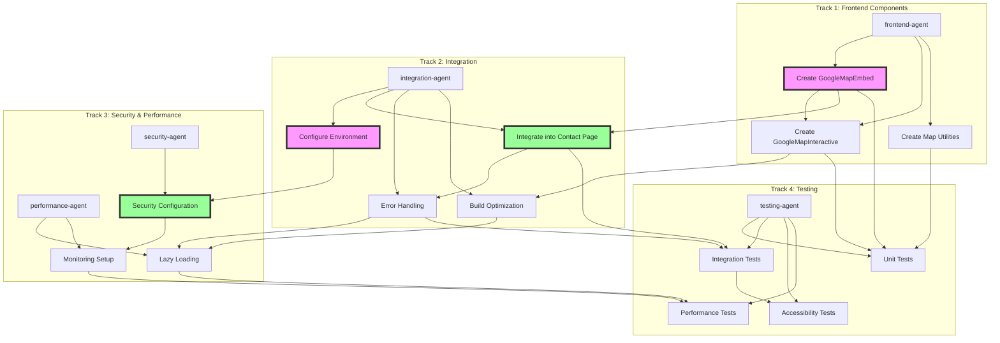

# Implementation Plan: Contact Page Google Maps Location

## Executive Summary

This plan details the integration of Google Maps functionality into The Reiki Goddess Healing Contact Page, replacing the current static map image with an interactive, user-friendly map experience. Based on extensive research and analysis, we will implement a two-phase approach starting with the Google Maps Embed API (free, unlimited usage) and optionally progressing to the JavaScript API for advanced features.

The implementation leverages the existing monorepo architecture, follows established security patterns from ARCHITECTURE.md, and can be completed by multiple specialized agents working in parallel across 4 tracks. Total estimated effort is 3-5 days with minimal risk due to graceful fallback strategies.

## Documentation Dependencies

This plan builds on comprehensive research and analysis from:

- `/docs/design/contact-google-maps-location/overview.md` - Feature requirements and scope
- `/docs/design/contact-google-maps-location/api-analysis.md` - Detailed API comparison and recommendations
- `/docs/design/contact-google-maps-location/current-state-analysis.md` - Existing Contact Page structure
- `/docs/design/contact-google-maps-location/implementation-architecture.md` - Technical design patterns
- `/docs/design/contact-google-maps-location/technical-considerations.md` - Security and performance analysis
- `/docs/design/contact-google-maps-location/integration-points.md` - Integration patterns and checklist
- `/docs/design/contact-google-maps-location/testing-strategy.md` - Comprehensive test requirements

## Parallel Work Streams

### Track 1: Component Development (Frontend)

- **Agent**: frontend-agent
- **Package**: packages/shared-components
- **Tasks**: T001, T003, T006
- **Focus**: Building reusable map components with TypeScript

### Track 2: Integration & Configuration (Full-Stack)

- **Agent**: integration-agent
- **Package**: apps/main, packages/shared-components
- **Tasks**: T002, T004, T007, T008
- **Focus**: Environment setup, Contact Page integration, error handling

### Track 3: Security & Performance (Specialized)

- **Agent**: security-agent, performance-agent
- **Package**: apps/main, packages/shared-components
- **Tasks**: T005, T009, T010
- **Focus**: API security, CSP configuration, lazy loading optimization

### Track 4: Testing & Documentation (Quality)

- **Agent**: testing-agent
- **Package**: All affected packages
- **Tasks**: T011, T012, T013, T014
- **Focus**: Unit tests, integration tests, accessibility compliance

## Task Details

### parallel_tasks:

#### Task T001: Create GoogleMapEmbed Component

```yaml
task_id: T001
name: "Create GoogleMapEmbed Component"
track: 1
dependencies: []
estimated_effort: "2-3 hours"
priority: "high"
description: "Build the core GoogleMapEmbed component with TypeScript interfaces and error handling"
technical_details: "Implement iframe-based map with responsive design, loading states, and fallback to static image"

assigned_agent_type: "frontend"
target_package: "packages/shared-components"
requires_figma_extraction: false
shared_components_needed: ["AnimatedSection"]

typescript_interfaces_required:
  - "GoogleMapEmbedProps - Component properties including address, dimensions, zoom level"
  - "MapLoadingState - Loading state management interface"

security_considerations:
  - "No API key exposure (Embed API doesn't require keys)"
  - "Sanitize address input to prevent injection"
  - "Implement proper iframe sandbox attributes"

accessibility_requirements:
  - "Title attribute for iframe describing map purpose"
  - "ARIA label for map container"
  - "Text alternative with business address"
  - "Keyboard navigation instructions"

test_requirements:
  unit_tests: true
  integration_tests: false
  coverage_target: 90
  test_documentation_required: false

context_dependencies:
  - "/docs/design/contact-google-maps-location/implementation-architecture.md#component-structure"
  - "/docs/project/ARCHITECTURE.md#component-architecture"
  - "packages/shared-components/src/ContactInfoCard/ContactInfoCard.tsx"

acceptance_criteria:
  - "Component renders iframe with properly encoded Google Maps Embed URL"
  - "Supports all props defined in GoogleMapEmbedProps interface"
  - "Implements loading state with skeleton/placeholder"
  - "Falls back gracefully to static image on error"
  - "TypeScript compilation with 0 errors"
  - "All unit tests passing with 90%+ coverage"
```

#### Task T002: Configure Environment Variables

```yaml
task_id: T002
name: "Configure Environment Variables"
track: 2
dependencies: []
estimated_effort: "1 hour"
priority: "high"
description: "Set up Vite environment configuration for Google Maps"
technical_details: "Create .env files, update .gitignore, add example configurations"

assigned_agent_type: "integration"
target_package: "apps/main"
requires_figma_extraction: false
shared_components_needed: []

typescript_interfaces_required:
  - "MapsConfig interface for type-safe environment access"

security_considerations:
  - "Ensure .env.local is in .gitignore"
  - "Use VITE_ prefix for client-exposed variables"
  - "Document security implications in .env.example"

accessibility_requirements: []

test_requirements:
  unit_tests: false
  integration_tests: true
  coverage_target: 80
  test_documentation_required: false

context_dependencies:
  - "/docs/design/contact-google-maps-location/technical-considerations.md#vite-environment-variables"
  - "/docs/design/contact-google-maps-location/integration-points.md#environment-configuration"

acceptance_criteria:
  - ".env.example created with documented variables"
  - ".env.local properly excluded from git"
  - "Environment variables accessible via import.meta.env"
  - "Type-safe config module created"
```

#### Task T003: Create GoogleMapInteractive Component (Phase 2)

```yaml
task_id: T003
name: "Create GoogleMapInteractive Component"
track: 1
dependencies: ["T001"]
estimated_effort: "3-4 hours"
priority: "medium"
description: "Build advanced interactive map component using @vis.gl/react-google-maps"
technical_details: "React component with custom markers, event handling, and full Google Maps API integration"

assigned_agent_type: "frontend"
target_package: "packages/shared-components"
requires_figma_extraction: false
shared_components_needed: ["AnimatedSection", "LazyImage"]

typescript_interfaces_required:
  - "GoogleMapInteractiveProps - Advanced component properties"
  - "MarkerProps - Custom marker configuration"
  - "MapEventHandlers - Event callback interfaces"

security_considerations:
  - "API key must be domain-restricted"
  - "Implement rate limiting for API calls"
  - "Sanitize user inputs for markers/info windows"

accessibility_requirements:
  - "Keyboard navigation for map controls"
  - "Screen reader announcements for interactions"
  - "Focus management for marker popups"
  - "Alternative text descriptions"

test_requirements:
  unit_tests: true
  integration_tests: true
  coverage_target: 85
  test_documentation_required: false

context_dependencies:
  - "/docs/design/contact-google-maps-location/implementation-architecture.md#phase-2-javascript-api"
  - "/docs/design/contact-google-maps-location/api-analysis.md#javascript-api"
  - "@vis.gl/react-google-maps documentation"

acceptance_criteria:
  - "Component renders interactive Google Map"
  - "Custom markers display business location"
  - "Supports zoom, pan, and street view"
  - "Handles API errors gracefully"
  - "TypeScript compilation with 0 errors"
  - "Performance: loads within 2 seconds"
```

#### Task T004: Integrate Map into Contact Page

```yaml
task_id: T004
name: "Integrate Map into Contact Page"
track: 2
dependencies: ["T001"]
estimated_effort: "2 hours"
priority: "high"
description: "Replace static map image with GoogleMapEmbed component in Contact Page"
technical_details: "Update ContactPage.tsx, maintain responsive layout, preserve 598px height"

assigned_agent_type: "integration"
target_package: "apps/main"
requires_figma_extraction: true
shared_components_needed: ["GoogleMapEmbed", "AnimatedSection"]

typescript_interfaces_required: []

security_considerations:
  - "Verify CSP headers allow Google Maps iframe"
  - "Ensure no sensitive data in map parameters"

accessibility_requirements:
  - "Maintain logical tab order"
  - "Preserve heading hierarchy"
  - "Add skip link if needed"

test_requirements:
  unit_tests: false
  integration_tests: true
  coverage_target: 80
  test_documentation_required: false

context_dependencies:
  - "/packages/shared-components/src/pages/ContactPage.tsx"
  - "/figma-screenshots/contact/desktop-contact-page.png"
  - "/docs/design/contact-google-maps-location/current-state-analysis.md"

acceptance_criteria:
  - "Map displays at correct location in page flow"
  - "Maintains 598px height as per design"
  - "Responsive behavior matches current implementation"
  - "Animation timing consistent with other sections"
  - "No visual regression from current design"
```

#### Task T005: Implement Security Configuration

```yaml
task_id: T005
name: "Implement Security Configuration"
track: 3
dependencies: ["T002"]
estimated_effort: "2-3 hours"
priority: "high"
description: "Configure CSP headers, domain restrictions, and API security"
technical_details: "Update security headers for Google Maps compatibility, set up monitoring"

assigned_agent_type: "security"
target_package: "apps/main"
requires_figma_extraction: false
shared_components_needed: ["SecurityValidator", "SecurityMonitor"]

typescript_interfaces_required:
  - "SecurityConfig - Security configuration interface"
  - "CSPDirectives - Type-safe CSP configuration"

security_considerations:
  - "Configure CSP to allow Google Maps domains"
  - "Set up domain restrictions in Google Cloud Console"
  - "Implement API key rotation strategy"
  - "Add security monitoring for map interactions"

accessibility_requirements: []

test_requirements:
  unit_tests: true
  integration_tests: true
  coverage_target: 90
  test_documentation_required: true

context_dependencies:
  - "/docs/design/contact-google-maps-location/technical-considerations.md#security-analysis"
  - "/docs/project/ARCHITECTURE.md#security-architecture"
  - "packages/shared-utils/src/security/"

acceptance_criteria:
  - "CSP headers allow Google Maps without compromising security"
  - "API keys properly restricted by domain"
  - "Security monitoring captures map-related incidents"
  - "No console errors related to CSP violations"
  - "Security best practices documented"
```

#### Task T006: Create Map Utilities and Helpers

```yaml
task_id: T006
name: "Create Map Utilities and Helpers"
track: 1
dependencies: ["T001", "T003"]
estimated_effort: "2 hours"
priority: "medium"
description: "Build utility functions for address encoding, coordinate handling, and map configuration"
technical_details: "Pure functions for map-related operations, shared between components"

assigned_agent_type: "frontend"
target_package: "packages/shared-utils"
requires_figma_extraction: false
shared_components_needed: []

typescript_interfaces_required:
  - "Coordinates - Latitude/longitude interface"
  - "AddressComponents - Structured address data"
  - "MapBounds - Bounding box interface"

security_considerations:
  - "Validate coordinate ranges"
  - "Sanitize address inputs"
  - "Prevent injection in URL construction"

accessibility_requirements: []

test_requirements:
  unit_tests: true
  integration_tests: false
  coverage_target: 95
  test_documentation_required: false

context_dependencies:
  - "/docs/design/contact-google-maps-location/api-analysis.md"
  - "packages/shared-utils/src/index.ts"

acceptance_criteria:
  - "Address encoding handles special characters correctly"
  - "Coordinate validation prevents invalid inputs"
  - "URL construction follows Google Maps API specs"
  - "All functions are pure and testable"
  - "100% test coverage for edge cases"
```

#### Task T007: Implement Error Handling and Fallbacks

```yaml
task_id: T007
name: "Implement Error Handling and Fallbacks"
track: 2
dependencies: ["T004"]
estimated_effort: "2 hours"
priority: "high"
description: "Add comprehensive error boundaries, loading states, and fallback UI"
technical_details: "React error boundaries, retry logic, graceful degradation patterns"

assigned_agent_type: "integration"
target_package: "apps/main"
requires_figma_extraction: false
shared_components_needed: ["GoogleMapEmbed"]

typescript_interfaces_required:
  - "MapErrorState - Error state management"
  - "RetryConfig - Retry strategy configuration"

security_considerations:
  - "Don't expose sensitive error details to users"
  - "Log errors securely for monitoring"

accessibility_requirements:
  - "Error messages announced to screen readers"
  - "Fallback content maintains accessibility"
  - "Retry controls keyboard accessible"

test_requirements:
  unit_tests: true
  integration_tests: true
  coverage_target: 85
  test_documentation_required: false

context_dependencies:
  - "/docs/design/contact-google-maps-location/implementation-architecture.md#error-handling"
  - "/docs/design/contact-google-maps-location/technical-considerations.md#error-scenarios"

acceptance_criteria:
  - "Network failures show static map fallback"
  - "Loading states display during map initialization"
  - "Error messages are user-friendly"
  - "Retry functionality works correctly"
  - "No unhandled promise rejections"
```

#### Task T008: Configure Build Optimization

```yaml
task_id: T008
name: "Configure Build Optimization"
track: 2
dependencies: ["T003"]
estimated_effort: "2 hours"
priority: "medium"
description: "Set up code splitting, lazy loading, and bundle optimization for maps"
technical_details: "Vite configuration for optimal map library loading"

assigned_agent_type: "integration"
target_package: "apps/main"
requires_figma_extraction: false
shared_components_needed: []

typescript_interfaces_required: []

security_considerations: []

accessibility_requirements: []

test_requirements:
  unit_tests: false
  integration_tests: true
  coverage_target: 80
  test_documentation_required: false

context_dependencies:
  - "/docs/design/contact-google-maps-location/implementation-architecture.md#bundle-optimization"
  - "apps/main/vite.config.ts"

acceptance_criteria:
  - "Google Maps code in separate chunk"
  - "Map component lazy loads on Contact route"
  - "Bundle size increase < 50KB for Phase 1"
  - "No impact on initial page load"
```

#### Task T009: Implement Lazy Loading Strategy

```yaml
task_id: T009
name: "Implement Lazy Loading Strategy"
track: 3
dependencies: ["T007", "T008"]
estimated_effort: "3 hours"
priority: "medium"
description: "Add intersection observer-based lazy loading for optimal performance"
technical_details: "Load map only when visible, implement loading skeleton"

assigned_agent_type: "performance"
target_package: "packages/shared-components"
requires_figma_extraction: false
shared_components_needed: ["useIntersectionObserver"]

typescript_interfaces_required:
  - "LazyLoadConfig - Lazy loading configuration"
  - "ViewportState - Viewport tracking interface"

security_considerations: []

accessibility_requirements:
  - "Loading state announced to screen readers"
  - "Skeleton maintains layout stability"

test_requirements:
  unit_tests: true
  integration_tests: true
  coverage_target: 85
  test_documentation_required: false

context_dependencies:
  - "/docs/design/contact-google-maps-location/technical-considerations.md#lazy-loading-benefits"
  - "/docs/project/ARCHITECTURE.md#intersection-observer-hook"
  - "/docs/design/contact-google-maps-location/integration-points.md#lazy-loading-strategies"

acceptance_criteria:
  - "Map loads only when scrolled into view"
  - "Loading skeleton prevents layout shift"
  - "Performance metrics stay within budget"
  - "Works across all supported browsers"
```

#### Task T010: Set Up Monitoring and Analytics

```yaml
task_id: T010
name: "Set Up Monitoring and Analytics"
track: 3
dependencies: ["T005"]
estimated_effort: "2 hours"
priority: "medium"
description: "Configure usage tracking, error monitoring, and performance metrics"
technical_details: "Integrate with existing monitoring infrastructure, set up alerts"

assigned_agent_type: "performance"
target_package: "apps/main"
requires_figma_extraction: false
shared_components_needed: ["SecurityMonitor"]

typescript_interfaces_required:
  - "MapAnalyticsEvent - Analytics event interface"
  - "PerformanceMetrics - Map performance tracking"

security_considerations:
  - "Don't track personally identifiable information"
  - "Comply with privacy policies"

accessibility_requirements: []

test_requirements:
  unit_tests: true
  integration_tests: false
  coverage_target: 80
  test_documentation_required: false

context_dependencies:
  - "/docs/design/contact-google-maps-location/technical-considerations.md#monitoring-requirements"
  - "/docs/design/contact-google-maps-location/integration-points.md#monitoring-requirements"

acceptance_criteria:
  - "Map load times tracked and reported"
  - "Error rates monitored with alerts"
  - "Usage metrics available in dashboard"
  - "No performance regression from monitoring"
```

#### Task T011: Write Unit Tests

```yaml
task_id: T011
name: "Write Unit Tests"
track: 4
dependencies: ["T001", "T003", "T006"]
estimated_effort: "3-4 hours"
priority: "high"
description: "Comprehensive unit test suite for all map components and utilities"
technical_details: "Vitest tests with mocked Google Maps API, edge case coverage"

assigned_agent_type: "testing"
target_package: "packages/shared-components"
requires_figma_extraction: false
shared_components_needed: []

typescript_interfaces_required: []

security_considerations:
  - "Test security validations"
  - "Test XSS prevention in address handling"

accessibility_requirements:
  - "Test ARIA attributes"
  - "Test keyboard navigation"

test_requirements:
  unit_tests: true
  integration_tests: false
  coverage_target: 90
  test_documentation_required: false

context_dependencies:
  - "/docs/design/contact-google-maps-location/testing-strategy.md#unit-tests"
  - "vitest.config.shared.ts"

acceptance_criteria:
  - "90%+ code coverage for map components"
  - "All edge cases tested"
  - "Mocks properly simulate Google Maps API"
  - "Tests run in < 30 seconds"
  - "No flaky tests"
```

#### Task T012: Write Integration Tests

```yaml
task_id: T012
name: "Write Integration Tests"
track: 4
dependencies: ["T004", "T007", "T011"]
estimated_effort: "3 hours"
priority: "high"
description: "Integration tests for Contact Page map functionality"
technical_details: "Test map integration, error scenarios, and user flows"

assigned_agent_type: "testing"
target_package: "apps/main"
requires_figma_extraction: false
shared_components_needed: []

typescript_interfaces_required: []

security_considerations:
  - "Test CSP compliance"
  - "Test API key security"

accessibility_requirements:
  - "Test full page accessibility"
  - "Test focus management"

test_requirements:
  unit_tests: false
  integration_tests: true
  coverage_target: 80
  test_documentation_required: true

context_dependencies:
  - "/docs/design/contact-google-maps-location/testing-strategy.md#integration-tests"
  - "/docs/project/ARCHITECTURE.md#testing-patterns"

acceptance_criteria:
  - "Contact page renders with map correctly"
  - "Error scenarios handled gracefully"
  - "Performance benchmarks met"
  - "Cross-browser compatibility verified"
```

#### Task T013: Write Accessibility Tests

```yaml
task_id: T013
name: "Write Accessibility Tests"
track: 4
dependencies: ["T012"]
estimated_effort: "2 hours"
priority: "high"
description: "Comprehensive accessibility testing for map components"
technical_details: "WCAG 2.1 AA compliance, screen reader testing, keyboard navigation"

assigned_agent_type: "testing"
target_package: "packages/shared-components"
requires_figma_extraction: false
shared_components_needed: []

typescript_interfaces_required: []

security_considerations: []

accessibility_requirements:
  - "WCAG 2.1 AA compliance"
  - "Screen reader compatibility"
  - "Keyboard navigation support"
  - "Color contrast requirements"

test_requirements:
  unit_tests: true
  integration_tests: true
  coverage_target: 100
  test_documentation_required: true

context_dependencies:
  - "/docs/design/contact-google-maps-location/testing-strategy.md#accessibility-tests"
  - "WCAG 2.1 guidelines"

acceptance_criteria:
  - "All WCAG 2.1 AA criteria pass"
  - "Screen readers announce map properly"
  - "Keyboard navigation fully functional"
  - "No accessibility violations"
```

#### Task T014: Write Performance Tests

```yaml
task_id: T014
name: "Write Performance Tests"
track: 4
dependencies: ["T009", "T010"]
estimated_effort: "2 hours"
priority: "medium"
description: "Performance benchmarks and optimization validation"
technical_details: "Measure load times, bundle sizes, runtime performance"

assigned_agent_type: "testing"
target_package: "apps/main"
requires_figma_extraction: false
shared_components_needed: []

typescript_interfaces_required: []

security_considerations: []

accessibility_requirements: []

test_requirements:
  unit_tests: false
  integration_tests: true
  coverage_target: 80
  test_documentation_required: true

context_dependencies:
  - "/docs/design/contact-google-maps-location/testing-strategy.md#performance-tests"
  - "/docs/design/contact-google-maps-location/technical-considerations.md#performance-and-reliability"

acceptance_criteria:
  - "LCP < 2.5 seconds with map"
  - "Bundle size increase < 50KB (Phase 1)"
  - "No memory leaks detected"
  - "Lazy loading works correctly"
```

## Agent Orchestration Plan



## Critical Path

The minimum sequence of tasks that must complete for basic functionality:

1. **T001** (Create GoogleMapEmbed) → **T004** (Integrate into Contact) → **T012** (Integration Tests)
2. **T002** (Configure Environment) → **T005** (Security Configuration)

Critical path duration: 2-3 days with parallel execution

## Resource Requirements

### Agent Types and Allocation

- **frontend-agent**: 2 instances (Component development)
- **integration-agent**: 1 instance (System integration)
- **security-agent**: 1 instance (Security configuration)
- **performance-agent**: 1 instance (Optimization)
- **testing-agent**: 1 instance (Quality assurance)

### Maximum Concurrent Agents: 4

- Track 1 & 2 can run fully parallel (Days 1-2)
- Track 3 depends on Track 1 & 2 outputs (Days 2-3)
- Track 4 runs alongside other tracks (Days 1-3)

### External Dependencies

- Google Cloud Console access for API configuration
- Figma access for design verification
- Domain configuration for security restrictions

## Repository Integration

### Existing Components to Reuse

- `AnimatedSection` - For map reveal animations
- `useIntersectionObserver` - For lazy loading implementation
- `SecurityValidator` - For address input validation
- `SecurityMonitor` - For tracking map-related security events
- `ContactInfoCard` - Reference for consistent styling
- `PageTransition` - For smooth page transitions

### New Components to Create

- `packages/shared-components/src/GoogleMap/` - Map component suite
  - `GoogleMapEmbed.tsx` - Phase 1 embed component
  - `GoogleMapInteractive.tsx` - Phase 2 interactive component
  - `GoogleMap.types.ts` - Shared TypeScript interfaces
  - `GoogleMap.test.tsx` - Component tests
- `packages/shared-utils/src/maps/` - Map utilities
  - `addressEncoder.ts` - Safe address URL encoding
  - `coordinates.ts` - Coordinate validation
  - `mapConfig.ts` - Configuration helpers

### Security Patterns to Apply

- **Form Validation**: Apply `SecurityValidator` patterns to address inputs
- **Rate Limiting**: Implement client-side limiting for API calls
- **CSP Configuration**: Update headers for Google Maps compatibility
- **Monitoring**: Use `SecurityMonitor` for tracking incidents

### Test Documentation Required

- Integration test failures during CSP configuration
- Performance regression documentation if limits exceeded
- Accessibility audit results and remediations

## Success Metrics

### Functional Requirements

- ✓ Interactive map displays business location correctly
- ✓ Users can zoom, pan, and get directions
- ✓ Map loads within performance budget
- ✓ Graceful fallback to static image on errors

### Technical Requirements

- ✓ TypeScript compilation: 0 errors
- ✓ Test coverage > 85% per package
- ✓ All unit and integration tests passing
- ✓ Lint and type-check passing

### Performance Metrics

- ✓ Bundle size increase < 50KB (Phase 1)
- ✓ LCP < 2.5 seconds with map loaded
- ✓ No memory leaks or performance regressions
- ✓ Lazy loading reduces initial impact

### Security & Compliance

- ✓ No API key exposure in client code
- ✓ CSP headers properly configured
- ✓ Domain restrictions enforced
- ✓ WCAG 2.1 AA compliant
- ✓ Privacy policy updated for data collection

## Risk Mitigation

### Technical Risks

**Component Conflicts**

- **Risk**: Existing CSS might conflict with map styling
- **Impact**: Medium
- **Mitigation**: Use scoped styles and test thoroughly in integration

**API Quota Exhaustion**

- **Risk**: Exceeding Google Maps free tier limits
- **Impact**: High
- **Mitigation**: Start with Embed API (unlimited free), implement monitoring and alerts

**Bundle Size Growth**

- **Risk**: JavaScript bundle becoming too large
- **Impact**: Medium
- **Mitigation**: Code splitting, lazy loading, use Embed API initially

### Security Risks

**API Key Exposure**

- **Risk**: Unrestricted API keys could be abused
- **Impact**: High
- **Mitigation**: Domain restrictions, separate keys per environment, monitoring

**CSP Violations**

- **Risk**: Security headers blocking Google Maps
- **Impact**: Medium
- **Mitigation**: Careful CSP configuration, thorough testing

### Operational Risks

**Cross-Browser Compatibility**

- **Risk**: Map features not working in all browsers
- **Impact**: Low
- **Mitigation**: Use well-supported APIs, test across browsers

**Mobile Performance**

- **Risk**: Maps performing poorly on mobile devices
- **Impact**: Medium
- **Mitigation**: Responsive design, touch optimization, performance testing

## Rollback Strategy

In case of critical issues:

1. **Immediate Rollback**: Revert ContactPage.tsx to use static image
2. **Feature Flag**: Implement feature toggle for gradual rollout
3. **Monitoring**: Track errors and performance before full deployment
4. **Staged Rollout**: Deploy to percentage of users first

## Phase 2 Considerations

After successful Phase 1 deployment, consider Phase 2 enhancements:

- Custom branded map markers
- Multi-location support for future expansion
- Integration with booking system
- Real-time availability display
- Driving directions integration
- Street view functionality

---

**Estimated Total Effort**: 3-5 days with parallel execution
**Recommended Start**: Phase 1 (Embed API) for immediate value
**Success Probability**: High (95%) due to incremental approach and fallback strategies
