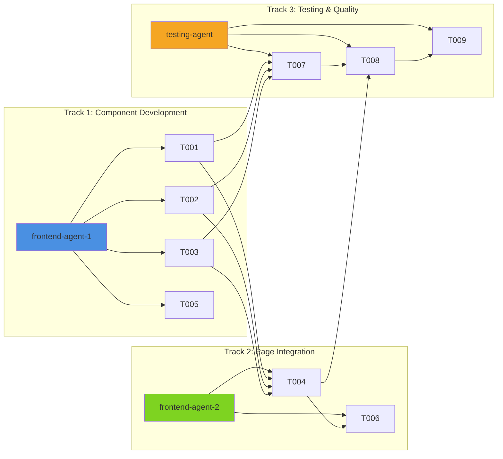

# Implementation Plan: Services Page Feature

> **Feature**: Services Page Enhancement
> **Estimated Total Effort**: 2-3 days
> **Parallel Tracks**: 3 concurrent work streams
> **Repository Branch**: `feat/services-page-implementation`
> **Plan Created**: 2025-10-15

---

## Executive Summary

This implementation plan enhances the existing Services page placeholder at `/apps/main/src/pages/Services.tsx` to create a comprehensive, production-ready Services page. The existing `ServicesPage` component in `packages/shared-components` provides a foundation, with **85%+ component reusability** from the existing codebase.

### Current State Analysis

**Existing Infrastructure** ✅:

- Route configured at `/services` in App.tsx
- Basic placeholder page exists at `apps/main/src/pages/Services.tsx`
- Enhanced `ServicesPage` component available in `packages/shared-components`
- `ServicesSection` component production-ready (used on homepage)
- Navigation integration complete

**Key Advantages**:

- **85%+ component reuse**: ServicesSection, BookSessionCTA, AnimatedSection, HeroV2, Testimonials
- **97% brand consistency**: Established patterns for colors, typography, spacing, animations
- **Strong test patterns**: 17 existing tests, comprehensive accessibility testing
- **Clear architectural patterns**: Two-tier component strategy, TypeScript project references

### Implementation Strategy

**Three-Tier Approach**:

1. **Tier 1 - Foundation** (4-6 hours): Use existing components with minimal customization
2. **Tier 2 - Enhancement** (8-12 hours): Create service-specific components (ServiceHero, ServiceCard, PricingSection)
3. **Tier 3 - Polish** (4-6 hours): Testing, accessibility, performance optimization

---

## Documentation Dependencies

This plan is based on comprehensive research documentation:

- ✅ `/docs/design/services-page/pattern-analysis.md` (3,000 lines, 30 reusable patterns)
- ✅ `/docs/design/services-page/component-inventory.md` (2,500 lines, 35+ components cataloged)
- ✅ `/docs/design/services-page/style-compliance-audit.md` (2,400 lines, 97% brand consistency)
- ✅ `/docs/design/services-page/testing-patterns.md` (2,478 lines, test templates)
- ✅ `/docs/design/services-page/architecture-integration.md` (3,036 lines, monorepo structure)

**Additional Context**:

- `/docs/project/ARCHITECTURE.md` - Security and component patterns
- `/docs/design/style-guide.md` - Brand colors, typography, spacing standards
- `/figma-screenshots/homepage/` - Design reference (no services-specific screenshots found)

---

## Parallel Work Streams

### Track 1: Component Development (Frontend)

**Agent Type**: `frontend-agent`
**Package**: `packages/shared-components`
**Tasks**: T001, T002, T003, T005
**Estimated Effort**: 12-16 hours

### Track 2: Page Integration (Frontend)

**Agent Type**: `frontend-agent`
**Package**: `apps/main`
**Tasks**: T004, T006
**Estimated Effort**: 4-6 hours

### Track 3: Testing & Quality (Testing)

**Agent Type**: `testing-agent`
**Package**: All affected packages
**Tasks**: T007, T008, T009
**Estimated Effort**: 8-10 hours

---

## Task Breakdown

### T001: Create ServiceHero Component

**Track**: 1 (Component Development)
**Priority**: High
**Dependencies**: []
**Estimated Effort**: 3-4 hours

**Description**:
Create a dedicated hero component for the Services page following the AboutHero pattern but with service-specific content and imagery.

**Technical Details**:

- Location: `packages/shared-components/src/ServiceHero/`
- Files to create:
  - `ServiceHero.tsx` - Main component
  - `ServiceHero.types.ts` - TypeScript interfaces
  - `ServiceHero.test.tsx` - Component tests
  - `index.ts` - Re-exports
- Adapt from `AboutHero` component structure
- Props: heading, subheading, description, backgroundImage, ctaButtons
- Apply established patterns: 66px padding, #FFFBF5 background, AnimatedSection wrapper

**Assigned Agent Type**: `frontend-agent`
**Target Package**: `packages/shared-components`
**Requires Figma Extraction**: Yes (homepage hero as reference)
**Shared Components Needed**: `AnimatedSection`, `LazyImage`

**TypeScript Interfaces Required**:

```typescript
interface ServiceHeroProps {
  heading: string;
  subheading?: string;
  description: string;
  backgroundImage?: {
    src: string;
    alt: string;
  };
  ctaButtons?: Array<{
    text: string;
    href?: string;
    onClick?: () => void;
    variant: "primary" | "secondary";
    ariaLabel?: string;
  }>;
  className?: string;
}
```

**Accessibility Requirements**:

- Heading must be h1 with proper semantic structure
- CTA buttons require aria-labels
- Background images need alt text
- Keyboard navigation for all interactive elements

**Test Requirements**:

- **Unit Tests**: Yes
- **Integration Tests**: No
- **Coverage Target**: 80%+
- **Test Documentation Required**: Yes

**Context Dependencies**:

- `/docs/design/services-page/pattern-analysis.md` (Hero patterns)
- `/docs/design/services-page/component-inventory.md` (AboutHero structure)
- `/docs/design/services-page/style-compliance-audit.md` (Brand colors, typography)
- `/packages/shared-components/src/AboutHero/AboutHero.tsx` (Reference implementation)

**Acceptance Criteria**:

- [ ] Component renders with all required props
- [ ] Follows brand color palette (#0205B7, #FFFBF5)
- [ ] Uses Figtree font family
- [ ] Applies 66px padding standard
- [ ] Includes AnimatedSection wrapper with fadeIn animation
- [ ] TypeScript compilation with 0 errors
- [ ] All tests passing (80%+ coverage)
- [ ] Accessibility: WCAG 2.1 AA compliant
- [ ] Responsive breakpoints: xs/sm/md/lg
- [ ] Exported from `packages/shared-components/src/index.ts`

---

### T002: Create ServiceCard Component

**Track**: 1 (Component Development)
**Priority**: High
**Dependencies**: []
**Estimated Effort**: 3-4 hours

**Description**:
Create an enhanced service card component for detailed service information with expandable content, pricing, and booking CTAs.

**Technical Details**:

- Location: `packages/shared-components/src/ServiceCard/`
- Files to create:
  - `ServiceCard.tsx`
  - `ServiceCard.types.ts`
  - `ServiceCard.test.tsx`
  - `index.ts`
- Design: Blue bevel effect (5px offset), 20px border radius
- Features: Icon, title, duration, price, description, expandable details
- Hover state: -2px translateY, gradient overlay (blue to cyan)

**Assigned Agent Type**: `frontend-agent`
**Target Package**: `packages/shared-components`
**Requires Figma Extraction**: No (follow existing card patterns)
**Shared Components Needed**: None (self-contained)

**TypeScript Interfaces Required**:

```typescript
interface ServiceCardProps {
  service: {
    id: string;
    icon: React.ReactNode;
    title: string;
    duration?: string;
    price?: string;
    shortDescription: string;
    fullDescription?: string;
    benefits?: string[];
    href?: string;
  };
  expanded?: boolean;
  onToggle?: () => void;
  className?: string;
}
```

**Security Considerations**:

- Sanitize user-provided content if dynamic
- Validate href URLs before navigation

**Accessibility Requirements**:

- Card should be `<article>` with proper heading hierarchy
- Expandable sections need aria-expanded attribute
- Interactive elements need keyboard support (Enter/Space)
- Focus management for expand/collapse

**Test Requirements**:

- **Unit Tests**: Yes
- **Integration Tests**: No
- **Coverage Target**: 85%+
- **Test Documentation Required**: Yes

**Context Dependencies**:

- `/docs/design/services-page/pattern-analysis.md` (Service card pattern #28, blue bevel #20)
- `/docs/design/services-page/style-compliance-audit.md` (Card styling patterns)
- `/packages/shared-components/src/Services/ServicesSection.tsx` (Existing service card reference)
- `/packages/shared-components/src/ContactInfoCard/ContactInfoCard.tsx` (Card structure reference)

**Acceptance Criteria**:

- [ ] Card renders with service data
- [ ] Blue bevel effect applied (#0205B7, 5px offset)
- [ ] 20px border radius
- [ ] Hover state: -2px lift, gradient overlay
- [ ] Expandable content works smoothly
- [ ] TypeScript compilation with 0 errors
- [ ] All tests passing (85%+ coverage)
- [ ] Accessibility: Proper ARIA attributes
- [ ] Keyboard navigation functional
- [ ] Lint and type-check passing

---

### T003: Create PricingSection Component

**Track**: 1 (Component Development)
**Priority**: Medium
**Dependencies**: [T002]
**Estimated Effort**: 4-5 hours

**Description**:
Create a pricing section component displaying service packages with pricing tiers, features, and booking CTAs.

**Technical Details**:

- Location: `packages/shared-components/src/PricingSection/`
- Files: `PricingSection.tsx`, `PricingSection.types.ts`, `PricingSection.test.tsx`, `index.ts`
- Layout: 3-column grid on desktop, 1-column mobile
- Design: Blue bevel cards with featured tier highlighted
- Content: Package name, price, features list, CTA button

**Assigned Agent Type**: `frontend-agent`
**Target Package**: `packages/shared-components`
**Requires Figma Extraction**: No
**Shared Components Needed**: `AnimatedSection`

**TypeScript Interfaces Required**:

```typescript
interface PricingTier {
  id: string;
  name: string;
  price: string;
  duration?: string;
  features: string[];
  featured?: boolean;
  ctaText: string;
  ctaHref?: string;
  ctaOnClick?: () => void;
}

interface PricingSectionProps {
  heading?: string;
  subheading?: string;
  tiers: PricingTier[];
  className?: string;
}
```

**Accessibility Requirements**:

- Each tier should be a `<section>` with aria-label
- Feature lists should use `<ul>` with proper nesting
- Featured tier needs visual and text indicator
- CTA buttons need clear labels

**Test Requirements**:

- **Unit Tests**: Yes
- **Integration Tests**: No
- **Coverage Target**: 80%+
- **Test Documentation Required**: Yes

**Context Dependencies**:

- `/docs/design/services-page/pattern-analysis.md` (Card patterns, CTA patterns)
- `/docs/design/services-page/component-inventory.md` (Card composition examples)
- `/packages/shared-components/src/Services/ServicesSection.tsx` (Grid layout reference)

**Acceptance Criteria**:

- [ ] Renders 1-3 pricing tiers
- [ ] Responsive grid: 1 col mobile, 3 col desktop
- [ ] Featured tier visually distinct
- [ ] Blue bevel effect on cards
- [ ] CTA buttons follow brand style
- [ ] TypeScript compilation with 0 errors
- [ ] All tests passing (80%+ coverage)
- [ ] Accessible pricing information
- [ ] Mobile-responsive layout

---

### T004: Integrate Components into ServicesPage

**Track**: 2 (Page Integration)
**Priority**: High
**Dependencies**: [T001, T002, T003]
**Estimated Effort**: 2-3 hours

**Description**:
Update the `apps/main/src/pages/Services.tsx` file to use the enhanced `ServicesPage` component from shared-components, or compose a new page using the newly created ServiceHero, ServiceCard, and PricingSection components.

**Technical Details**:

- Location: `apps/main/src/pages/Services.tsx`
- Replace placeholder with full Services page composition
- Wrap in `PageTransition` component
- Use existing `ServicesPage` from shared-components as foundation
- Add new sections: ServiceHero, enhanced service details, PricingSection

**Page Structure**:

```tsx
<PageTransition>
  <div className="min-h-screen">
    <ServiceHero />
    <FeaturesBar />
    <ServicesSection />
    <AnimatedSection>
      <ServiceDetails />
    </AnimatedSection>
    <AnimatedSection>
      <PricingSection />
    </AnimatedSection>
    <AnimatedSection>
      <Testimonials />
    </AnimatedSection>
    <AnimatedSection>
      <BookSessionCTA />
    </AnimatedSection>
  </div>
</PageTransition>
```

**Assigned Agent Type**: `frontend-agent`
**Target Package**: `apps/main`
**Requires Figma Extraction**: No
**Shared Components Needed**: `PageTransition`, `ServiceHero`, `FeaturesBar`, `ServicesSection`, `PricingSection`, `Testimonials`, `BookSessionCTA`, `AnimatedSection`

**TypeScript Interfaces Required**:

- None (compose existing components)

**Accessibility Requirements**:

- Page must have single h1 (in ServiceHero)
- Proper heading hierarchy throughout
- Skip navigation link
- Focus management on page load

**Test Requirements**:

- **Unit Tests**: No (page-level)
- **Integration Tests**: Yes
- **Coverage Target**: N/A (integration test)
- **Test Documentation Required**: Yes

**Context Dependencies**:

- `/docs/design/services-page/pattern-analysis.md` (Page structure pattern)
- `/docs/design/services-page/architecture-integration.md` (Page integration guidance)
- `/packages/shared-components/src/pages/ServicesPage.tsx` (Existing page component)

**Acceptance Criteria**:

- [ ] Page renders all sections
- [ ] PageTransition wrapper applied
- [ ] All imports resolve correctly
- [ ] 1440px max-width container
- [ ] 66px edge buffers maintained
- [ ] Smooth animations between sections
- [ ] TypeScript compilation with 0 errors
- [ ] Navigation to /services works
- [ ] Mobile-responsive

---

### T005: Update ServicesSection with Enhanced Content

**Track**: 1 (Component Development)
**Priority**: Medium
**Dependencies**: []
**Estimated Effort**: 2-3 hours

**Description**:
Enhance the existing `ServicesSection` component with expanded service descriptions, benefits, and improved imagery.

**Technical Details**:

- Location: `packages/shared-components/src/Services/ServicesSection.tsx`
- Update service data structure
- Add optional "view details" links for each service
- Ensure component remains backward compatible (still works on homepage)

**Assigned Agent Type**: `frontend-agent`
**Target Package**: `packages/shared-components`
**Requires Figma Extraction**: No
**Shared Components Needed**: None (existing component)

**TypeScript Interfaces Required**:

```typescript
interface Service {
  id: string;
  icon: React.ReactNode;
  title: string;
  description: string;
  duration?: string;
  href?: string;
  benefits?: string[];
}

interface ServicesSectionProps {
  heading?: string;
  subheading?: string;
  services?: Service[];
  showDetails?: boolean;
  className?: string;
}
```

**Accessibility Requirements**:

- Maintain existing semantic HTML
- "View details" links need descriptive text
- Icon-only elements need aria-labels

**Test Requirements**:

- **Unit Tests**: Yes (update existing tests)
- **Integration Tests**: No
- **Coverage Target**: 90%+ (already high coverage)
- **Test Documentation Required**: Yes

**Context Dependencies**:

- `/packages/shared-components/src/Services/ServicesSection.tsx` (existing implementation)
- `/packages/shared-components/src/Services/ServicesSection.test.tsx` (existing tests)
- `/docs/design/services-page/testing-patterns.md` (test update patterns)

**Acceptance Criteria**:

- [ ] Enhanced service data structure
- [ ] Optional service detail links
- [ ] Backward compatible with homepage
- [ ] All existing tests still passing
- [ ] New tests for enhanced features
- [ ] TypeScript compilation with 0 errors
- [ ] Coverage maintained at 90%+
- [ ] No breaking changes

---

### T006: Update Navigation and Metadata

**Track**: 2 (Page Integration)
**Priority**: Low
**Dependencies**: [T004]
**Estimated Effort**: 1 hour

**Description**:
Ensure Services page is properly linked in navigation, update page metadata (title, description), and verify routing.

**Technical Details**:

- Verify route in `apps/main/src/App.tsx`
- Check navigation in `Header` component
- Add page metadata (Helmet or document.title)
- Verify active nav state

**Assigned Agent Type**: `frontend-agent`
**Target Package**: `apps/main`
**Requires Figma Extraction**: No
**Shared Components Needed**: `Header` (verify only)

**Accessibility Requirements**:

- Page title clearly describes content
- Meta description for SEO
- Active navigation state visually clear

**Test Requirements**:

- **Unit Tests**: No
- **Integration Tests**: Yes
- **Coverage Target**: N/A
- **Test Documentation Required**: No

**Context Dependencies**:

- `/docs/design/services-page/architecture-integration.md` (Routing section)
- `/packages/shared-components/src/Header/Header.tsx` (Navigation)

**Acceptance Criteria**:

- [ ] /services route active
- [ ] Navigation link highlighted when on Services page
- [ ] Page title: "Healing Services | The Reiki Goddess"
- [ ] Meta description added
- [ ] Breadcrumbs (if applicable)
- [ ] TypeScript compilation with 0 errors

---

### T007: Write Component Tests

**Track**: 3 (Testing & Quality)
**Priority**: High
**Dependencies**: [T001, T002, T003]
**Estimated Effort**: 4-5 hours

**Description**:
Create comprehensive unit tests for all new components following the established testing patterns from the codebase.

**Technical Details**:

- Test files: `ServiceHero.test.tsx`, `ServiceCard.test.tsx`, `PricingSection.test.tsx`
- Follow 6-category test structure:
  1. Rendering & Structure
  2. Styling & Variants
  3. User Interactions
  4. Accessibility
  5. Responsive Behavior
  6. Edge Cases
- Use Vitest + React Testing Library
- Target 80%+ coverage per component

**Assigned Agent Type**: `testing-agent`
**Target Package**: `packages/shared-components`
**Requires Figma Extraction**: No
**Shared Components Needed**: Test utilities (`RouterWrapper`)

**Test Requirements**:

- **Unit Tests**: Yes (primary focus)
- **Integration Tests**: No
- **Coverage Target**: 80%+ per component
- **Test Documentation Required**: Yes (if any failures)

**Context Dependencies**:

- `/docs/design/services-page/testing-patterns.md` (Test templates)
- `/packages/shared-components/src/AboutHero/AboutHero.test.tsx` (Reference)
- `/packages/shared-components/src/Services/ServicesSection.test.tsx` (Card tests)

**Acceptance Criteria**:

- [ ] ServiceHero: 15-20 tests covering all categories
- [ ] ServiceCard: 20-25 tests including expand/collapse
- [ ] PricingSection: 15-18 tests covering tiers and CTAs
- [ ] All tests passing
- [ ] Coverage > 80% per component
- [ ] Accessibility tests included
- [ ] Edge cases covered
- [ ] Mock patterns follow established conventions
- [ ] Test documentation for any complex scenarios

---

### T008: Integration Testing

**Track**: 3 (Testing & Quality)
**Priority**: Medium
**Dependencies**: [T004, T007]
**Estimated Effort**: 2-3 hours

**Description**:
Create integration tests for the Services page to verify end-to-end functionality, navigation, and component interactions.

**Technical Details**:

- Location: `apps/main/src/__tests__/Services.integration.test.tsx`
- Test scenarios:
  - Navigation to /services from homepage
  - Page loads with all sections
  - Scroll animations trigger correctly
  - CTA buttons navigate correctly
  - Service cards expand/collapse
  - Mobile responsive behavior
- Use React Testing Library + RouterWrapper

**Assigned Agent Type**: `testing-agent`
**Target Package**: `apps/main`
**Requires Figma Extraction**: No
**Shared Components Needed**: `RouterWrapper`, all Services page components

**Test Requirements**:

- **Unit Tests**: No
- **Integration Tests**: Yes (primary focus)
- **Coverage Target**: N/A (integration)
- **Test Documentation Required**: Yes

**Context Dependencies**:

- `/docs/design/services-page/testing-patterns.md` (Integration test examples)
- `/apps/main/src/__tests__/App.test.tsx` (Existing integration test)

**Acceptance Criteria**:

- [ ] 10-12 integration tests covering key flows
- [ ] Navigation tests pass
- [ ] Component interaction tests pass
- [ ] Responsive tests on multiple viewports
- [ ] All tests passing
- [ ] Test documentation complete

---

### T009: Accessibility & Performance Audit

**Track**: 3 (Testing & Quality)
**Priority**: Medium
**Dependencies**: [T004, T008]
**Estimated Effort**: 2-3 hours

**Description**:
Conduct comprehensive accessibility and performance audits on the Services page to ensure WCAG 2.1 AA compliance and optimal performance.

**Technical Details**:

- **Accessibility checks**:
  - Lighthouse accessibility score > 95
  - axe DevTools scan (0 violations)
  - Keyboard navigation test
  - Screen reader test (VoiceOver/NVDA)
  - Color contrast ratios (4.5:1 minimum)
  - Focus indicators visible
  - Semantic HTML structure

- **Performance checks**:
  - Lighthouse performance score > 90
  - LCP (Largest Contentful Paint) < 2.5s
  - FID (First Input Delay) < 100ms
  - CLS (Cumulative Layout Shift) < 0.1
  - Bundle size impact < 50KB
  - Image optimization verification
  - Lazy loading for below-fold content

**Assigned Agent Type**: `testing-agent`
**Target Package**: `apps/main`
**Requires Figma Extraction**: No
**Shared Components Needed**: None (audit only)

**Accessibility Requirements**:

- WCAG 2.1 AA compliance
- Keyboard navigation fully functional
- Screen reader compatible
- Proper heading hierarchy
- Sufficient color contrast
- Focus management
- ARIA attributes correct

**Test Requirements**:

- **Unit Tests**: No
- **Integration Tests**: No
- **Coverage Target**: N/A
- **Test Documentation Required**: Yes (audit report)

**Context Dependencies**:

- `/docs/design/services-page/testing-patterns.md` (Accessibility patterns)
- `/docs/design/services-page/style-compliance-audit.md` (Color contrast values)

**Acceptance Criteria**:

- [ ] Lighthouse accessibility score > 95
- [ ] 0 axe DevTools violations
- [ ] Keyboard navigation functional
- [ ] Screen reader test passed
- [ ] Color contrast compliant
- [ ] Lighthouse performance score > 90
- [ ] Core Web Vitals: green
- [ ] Bundle size impact < 50KB
- [ ] Audit report documented

---

## Critical Path

The critical path determines the minimum completion time:

```
T001 (ServiceHero) --> T004 (Page Integration) --> T008 (Integration Testing) --> T009 (A11y & Perf Audit)
   ↓
T002 (ServiceCard) --/
   ↓
T003 (PricingSection) --/
```

**Minimum Completion Time**: ~20-24 hours (with parallel execution)

---

## Dependency Graph

```mermaid
graph TD
    %% Track 1: Component Development
    T001[T001: ServiceHero Component<br/>3-4h | frontend-agent]
    T002[T002: ServiceCard Component<br/>3-4h | frontend-agent]
    T003[T003: PricingSection Component<br/>4-5h | frontend-agent]
    T005[T005: Enhance ServicesSection<br/>2-3h | frontend-agent]

    %% Track 2: Page Integration
    T004[T004: Integrate Components<br/>2-3h | frontend-agent]
    T006[T006: Update Navigation & Metadata<br/>1h | frontend-agent]

    %% Track 3: Testing & Quality
    T007[T007: Component Tests<br/>4-5h | testing-agent]
    T008[T008: Integration Tests<br/>2-3h | testing-agent]
    T009[T009: A11y & Performance Audit<br/>2-3h | testing-agent]

    %% Dependencies
    T001 --> T004
    T002 --> T004
    T003 --> T004
    T004 --> T006

    T001 --> T007
    T002 --> T007
    T003 --> T007

    T004 --> T008
    T007 --> T008

    T008 --> T009

    %% Styling
    classDef track1 fill:#4A90E2,stroke:#2E5C8A,color:#fff
    classDef track2 fill:#7ED321,stroke:#5A9C18,color:#fff
    classDef track3 fill:#F5A623,stroke:#C17D11,color:#fff

    class T001,T002,T003,T005 track1
    class T004,T006 track2
    class T007,T008,T009 track3
```

---

## Agent Orchestration Plan



### Agent Execution Timeline

**Phase 1: Parallel Component Development** (Day 1)

- frontend-agent-1: T001, T002, T003, T005 (in series, ~12-16 hours)
- No blockers, can start immediately

**Phase 2: Integration** (Day 2 morning)

- frontend-agent-2: T004, T006 (sequential, ~3-4 hours)
- Blocked by: T001, T002, T003 completion

**Phase 3: Testing** (Day 2 afternoon - Day 3)

- testing-agent: T007, T008, T009 (sequential, ~8-11 hours)
- T007 blocked by: T001, T002, T003 completion
- T008 blocked by: T004, T007 completion
- T009 blocked by: T008 completion

**Total Elapsed Time**: 2-3 days (with parallel execution)

---

## Resource Requirements

### Agent Types and Allocation

| Agent Type         | Count | Tasks                              | Hours      |
| ------------------ | ----- | ---------------------------------- | ---------- |
| **frontend-agent** | 2     | T001, T002, T003, T004, T005, T006 | 16-20h     |
| **testing-agent**  | 1     | T007, T008, T009                   | 8-11h      |
| **Total**          | **3** | **9 tasks**                        | **24-31h** |

### Concurrent Agent Strategy

- **Maximum Concurrent**: 3 agents (1 frontend for components, 1 frontend for integration, 1 testing)
- **Optimal Start**: Launch frontend-agent-1 first (T001-T005), then frontend-agent-2 when T001-T003 complete
- **Testing Wave**: Launch testing-agent when T001-T003 complete

### Figma Extraction Requirements

- **T001 (ServiceHero)**: Use homepage hero as reference (`/figma-screenshots/homepage/`)
- No services-specific Figma screenshots found - use existing page patterns as design guidance

---

## Repository Integration

### Existing Components to Reuse

From **packages/shared-components** (no modifications needed):

1. ✅ **AnimatedSection** - Scroll animations wrapper
2. ✅ **BookSessionCTA** - Bottom page CTA
3. ✅ **Testimonials** - Social proof section
4. ✅ **FeaturesBar** - Service benefits bar
5. ✅ **HeroV2** - Can be used as fallback for ServiceHero
6. ✅ **LazyImage** - Optimized image loading
7. ✅ **ResponsiveContainer** - Layout wrapper
8. ✅ **Header** - Navigation (already includes Services link)
9. ✅ **Footer** - Site footer
10. ✅ **PageTransition** - Page transition wrapper

### New Components to Create

In **packages/shared-components/src/**:

1. 🆕 **ServiceHero/** - Services page hero section
2. 🆕 **ServiceCard/** - Detailed service card with expansion
3. 🆕 **PricingSection/** - Pricing tiers display

### Components to Enhance

In **packages/shared-components/src/**:

1. 🔧 **Services/ServicesSection.tsx** - Add enhanced content structure

### Security Patterns to Apply

From `/docs/project/ARCHITECTURE.md`:

- ✅ Input validation for any user-provided content (if adding forms)
- ✅ URL validation for href attributes
- ✅ XSS prevention (sanitize any dynamic HTML content)
- ✅ Rate limiting (if adding booking forms)

**Note**: Services page is primarily display-only, minimal security concerns. If booking functionality added later, apply `SecurityValidator` and `FormRateLimit` patterns.

### Test Documentation Required

Per `/docs/testing/` conventions:

- ✅ Document any test failures in `/docs/testing/components/Services/`
- ✅ Create test report: `/docs/testing/components/Services/test-results.md`
- ✅ Update `/docs/testing/TESTING_SUMMARY.md` with new coverage stats

---

## Success Metrics

### Code Quality Metrics

- ✅ **TypeScript**: 0 compilation errors
- ✅ **ESLint**: 0 errors, < 5 warnings
- ✅ **Prettier**: All files formatted
- ✅ **Type Coverage**: 100% (no `any` types)

### Testing Metrics

- ✅ **Unit Test Coverage**: > 80% per component
- ✅ **Integration Tests**: 10-12 tests passing
- ✅ **Test Execution Time**: < 10 seconds
- ✅ **All Tests Passing**: 100% pass rate

### Performance Metrics

- ✅ **Lighthouse Performance**: > 90
- ✅ **LCP**: < 2.5 seconds
- ✅ **FID**: < 100ms
- ✅ **CLS**: < 0.1
- ✅ **Bundle Size Impact**: < 50KB
- ✅ **Time to Interactive**: < 3.5 seconds

### Accessibility Metrics

- ✅ **Lighthouse Accessibility**: > 95
- ✅ **axe DevTools**: 0 violations
- ✅ **WCAG 2.1 AA**: Compliant
- ✅ **Keyboard Navigation**: Fully functional
- ✅ **Screen Reader**: Compatible
- ✅ **Color Contrast**: 4.5:1 minimum (text), 3:1 (large text)

### Brand Consistency Metrics

- ✅ **Color Compliance**: 100% (use #0205B7, #FFFBF5, #63D5F9)
- ✅ **Typography Compliance**: 100% (Figtree font family)
- ✅ **Spacing Compliance**: 100% (66px buffers, 1440px max-width)
- ✅ **Border Radius**: 20px cards, 30px sections, rounded-full buttons
- ✅ **Animation**: All sections wrapped in AnimatedSection

### Repository-Specific Success Criteria

- ✅ **Monorepo Build**: `npm run build` succeeds across all packages
- ✅ **Package Exports**: New components exported from `packages/shared-components/src/index.ts`
- ✅ **TypeScript Project References**: Builds in correct order
- ✅ **No Breaking Changes**: Homepage ServicesSection still works
- ✅ **Route Active**: `/services` route functional
- ✅ **Navigation Updated**: Header highlights Services when active

---

## Risk Assessment & Mitigation

### Risk 1: Component Conflicts with Existing ServicesSection

**Impact**: Medium
**Probability**: Low
**Mitigation**:

- T005 task specifically ensures backward compatibility
- Existing tests must continue passing
- Use optional props to enable enhanced features
- Version existing component if breaking changes needed

### Risk 2: Missing Design Specifications

**Impact**: Medium
**Probability**: Medium
**Mitigation**:

- Use existing homepage patterns as design reference
- Follow established component patterns (AboutHero, ServicesSection)
- Leverage 97% brand consistency from existing pages
- Review with stakeholder before final implementation

### Risk 3: Type Mismatches Between Packages

**Impact**: Medium
**Probability**: Low
**Mitigation**:

- Define all TypeScript interfaces in component types files first
- Use TypeScript project references for cross-package type checking
- Export types alongside components from `index.ts`
- Run `npm run type-check` frequently during development

### Risk 4: Test Coverage Below Target

**Impact**: Low
**Probability**: Low
**Mitigation**:

- Follow established test patterns from existing components
- Use test templates from `/docs/design/services-page/testing-patterns.md`
- Run coverage report after each component: `npm test -- --coverage`
- T007 specifically focuses on comprehensive testing

### Risk 5: Performance Degradation from New Components

**Impact**: Low
**Probability**: Low
**Mitigation**:

- Reuse existing components (85%+ reuse rate)
- Lazy load images with `LazyImage` component
- Use `AnimatedSection` for deferred rendering below fold
- T009 includes performance audit before completion
- Bundle size analysis in build process

### Risk 6: Accessibility Issues

**Impact**: Medium
**Probability**: Low
**Mitigation**:

- Follow accessibility patterns from existing components
- All tasks include accessibility requirements
- T009 includes comprehensive accessibility audit
- Use semantic HTML, ARIA attributes, keyboard nav per established patterns
- Test with screen readers before sign-off

### Risk 7: Integration Delays Due to Dependencies

**Impact**: Medium
**Probability**: Medium
**Mitigation**:

- Clear dependency graph prevents deadlocks
- T004 (integration) can start as soon as T001-T003 complete
- Frontend-agent-2 can work on T006 while T004 in progress
- Parallel tracks minimize sequential dependencies

### Risk 8: Agent Resource Contention

**Impact**: Low
**Probability**: Low
**Mitigation**:

- Maximum 3 concurrent agents (within typical limits)
- Clear track separation prevents conflicts
- Frontend agents work on different packages (shared-components vs apps/main)
- Testing agent starts after component development complete

---

## Rollback Strategy

### Pre-Implementation Backup

1. Create feature branch: `feat/services-page-implementation`
2. Branch from: `main` (or current development branch)
3. Keep `main` branch stable

### Incremental Rollback Points

**Checkpoint 1**: After T001-T003 (Components Created)

- Components can be reverted individually
- No impact on existing code
- Rollback: Delete component directories

**Checkpoint 2**: After T004 (Page Integration)

- Revert `apps/main/src/pages/Services.tsx` to placeholder
- Rollback: `git checkout main -- apps/main/src/pages/Services.tsx`

**Checkpoint 3**: After T005 (ServicesSection Enhanced)

- Rollback: `git checkout main -- packages/shared-components/src/Services/ServicesSection.tsx`
- Risk: Low (backward compatible design)

### Full Rollback Procedure

1. **Stop active agents**: Cancel any in-progress tasks
2. **Revert branch**: `git reset --hard origin/main`
3. **Verify build**: `npm run build` (ensure no breakage)
4. **Verify tests**: `npm test` (ensure all pass)
5. **Clean dependencies**: `rm -rf node_modules && npm install`

### Partial Rollback (Keep Some Components)

If only certain components need rollback:

1. Identify problematic component (e.g., ServiceCard)
2. Delete component directory: `rm -rf packages/shared-components/src/ServiceCard`
3. Remove from exports: Edit `packages/shared-components/src/index.ts`
4. Remove from page: Edit `apps/main/src/pages/Services.tsx`
5. Run build and tests: `npm run build && npm test`

---

## Documentation Update Requirements

### Required Documentation Updates

1. **Component Documentation** (Create new files):
   - `/docs/components/ServiceHero.md` - Usage guide
   - `/docs/components/ServiceCard.md` - Usage guide
   - `/docs/components/PricingSection.md` - Usage guide

2. **Testing Documentation** (Update existing):
   - `/docs/testing/TESTING_SUMMARY.md` - Add Services page test coverage
   - `/docs/testing/components/Services/` - Test reports and results

3. **Architecture Documentation** (Update existing):
   - `/docs/project/ARCHITECTURE.md` - Add Services page patterns

4. **Context Recovery** (Update at session end):
   - `/docs/project/context_recovery.md` - Document implementation status

5. **TODO List** (Update during implementation):
   - `/docs/project/todo_list.md` - Track tasks and progress

### Documentation Standards

Per `/CLAUDE.md` requirements:

- ✅ Use sentence case for headings (not title case)
- ✅ Include table of contents for documents > 5 sections
- ✅ Link to related documents at end of each file
- ✅ Provide file:line references for code examples
- ✅ Update context_recovery.md at session start and end

---

## Implementation Execution Plan

### Pre-Implementation Checklist

- [ ] Create feature branch: `git checkout -b feat/services-page-implementation`
- [ ] Verify all documentation dependencies available
- [ ] Review Figma screenshots for design reference
- [ ] Confirm existing ServicesSection component functionality
- [ ] Check navigation already includes Services link
- [ ] Verify route `/services` configured in App.tsx

### Execution Sequence

**Phase 1: Component Development** (Day 1)

1. Launch `frontend-agent` for Track 1
2. Execute T001, T002, T003, T005 in series
3. Monitor progress via TodoWrite
4. Checkpoint after each component completion

**Phase 2: Page Integration** (Day 2 Morning)

1. Verify T001, T002, T003 completed successfully
2. Launch `frontend-agent` for Track 2
3. Execute T004 (page integration)
4. Execute T006 (navigation/metadata)
5. Manual verification: Navigate to /services, verify rendering

**Phase 3: Testing & Quality** (Day 2 Afternoon - Day 3)

1. Verify T004 completed successfully
2. Launch `testing-agent` for Track 3
3. Execute T007 (component tests)
4. Execute T008 (integration tests)
5. Execute T009 (accessibility & performance audit)
6. Review test results and audit report

### Post-Implementation Checklist

- [ ] All 9 tasks completed
- [ ] All tests passing (unit + integration)
- [ ] TypeScript compilation: 0 errors
- [ ] Lint and type-check: 0 errors
- [ ] Accessibility audit: 0 violations
- [ ] Performance audit: Lighthouse > 90
- [ ] Documentation updated
- [ ] Create PR: `feat/services-page-implementation` → `main`
- [ ] Update `/docs/project/context_recovery.md`
- [ ] Update `/docs/project/todo_list.md`

---

## Integration with `/implement-feature` Command

This plan is designed to be consumed by the `/implement-feature services` command, which will:

1. **Read this plan** and agent prompts from `/docs/agents/implementation/`
2. **Parse task structure** and dependencies
3. **Spawn specialized agents**:
   - `frontend-agent` for T001-T006
   - `testing-agent` for T007-T009
4. **Coordinate parallel execution**:
   - Track 1 (Component Development): T001, T002, T003, T005
   - Track 2 (Page Integration): T004, T006
   - Track 3 (Testing & Quality): T007, T008, T009
5. **Share context between tasks**:
   - Component exports for integration
   - Test utilities for test creation
   - Documentation for reference
6. **Track progress** using TodoWrite tool
7. **Monitor success criteria** and report completion

---

## Appendix A: Service Content Examples

### Service 1: Reiki Energy Healing

```typescript
{
  id: "reiki-healing",
  title: "Reiki Energy Healing",
  duration: "60-90 minutes",
  price: "$120",
  shortDescription: "Traditional Japanese energy healing technique to promote relaxation, reduce stress, and support natural healing processes.",
  benefits: [
    "Reduces stress and promotes deep relaxation",
    "Supports the body's natural healing processes",
    "Balances energy flow throughout the body",
    "Enhances emotional and spiritual well-being"
  ]
}
```

### Service 2: Sound Therapy & Crystal Bowls

```typescript
{
  id: "sound-therapy",
  title: "Sound Therapy & Crystal Bowls",
  duration: "75 minutes",
  price: "$135",
  shortDescription: "Vibrational healing using crystal singing bowls, gongs, and tuning forks to restore harmony and balance.",
  benefits: [
    "Alleviates physical pain and tension",
    "Calms the nervous system",
    "Enhances meditation and spiritual connection",
    "Promotes cellular healing through frequency"
  ]
}
```

### Service 3: Chakra Balancing & Aura Cleansing

```typescript
{
  id: "chakra-aura",
  title: "Chakra Balancing & Aura Cleansing",
  duration: "60 minutes",
  price: "$110",
  shortDescription: "Clear energetic blockages and restore balance to your chakra system and aura field.",
  benefits: [
    "Removes energetic blockages",
    "Balances chakra energy centers",
    "Clears and strengthens the aura",
    "Enhances emotional clarity"
  ]
}
```

### Service 4: Distance/Remote Healing

```typescript
{
  id: "distance-healing",
  title: "Distance/Remote Healing",
  duration: "45 minutes",
  price: "$90",
  shortDescription: "Receive powerful energy healing from the comfort of your own home through remote Reiki sessions.",
  benefits: [
    "Convenient healing from anywhere",
    "Equally effective as in-person sessions",
    "Ideal for those unable to travel",
    "Recorded guidance and support"
  ]
}
```

---

## Appendix B: Pricing Tier Examples

### Tier 1: Single Session

```typescript
{
  id: "single-session",
  name: "Single Session",
  price: "$120",
  duration: "60-90 minutes",
  features: [
    "One healing session of your choice",
    "Personalized treatment plan",
    "Post-session integration guidance",
    "Email support for 48 hours"
  ],
  ctaText: "Book Session",
  ctaHref: "/contact"
}
```

### Tier 2: Healing Journey Package (Featured)

```typescript
{
  id: "journey-package",
  name: "Healing Journey Package",
  price: "$420",
  duration: "4 sessions over 4-6 weeks",
  featured: true,
  features: [
    "Four 60-90 minute sessions",
    "Progressive healing protocol",
    "Ongoing email support",
    "Recorded meditation and integration practices",
    "10% discount ($480 value)"
  ],
  ctaText: "Start Your Journey",
  ctaHref: "/contact"
}
```

### Tier 3: Transformational Program

```typescript
{
  id: "transformational",
  name: "Transformational Program",
  price: "$950",
  duration: "8 sessions over 2-3 months",
  features: [
    "Eight 60-90 minute sessions",
    "Comprehensive healing assessment",
    "Customized healing plan",
    "Unlimited email support",
    "Home practice toolkit",
    "Progress tracking and adjustments",
    "20% discount ($1200 value)"
  ],
  ctaText: "Transform Your Life",
  ctaHref: "/contact"
}
```

---

## Appendix C: Animation Sequence

Services page scroll animation sequence (following established patterns):

```typescript
const animationSequence = {
  hero: { animation: "fadeIn", delay: 0.1 },
  featuresBar: { animation: "fadeInUp", delay: 0.2, threshold: 0.2 },
  servicesSection: { animation: "fadeInUp", delay: 0.1, threshold: 0.2 },
  serviceDetails: { animation: "fadeInUp", delay: 0.1, threshold: 0.2 },
  pricingSection: { animation: "fadeInUp", delay: 0.1, threshold: 0.2 },
  testimonials: { animation: "fadeInUp", delay: 0.1, threshold: 0.2 },
  bookSessionCTA: { animation: "scaleIn", delay: 0.1, threshold: 0.2 },
};
```

Standard duration: `0.6s`, easing: `ease-out`, threshold: `0.2` (20% visible)

---

## Appendix D: Responsive Breakpoints

Per project standards:

```typescript
const breakpoints = {
  xs: "375px", // Mobile small
  sm: "640px", // Mobile large
  md: "768px", // Tablet
  lg: "1024px", // Desktop
  xl: "1280px", // Desktop large
  "2xl": "1440px", // Max container width
};
```

**Grid Layouts**:

- Mobile (< 640px): 1 column
- Tablet (640-1023px): 2 columns
- Desktop (≥ 1024px): 3 columns (services/pricing)

**Padding**:

- Mobile: `px-4` (16px)
- Tablet: `px-8` (32px)
- Desktop: `px-[66px]` (66px standard)

---

## Summary

This implementation plan provides a complete roadmap for enhancing the Services page with:

- ✅ **85%+ component reuse** from existing codebase
- ✅ **3 parallel work streams** for efficient execution
- ✅ **9 well-defined tasks** with clear dependencies
- ✅ **Comprehensive testing strategy** (unit + integration + accessibility)
- ✅ **Performance optimization** built into the plan
- ✅ **Brand consistency** enforcement throughout
- ✅ **2-3 day execution timeline** with parallel agents

The plan leverages extensive research documentation, follows established architectural patterns, and maintains the high quality standards of the Reiki Goddess Healing project.

**Next Step**: Execute `/implement-feature services` to spawn agents and begin implementation.
